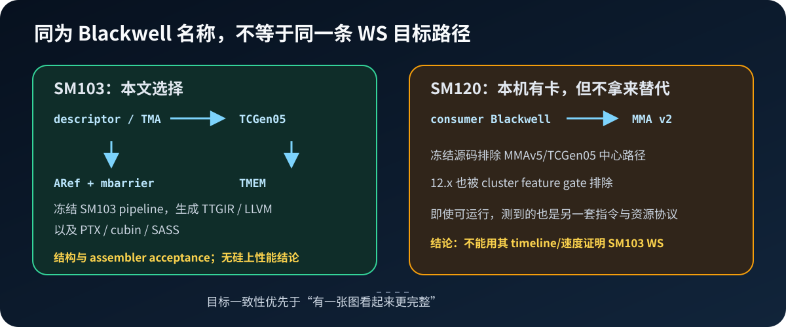
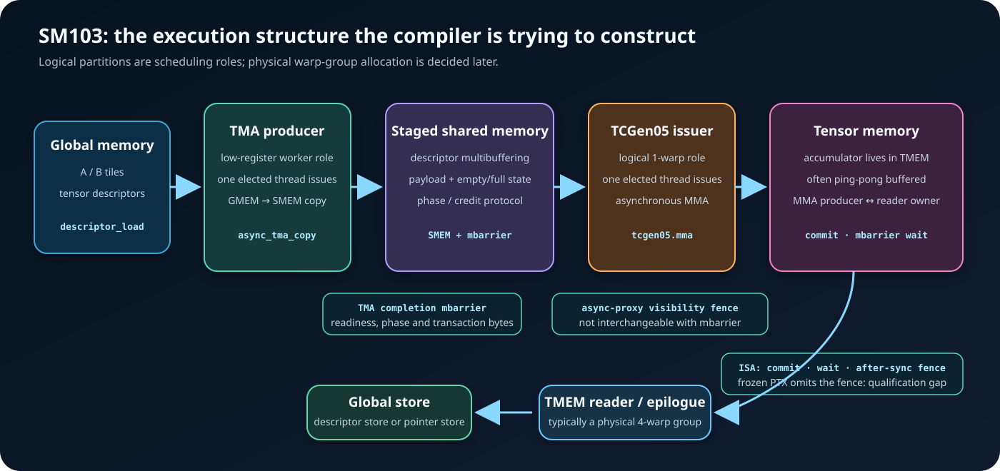
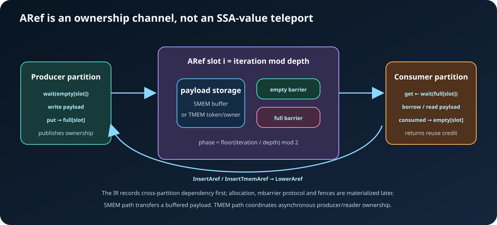
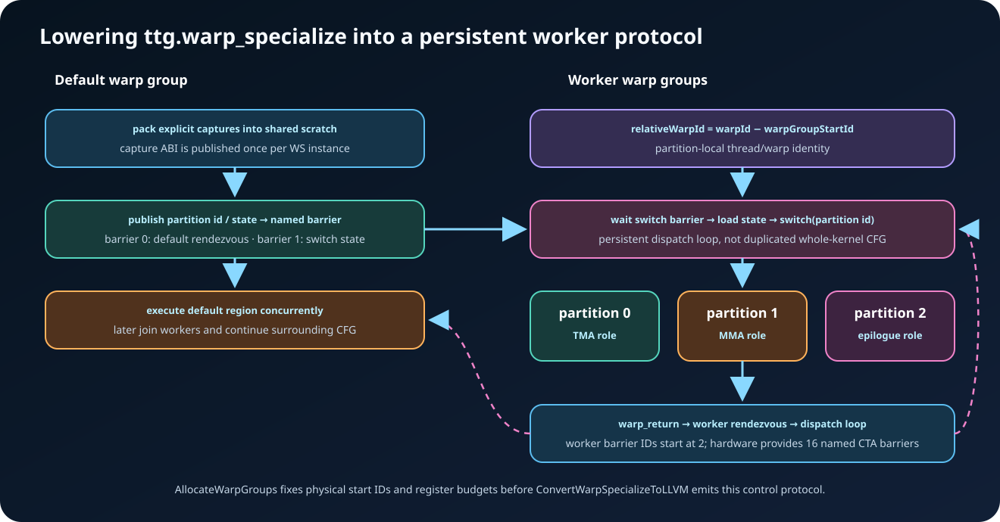

# Triton Blackwell Warp Specialization：从一个循环到 SM103 持久化执行协议

> 冻结源码：Triton `bf64a5db1bc8aab0fd4f0076e60f6c367852e47d`<br>
> LLVM：`850a2b1b975c061ae0fc982ba68064d305485cb2`<br>
> 目标：`GPUTarget("cuda", 103, 32)`，只做编译、汇编与反汇编证明，不启动 cubin。

本文只回答一件事：Triton 如何把一个带有 `warp_specialize=True` 的循环，逐层变成 Blackwell SM103 上能够并发推进的 TMA、TCGen05 和 TMEM 角色，以及这条实现链现在能可靠覆盖哪些程序形状。

阅读时始终区分六个层次：

1. 前端是否表达了 WS 请求；
2. 当前 loop 是否满足自动分区的资格；
3. partition graph 是否真的得到多个分区；
4. 跨角色 storage/ownership channel、barrier、warp group 和寄存器协议是否完成物化；
5. LLVM/PTX 是否出现目标执行结构；
6. ptxas 和 nvdisasm 是否接受该结构。

六层都成立，仍只能证明编译器完成了目标变换并且 SM103 assembler 接受了结果；没有 SM103 实机就不能声称运行时正确、无死锁或更快。本文的所有“效果”都遵守这个边界。

本项目选择 **SM103 compile-only**，而不是借本机 SM120 做一组看似更完整的 runtime 图。原因在源码里是明确的：`AccelerateMatmul.cpp::getMMAVersionSafe` 把 SM120 标为 consumer Blackwell，并为 `120 <= cc < 130` 选择 MMA v2，排除本文中心路径所需的 MMAv5/TCGen05；`TargetFeatures::supportClusterOps` 也排除 compute capability 12.x。backend 虽然对 `cc // 10 >= 10` 都注册 AutomaticWS pass，但“pass 被注册”不等于 SM120 会产生同一套 TMA→TCGen05→TMEM partitions。公开的 SM120 ordinary-load matmul 报告也把正确方向钉在 **safe no-op**：没有 eligible descriptor/TMA root 时应保留普通 pipeline，而不是强行物化一套并无正向投入的 SM120 WS 路径。冻结树中的 `hasEligibleMemoryOps` 已实现这个 mutation 前退出合同；它是目标选择的旁证，不是 SM120 正向支持证据。用 SM120 实机跑出的 kernel 将是另一条 matmul 指令与资源路径，不能替 SM103 证明本文机制的正确性或速度。于是这里固定 SM103，完整保留 MLIR→PTX→cubin→SASS 的结构证据；不画跨架构、跨 lowering 路径的性能对比图。

阅读顺序也由这个目标约束：第 1–2 章只先给出终局与后文必需的 TCGen05/fence 硬件词汇；第 3 章随即完整定义 NVWS 的语言、pass 与消失边界，此后才进入 AutomaticWS 的变换机制，不要求读者在使用 ARef/warp-group 概念后再回头补定义。



---

## 1. 先看终局：编译器究竟想造出什么

### 1.1 读图前先认清 TCGen05 指令族

`tcgen05` 不是一条“Blackwell MMA 指令”的简称，而是一组围绕第五代 Tensor Core、
Tensor Memory 和异步完成协议设计的 PTX 指令。本文会同时出现三层名字：Triton
TTGIR 的 `ttng.tc_gen5_mma`，PTX 的 `tcgen05.*`，以及反汇编中的
`UTCHMMA`、`LDTM`、`STTM` 等机器指令。三者属于连续 lowering 层，不能按字符串
一一对应；本文判断编译器机制时以 TTGIR/PTX 为主，SASS 只作反向定位。

先把后文真正会用到的成员放在一张表里：

| 指令或限定符 | 谁参与、是否异步 | 在本文中的作用 | 最容易误解的地方 |
|---|---|---|---|
| `tcgen05.alloc` / `dealloc` / `relinquish_alloc_permit` | allocator 协议要求一个 warp 协同参与 | 分配、释放 TMEM columns，并结束 allocation permit 生命周期 | 管的是 TMEM 空间生命周期，不是跨角色 producer/consumer ownership |
| `tcgen05.mma{.sp}` | single-thread issue；MMA 本身异步 | 用 `a-desc`、`b-desc`、32-bit `idesc` 和 `[d-tmem]` 发起 `D=A×B+D`；`enable-input-d=false` 表示从零开始 | 发起线程不持有完整 accumulator；结果写入 TMEM，完成也不会由普通程序顺序自动保证 |
| `.cta_group::1` / `::2` | 一 CTA，或本 CTA 与 peer CTA 协作 | 决定 MMA、commit、TMEM 数据通路的 CTA group；本文主 case 是 `::1`，Case 12 分析 `::2` | 同一 kernel 的 TCGen05 指令必须保持一致的 CTA-group 取值；`::2` 还需要 cluster 协议 |
| `.kind::f16`、`.kind::tf32`、`.kind::mxf*` 与 `block_scale` | 编码在 opcode 与 `idesc` 中 | 选择数据族、shape、scale layout；Case 11 研究 block-scaled 变体 | `.kind` 不是完整类型签名；精确 input/output types 和 shape 还在 `idesc` 中 |
| `tcgen05.commit...mbarrier::arrive` | elected issuer 执行；把此前异步 TCGen05 工作挂到 mbarrier | 让另一个 role 能用 mbarrier 观察此前 MMA 的完成 | `commit` 不是 wait，也不把 accumulator 搬进寄存器 |
| `tcgen05.fence::{before,after}_thread_sync` | 不等待异步操作完成；与中间的 thread synchronization 组合 | `before` 把先前 TCGen05 操作接到同步点之前，`after` 把后续 TCGen05 操作接到同步点之后 | 这是 TCGen05 专用执行排序 fence，不是 generic/async memory-proxy fence；当前 Triton 缺口见 4.4 |
| `tcgen05.ld` / `st`，随后 `tcgen05.wait::ld` / `::st` | `ld/st` 是 warp-collective、异步；`wait` 完成本 warp 相应操作 | accumulator 在 TMEM 与普通 registers 之间显式搬运 | opcode 中的 `.sync` 表示 warp collective participation，不表示异步数据已经完成 |
| `tcgen05.cp` | TMEM 相关异步 data movement | 两 CTA、scale 或特殊布局路径中搬运 TMEM 数据 | 它不是 TMA；TMA 是另一套 `cp.async.bulk.tensor` 数据通路 |

还有一个特别容易造成全文概念错位的名字：PTX 的 `tcgen05.mma.ws` 中，`ws`
表示 **weight stationary** 卷积 MMA，不是本文讨论的 **warp specialization**。
本文实际生成的 canonical GEMM PTX 是 `tcgen05.mma.cta_group::1...`，没有
`.mma.ws`。Triton 的 warp specialization 是把不同 compiler partitions 分派给
不同 warps；它不由某个带 `.ws` 后缀的 Tensor Core opcode 开启。

把生命周期压成最短序列，后文就不会把“发起”“完成”“跨线程排序”“读回完成”混成
一个事件：

```text
one warp:       tcgen05.alloc                         // 取得 TMEM columns
CTA threads:    thread synchronization / address hand-off
one warp:       tcgen05.relinquish_alloc_permit       // allocation 完成后尽早归还 permit
elected thread: tcgen05.mma ... [d-tmem]              // 异步发起，可连续多次
elected thread: tcgen05.commit ... [full_mbarrier]     // 将此前工作关联到完成对象
reader role:    mbarrier.try_wait ...                  // 观察 MMA 完成
reader role:    tcgen05.fence::after_thread_sync       // ISA canonical 跨线程排序
reader warp:    tcgen05.ld ... [d-tmem]
reader warp:    tcgen05.wait::ld                       // 此后 registers 才可消费
one warp:       tcgen05.dealloc                        // 所有 TMEM 使用结束后释放 columns
```

这是一条把 allocation lifecycle 与 PTX ISA 的 canonical MMA→load 因果链合在一起的
最短示意，不是对当前 Triton 输出的逐指令转录。冻结 lowering 在 `tcgen05.alloc` 后先用
两次 CTA barrier 完成地址发布，再立刻发 `relinquish_alloc_permit`；`dealloc` 只插在每个
kernel return 前。permit 的归还和 TMEM columns 的释放因此不是同一个末尾动作。本文冻结
版本实际生成了 MMA、commit、mbarrier wait、CTA barrier、TMEM load 和 `wait::ld`，却
没有生成其中的 `tcgen05.fence::after_thread_sync`；4.4 节会把这个差异作为独立的
qualification gap 审计，而不是悄悄用理想序列替代真实 artifact。

### 1.2 本文涉及的 fence 不是同一种 fence

只看名字中的 `fence` 很容易犯错。本文实际会遇到五种不同目的的 ordering primitive：

| 指令 | 排序的两端 | Triton 中的来源与本文覆盖 | 不能替代什么 |
|---|---|---|---|
| `fence.proxy.async.shared::cta` / `shared::cluster` | 同一 shared allocation 上的 generic proxy 与 async proxy accesses；无方向限定时建立双向 proxy ordering | `FenceAsyncSharedOp` 经 `BarrierOpToLLVM.cpp` lowering；`FenceInsertion`、`ProxyFenceInsertion`、`LowerAref` 和 TMA lowering 都可能创建，exact SM103 artifact 出现 CTA 形态 | 不等待 TMA/MMA 完成，也不让 producer 与 consumer rendezvous |
| `fence.proxy.tensormap::generic.acquire.gpu [addr], 128` | generic proxy 准备或更新的 128-byte tensor map，交给 tensormap proxy 使用 | `TMAToLLVM.cpp::TensormapFenceproxyAcquireOpConversion`；canonical TMA artifact 实际出现 | 不发布 TMA 写入 shared memory 的 payload；它保护 descriptor 本身 |
| `tensormap.cp_fenceproxy...release` | 把在 shared/generic proxy 构造的 descriptor copy 到 global tensormap proxy，并建立 release ordering | `TMAToLLVM.cpp::tensormap_cp_fenceproxy`；动态 descriptor、grouped/persistent 形状会用到 | 不是一次 tensor tile copy，也不是其 completion |
| `fence.mbarrier_init.release.cluster` | 当前 CTA 对 shared-cluster mbarrier 的初始化，发布给 peer CTA | `ClusterBarrierInsertion` 创建高层 op，`BarrierOpToLLVM.cpp` 与 `ClusterOpsToLLVM.cpp` lowering；Case 12 的 component fixtures 覆盖 | 只发布 mbarrier 初始化；不能替代 cluster arrive/wait，也不能完成 TCGen05 MMA |
| `tcgen05.fence::{before,after}_thread_sync` | thread synchronization 前后的异步 TCGen05 operations | PTX ISA canonical TCGen05 protocol；冻结 Triton 源码、tests 与 exact PTX 中均未找到对应 lowering | 不做 memory-proxy visibility，不等待 MMA，也不完成 `tcgen05.ld/st` |

反汇编还会看到 `FENCE.VIEW.ASYNC.S` 与 `.T`，但它们是机器层名称，不应倒推成新的 PTX fence 类别。在本次产物的 PTX/SASS 邻近序列中，`.S` 出现在 `fence.proxy.async.shared` 对应区域，`.T` 紧跟 TCGen05 store/`wait::st` 区域；优化与指令选择不保证逐条同址映射。可靠做法是同时对照 PTX、LLVM intrinsic 与上下游访问，且绝不能把任一 `FENCE.VIEW` 仅凭名字当成缺失的 `tcgen05.fence::after_thread_sync`。

普通 `barrier.sync`/`bar.sync` 解决参与线程的 rendezvous，mbarrier 的
arrival/transaction count 解决指定异步操作的 completion；它们都可以位于 fence 两侧，
但不能因为“已经等过 barrier”就自动获得另一个 proxy 或 TCGen05 pipeline 的 ordering。

### 1.3 从这些指令拼回 WS 终局

未特化时，CTA 内各 warp 共享同一静态 loop 程序，并按 layout 处理不同的数据切片；load、MMA 与 epilogue 的推进仍绑定在同一组 warps 上。SM103 上的 AutomaticWS 要把这组 warps 拆成可并发推进的所有权角色：



把上图压缩成一条因果链：

```text
TMA producer
  └─ elected thread issues descriptor load
       ↓  SMEM payload + TMA completion mbarrier
TCGen05 MMA issuer
  └─ elected thread issues asynchronous tcgen05.mma
       ↓  accumulator in TMEM + commit/mbarrier wait
TMEM reader / epilogue
  └─ warp-wide TMEM load；当前 Triton 为这类 role 保留至少 4 warps
       ↓
global store
```

这个结构有三个容易误读的地方。

第一，角色不等于硬件强制占用量。TMA 和 `tcgen05.mma` 都可以由一个 elected thread 发起；Triton 把它们放进独立、低寄存器的 worker partition，是调度与资源生命周期策略，不是“硬件要求整个 warp 只能做 TMA”。

第二，逻辑 1-warp partition 不等于 kernel 最终只为它消耗一个孤立的物理 warp。Blackwell 的动态寄存器协议以四个连续 warp 构成的物理 warpgroup 为参与单位。`OptimizePartitionWarps` 先选择逻辑角色宽度，`AllocateWarpGroups` 再做 padding、起始 warp ID 和寄存器预算的物理化。

第三，TMEM 让 accumulator 脱离普通寄存器，但没有消除同步。MMA issue、异步完成、跨线程 TCGen05 ordering、TMEM load 完成，是四个不同事件。`tcgen05.commit`、mbarrier wait、`tcgen05.fence` 与 `tcgen05.wait::ld` 不能合并成一句模糊的“等 barrier”；更不能因为当前编译器漏掉其中一环，就在说明图里把它当成已经生成。

### 1.4 Case 1：只证明终局，不依赖自动分区

第一组实验直接取 `test/Conversion/warp_specialize_to_llvm.mlir` 中的显式 `ttg.warp_specialize`。它跳过 heuristic，单独证明定义明确且有 verifier 覆盖的 IR contract 到 LLVM 控制流的 lowering：

```mlir
ttg.warp_specialize(%capture)
default {
  // 原 warp group 执行，并与 workers 并发
  ttg.warp_yield
}
partition0(%arg: i32) num_warps(1) {
  // worker role
  ttg.warp_return
} : (i32) -> ()
```

这个 case 的价值不是算术，而是把两个问题拆开：

- `ttg.warp_specialize` 的并发语义与 ABI 是否成立；
- AutomaticWS 是否有能力从普通 loop 推导出这个 ABI。

前者把问题限定为一个有 verifier 和 focused lowering tests 的 IR 契约，因而可以与自动分区策略分开验证。

---

## 2. Blackwell ISA 因果模型，以及它在 SM103 目标上的物化

### 2.1 TMA：发起者很窄，数据路径很宽

TMA 的 global-to-shared bulk tensor copy 由一个 elected thread 发起，descriptor 携带地址、shape、stride 和 tile 信息。发起窄，不代表传输窄；硬件异步搬运整个 tile，并把完成计入 shared-memory mbarrier 的 transaction bytes。

因此 producer partition 的理想属性是：

- 指令流短；
- 活跃标量少；
- 低寄存器预算；
- 能提前推进下一 stage；
- 不承担消费 tile 的向量计算。

Triton 在 `PartitionScheduling.cpp` 中把 `DescriptorLoadLikeOpInterface` 的结果作为 data root。它不是看到任意 `tt.load` 就创建 TMA partition；descriptor/TMA 是资格和角色识别的关键。

### 2.2 TMEM：128 lanes × allocated columns 的 accumulator 空间

把 TMEM 想成 CTA 所有、Tensor Core 专用的二维片上存储：横向是 128 个 lane，纵向是按列分配的空间。`tcgen05.alloc`/`dealloc` 管列的生命周期，`tcgen05.mma` 把累加结果写入其中。

这里必须区分 ISA 的发起粒度与 Triton 当前的 partition 策略：

- Triton 当前只让 warp 0 中的 elected thread 发出 MMA/commit；
- `tcgen05.alloc/dealloc` 要求一个 warp 参与；
- `tcgen05.ld/st` 是 warp-aligned、warp-wide 指令；
- Triton 当前对包含 TMEM load/store/alloc 的 partition 保留至少 4 warps，以满足现有 layout 与 lowering 支持范围。

因此，MMA issuer 可以是逻辑 1 warp，TMEM reader/epilogue 在当前 Triton 中却保留 4 warps；这个四-warp floor 不能外推成所有手写 PTX 的硬件下限。硬件粒度使 MMA/reader 拆分有价值，而当前 scheduler 与跨角色通信实现又进一步禁止 MMA partition 和 TMEM partition 随意合并，并把同一 allocation 限定为一个 MMA owner 与一个合并后的 TMEM owner。

### 2.3 TCGen05：issue 与 execute 解耦

`tcgen05.mma` 的发起线程并不在普通寄存器中持有整个 accumulator。它描述 SMEM/TMEM operand 与 TMEM destination，Tensor Core 随后异步执行。于是：

```text
issue progress ≠ computation complete ≠ cross-thread TCGen05 ordering ≠ reader finished
```

WS 的意义正在这里：让 issue role 尽早发出下一批 MMA，让 reader role 对已完成的 TMEM tile 做 correction、convert、reduce 或 store，同时让 TMA role 准备后继 operands。三种硬件资源的可推进区间被显式分开。

### 2.4 logical partition 与 physical warpgroup

TTGIR 的 partition 是编译器调度角色。它的 `num_warps(1|2|4...)` 表示该 region 的逻辑执行宽度。PTX 的 warpgroup 则是四个连续 physical warps，且参与 `setmaxnreg` 的四个 warp 必须一致执行。

物理化发生在 `lib/Conversion/TritonGPUToLLVM/AllocateWarpGroups.cpp`：

1. 求所有 WS sites 所需的最大额外 worker warp 数；
2. 向上取整到完整四-warp warpgroups，并把每个 WS site 都 pad 到这个程序级最大值；
3. 为每个逻辑 partition 分配连续的 `warpGroupStartIds`；
4. 若存在 `requestedRegisters` 且预算计算成功，生成每个 region 的 `actualRegisters`；它仍是编译器预算，LLVM lowering 才把最终 `setmaxnreg` 立即数裁到合法范围；
5. 设置 `ttg.total-num-warps`，让不同 WS sites 复用同一物理 worker 池。

padding 与寄存器 handoff 是程序级问题：若每个 site 各自拥有不同数量的物理 workers，未参与当前 site 的 warps 就无法稳定留在同一 persistent loop 中归还寄存器。当前 verifier 还要求 base `num_warps` 是 4 的倍数。看到 TTGIR 中 `partition0 num_warps(1)` 时，只能说“该角色的有效计算宽度是一个 warp”，不能直接把它当作 occupancy 结论。

---

## 3. NVWS dialect：AutomaticWS 的瞬时事务语言

硬件因果关系已经明确，下一步不是马上数 barrier，而是先认清编译器用什么 IR 暂存“谁拥有数据、谁归还 credit、哪些角色将并发执行”。否则看到 `nvws.aref.*`、`ttg.warp_specialize` 和 LLVM switch loop 时，很容易把三个生命周期不同的层次混成一个 dialect。

### 3.1 它解决什么，又刻意不解决什么

`NVWS_Dialect` 的文本名字是 `nvws`，C++ namespace 是 `mlir::triton::nvws`，依赖 Triton 与 TritonGPU。定义不在公共 `include/triton`，而在 NVIDIA backend 的目录：

```text
third_party/nvidia/include/Dialect/NVWS/IR/
  NVWSDialect.td
  NVWSTypes.td
  NVWSAttrDefs.td
  NVWSOpInterfaces.td
  NVWSOps.td
```

它不是 Python/frontend API，不是承诺长期兼容的 TTGIR ABI，也不是 target dialect。对当前
Blackwell AutomaticWS，它给中间 transforms 提供两类短命表示：

1. 用 ARef family 表达跨 partition payload 或 TMEM ownership 的借出、完成和归还；
2. 用 `nvws.warp_group` family 暂存已经拆开的 role regions，随后归一为正式 `ttg.warp_specialize`。

两类表示属于先后两个 **transient epoch**。ARef family 会在 `PartitionLoops` 之前被 `LowerAref` 消除；`PartitionLoops` 之后才出现 `nvws.warp_group`，并立即由 `LowerWarpGroup` 消除。因此 NVWS 不是一层从 TTIR 连续保留到 LLVM 的完整 codegen IR；正常 pass trace 中，两套主要 family 通常不会同时完整存在。

dialect 另外还保留一套旧 code-partition channel，后面会单独列出；它不属于上面两段
Blackwell AutomaticWS epoch。先用一个 slot 建立 ARef 的最小心智模型：producer 必须先
拿到 empty credit，才能写 payload；写完发布 full，consumer 等 full 后借用 payload，
最后归还 empty credit。多 buffer 只是把这条状态机按 stage 排成 ring，并没有改变所有权
方向。



这层“瞬时事务语言”不是一开始就天然长成现在的形状。早期实现曾让同一 dependency 在 rewrite 中反复增殖 producer/consumer 操作；复杂 control flow 与多个 users 出现后，很难判断哪一次 rewrite 才真正结束 storage lifetime。当前 enter/exit 模型把问题改写成一条可配对的生命周期：enter 取得 slot/ownership，exit 明确最后一次使用及 completion kind。这个设计史解释了为什么 NVWS op 看起来比一组 raw barrier 冗长：冗长的部分正是后续 pass 用来证明“何时可复用”的信息。

### 3.2 两个类型、属性与两个接口

| 构造 | 编译期含义 | 不应怎样理解 |
|---|---|---|
| `!nvws.aref<[T0, T1, ...]>` | asynchronous-reference meta-type，类型定义本身保存一组任意 MLIR types；当前可执行 `aref.create` 的 operands 则被 ODS 收窄为 `TTG_MemDescType`。普通 Shared/TMEM memdesc 的 leading dimension 表示 ring depth，enter 返回当前 slot 的 view | 不是指针类型、硬件句柄或最终 ABI；C++ verifier 中保留的 ranked-tensor 分支也不能反向证明当前 textual op 接受 tensor operand；`LowerAref` 后必须消失 |
| `!nvws.token` | 旧 code-partition channel 的 token element type，实际形态通常是 `tensor<Nx!nvws.token>` | 不是当前 AutomaticWS ARef enter 返回的 token |
| `#nvws.type_array<...>` / `#nvws.int_array<...>` | dialect 自有的 type/int 数组属性容器；ARef 用前者保存 base types；`int_array` 在冻结树只定义、尚未被 op 或 transform 使用 | 不代表 kernel runtime array；exit 的 completion kinds 使用另一个具名 `NVWS_AsyncOpArrayAttr` 容器 |
| `TokenLoadType` | 旧 `nvws.create_token` 的分类：`none`、`asyncLoadOp`、`tmaLoadOp`、`localStoreOp`、`TmemLoadOp` | 不参与当前 ARef lowering 的 completion 决策 |
| `#nvws.async_op<kind>` | ARef exit 上的静态 completion-kind metadata；枚举为 `none`、`tma_load`、`tc5mma`、`tmem_copy`、`cp_async`、`wgmma` | 不是 completion token，也不表示操作已经完成 |
| `ArefStageInterface` | 为 put/get enter、exit 与 `aref.buffer` 统一提供 `getStage/setStage`；`AssignStagePhase` 后填 schedule 位置 | 不是通用 MLIR pipeline interface |
| `DescriptorLoadOpInterface` | 继承 Triton descriptor interface，并增加 `getTxCount()`，供 lowering 计算 TMA transaction bytes | 不等于原 `tt.descriptor_load` 的 tensor-result contract |

普通 ARef base buffer 的第一维是 multibuffer depth；`ArefPut/GetEnterOp::verify` 会检查返回 slice 相对 base type 少这一维。`TensorMemoryScalesEncodingAttr` 是明确的例外：其 verifier 要求 base 与 slice 保持同 rank、同 shape 和同 element type。因此“所有 ARef 都简单去掉第一维”并不成立，scaled/TMEM case 必须读 encoding-specific 分支。

`AsyncOp` 的枚举集合也大于每个 lowering 位置实际接受的集合。枚举值存在，只说明 IR 能表示该名字；它不保证 producer exit、consumer exit 和 arrive lowering 的任意组合都合法。第 3.6 节会列出冻结实现真正接住的分支。

### 3.3 16 个 operation：四组用途、两个 transient epochs 与一条 legacy channel

`NVWSOps.td` 一共定义 16 个 op，完整 inventory 如下：

| 分组 | Operations | 在冻结树中的角色 |
|---|---|---|
| ARef channel，6 个 | `nvws.aref.create`、`nvws.aref.put.enter`、`nvws.aref.put.exit`、`nvws.aref.get.enter`、`nvws.aref.get.exit`、`nvws.aref.buffer` | 当前 Blackwell AutomaticWS 的主路径；LowerAref 生成 storage/barrier/completion protocol 后全部擦除 |
| role container，3 个 | `nvws.warp_group`、`nvws.warp_group.yield`、`nvws.warp_group.return` | `PartitionLoops` 与正式 `ttg.warp_specialize` 之间的临时容器 |
| legacy channel，5 个 | `nvws.create_token`、`nvws.producer_acquire`、`nvws.producer_commit`、`nvws.consumer_wait`、`nvws.consumer_release` | 旧 code-partition 路径使用；当前 AutomaticWS composite 不构造 |
| descriptor destination bridge，2 个 | `nvws.descriptor_load`、`nvws.descriptor_gather` | 把原先返回 register tensor 的 descriptor op 改成直接写给定 memdesc；LowerAref 随后生成 async TMA |

先逐个看当前主路径的语义。

`nvws.aref.create` 在正常 inserter 路径中接受至少一个已分配的 backing buffer，返回一个 `!nvws.aref`。它不分配 storage，只把已有 buffers 纳入同一逻辑 channel。verifier 要求每个 backing buffer 的 direct users 只能是 `aref.create` 或最终 `local_dealloc`，并要求各 backing 的 leading depth 相同；这排除了普通旁路读写，却**不保证唯一 owner**——同一 buffer 同时被多个 `aref.create` 使用仍能通过。ODS operand 又是 variadic，零 backing 在语法层没有被禁止，而 `LowerAref` 与 `AssignStagePhase` 都会直接索引第 0 项。因而“至少一个 backing、一个正常 lifecycle”是 inserter 保证的 pipeline invariant，不是 dialect verifier 已经封闭的合同。

`put.enter`/`get.enter` 分别打开写入和读取区间，返回一组当前 slot 的 memdesc views，以及一个 `!ttg.async.token`。ODS description 把这段区间称作 “region”，但 op 本身没有 MLIR `Region`；enter 与 exit 之间的 SSA use interval 才是逻辑临界区。可选 `stage, phase` 决定访问哪个 ring slot 以及等待哪一轮 barrier parity。`put.exit`/`get.exit` 消费 pairing token，并用 `[#nvws.async_op<...>]` 告诉 LowerAref 由哪类异步工作完成这次 release。这里的 pairing 和非空 completion array 是当前 inserter 遵守的 protocol invariant：exit op 自身没有 verifier 阻止空数组或不匹配的 token。

`nvws.aref.buffer` 不打开一条新 ownership transaction。正常 pipeline 用已有 enter token 取得相应 stage 的 backing view，主要服务 `InsertTmemAref` 构建的 TMEM access DAG；op 自身既没有 verifier 证明 token 来自匹配 enter 或属于同一 ARef，也没有把 variadic result 的数量和精确 memdesc types 绑定到 ARef bases。`LowerAref` 到物化 subviews 时才用 C++ `assert` 检查 view/result 数量，type 一致性还留给替换与后续 module verification。因而“受已有 transaction 约束且 result 与 backing 一一对应”是 inserter/lowering protocol，不是任意手写 IR 都能得到的静态保证。

两个 descriptor bridge 都是 destination form：没有 tensor SSA result，payload 直接写入 memdesc operand，并携带 `txCount`。ODS 把该抽象 op 描述为同步效果；真正的异步 TMA、expect-tx 与 completion barrier 是 `LowerAref` 的产物，不能把 `nvws.descriptor_load` 本身当作硬件 `cp.async.bulk.tensor`。

`nvws.warp_group` 保存 `numWarps[i]` 与同样数量的 regions。正常 `PartitionLoops` provenance
让第一 region 用 `nvws.warp_group.yield` 定义整个 op 的 results，让 worker regions 以无
operand 的 `nvws.warp_group.return` 结束；这也是 LowerWarpGroup 实际消费的 ABI。它却
没有被 verifier 完整封闭：两个 terminator 的 ODS 只要求 parent 是 `WarpGroupOp`，只有 op
确实有 results 时才检查第一 region 的 terminator/arity，worker-yield 和无结果首区 return
都没有被禁止。worker 产生、其他角色消费的值仍必须在正常路径中先变成 Shared/TMEM
storage、副作用或可显式捕获的对象，不能把 verifier 的宽松域误当成 worker SSA return
能力。

最后五个 legacy ops 要保留在完整 dialect 图里，但不要与当前路径混用。最短状态流是：

```text
nvws.create_token(numBuffers, loadType)
  producer: nvws.producer_acquire(idx, phase)   // wait empty
            ... fill payload ...
            nvws.producer_commit(idx)           // publish full
  consumer: nvws.consumer_wait(idx, phase)      // wait full
            ... consume payload ...
            nvws.consumer_release(idx)           // return empty credit
```

它们由 `third_party/nvidia/hopper/.../WSCodePartition.cpp` 构造，`WSLowerToken.cpp` 把 token
换成 empty/full mbarrier arrays：acquire/wait 分别变成 empty/full wait，commit/release
分别发布 full/empty。旧 lowering 还只支持单 CTA，producer commit 的 `loadType` 分支也
比 enum 窄。冻结 Blackwell AutomaticWS 的 `InsertAref/LowerAref` 不生成、也不消费这五个
op。读到它们时应判断自己正在看旧 code-partition pipeline，而不是误以为 current ARef
epoch 有第二套必经语法。

### 3.4 四类 token/状态：名字最像，语义反而最不同

| 表示 | 谁创建 | 用途 | 消失位置 |
|---|---|---|---|
| TCGen05/TMEM 等原 op 的 `!ttg.async.token` | TTG/TTNG compute 或 memory op | accumulator/memory object 的 dependency、mod/ref edge，供 alias、partition 与 ownership analysis 使用；不是硬件 completion object | 随原 TTGIR op 的后续 lowering |
| ARef enter 返回的 `!ttg.async.token` | `nvws.aref.put/get.enter` | 与上一行使用相同 MLIR type，但这里只作为 enter↔exit、enter↔buffer 的 SSA pairing identity | LowerAref 找到 matching exit 后以 `ub.poison !ttg.async.token` 替换残余 uses，再随 ARef ops 擦除 |
| `tensor<Nx!nvws.token>` | legacy `nvws.create_token` | 旧 producer/consumer communication channel 的 SSA handle | 旧 `doTokenLowering` 变成 mbarrier arrays 后擦除 |
| Shared-memory mbarrier object | `ttng.init_barrier` 对应的 Shared allocation | 真正保存 phase、pending arrivals 与 expected transaction bytes 的运行时状态 | 继续降成 PTX mbarrier 指令，并在 kernel 执行期存在 |

`#nvws.async_op` 不是第五种 token，只是 exit 的编译期枚举。类型相同也不等于协议相同：前两行都写 `!ttg.async.token`，一条是原计算依赖边，另一条只是 LowerAref 自己创建的配对 handle；反过来，名字真正包含 `nvws.token` 的类型属于旧路径。

### 3.5 六个 NVWS pass，以及谁真正创建 NVWS IR

| Pass | 输入事实 | 主要变换 | 是否留下 `nvws.*` |
|---|---|---|---|
| `nvws-hoist-tmem-store` | 带 partition attrs 的 persistent/nested TMEM initialization + MMA 形态 | 先把任意满足支配关系的初始化 store 折进 alloc；canonical clear case 再在 `useD=false` 和执行次数安全条件下提升，避免后续多造一次 ownership hand-off | 通常不创建 NVWS op；它只是归在 NVWS transform package |
| `nvws-insert-aref` | 跨 partition 的 scalar/tensor/SMEM producer-consumer；descriptor load/gather | 分配 backing、创建 Shared ARef put/get；把 descriptor result form 改成 NVWS destination form | 创建 ARef 与 descriptor family |
| `nvws-insert-tmem-aref` | 同一 TMEM allocation 的 token/access DAG 与 owner changes | 把 TMEM owner 交替改写成 put/get transaction，并按条件选择 single/double buffering | 创建 ARef family，常用 `aref.buffer` |
| `nvws-assign-stage-phase` | ARef use-def 与 loop schedule | 为 enter/exit/buffer 写 stage，为 enter 计算 phase；必要时把 root/default partition 传播到外部 scalar dependency | 修改 ARef ops；由 LowerAref 内部调用 |
| `nvws-lower-aref` | ARef、descriptor bridge、stage/phase、async kind | combine/multibuffer ARef，生成 buffers、mbarriers、TMA、wait/arrive/commit/fence，再擦除 ARef/descriptor family | 正常路径不应留下这两组 NVWS op |
| `nvws-lower-warp-group` | `PartitionLoops` 创建的 role regions | 选择 default，处理 captures/rematerialization，把临时 regions 改成 `ttg.warp_specialize` | 正常路径不应留下 warp-group family |

`PartitionScheduling`、`PartitionLoops` 和 `ScheduleLoops` 不属于 NVWS dialect pass，但分别提供 partition attrs、创建 `nvws.warp_group`、重建分区后的 software-pipeline schedule。AutomaticWS 的实际顺序因此是跨 dialect 的组合事务，而不是六个 NVWS pass 自己闭环。

policy 与 materialization 被刻意拆开：partition graph 可以单独测试多个 load/MMA/SFU groups 的 assignment，ARef passes 再只消费已经序列化的跨角色边。这样更换 merge heuristic 不需要同时重写 barrier lowering；反过来，修复 channel 生命周期也不应偷偷改变角色选择。`ttg.partition*` 因而是 pass-local analysis ABI，而不是可长期保存的公共 dialect contract。

### 3.6 第一个 transient epoch：ARef 怎样变成可执行 protocol

冻结 `AutomaticWarpSpecialization.cpp` 的关键顺序可压缩为：

```text
PartitionScheduling
  └─ 同一 scf.for 上的 ttg.partition / partition.outputs / stages / tag
      ↓
HoistTmemStore → InsertAref → InsertTmemAref → SCCP → CSE
  └─ nvws.aref.* + nvws.descriptor_{load,gather}
      ↓
LowerAref
  └─ ARef/descriptor family 全部消失
     ttg.local_alloc / memdesc_index / local_dealloc
     ttng.init|inval|wait|arrive_barrier / barrier_expect
     ttng.async_tma_* / fence_async_shared / tc_gen5_commit
      ↓
PartitionLoops
```

`LowerAref` 本身先 combine compatible ARefs，并只对 global-to-shared producer ARefs 按 `numStages` multibuffer；随后内部运行 `AssignStagePhase`，再用 greedy rewrite 逐个消费 `aref.create`。对一条 channel，它完成九件事：

1. 从 producer/consumer partitions 与 `AsyncOp` 计算 empty/full barrier arrival count；
2. 按 channel depth 分配、初始化两组 mbarrier arrays，并在生命周期末 invalidate/dealloc；
3. 把 put-enter 变成 empty wait，把 get-enter 变成 full wait；
4. 由 stage 选择 `memdesc_index`，用真实 slot views 替换 enter/buffer results；
5. 累加同一 put transaction 内 descriptor ops 的 `txCount`，生成 `barrier_expect`；
6. 把 `nvws.descriptor_load/gather` 改成 `ttng.async_tma_copy_global_to_local` / `ttng.async_tma_gather`；
7. 根据 exit 的 async kind 生成 arrive 或 TCGen05 commit，或把 arrival 留给 TMA hardware completion；
8. 在 generic 与 async proxy hand-off 确有需要时生成 `ttng.fence_async_shared`；
9. 逆 use-def 顺序擦除 exit、enter/buffer、descriptor bridge 与 `aref.create`，并以 poison 收口纯配对 token。

这里有三条不能从 op 的文本顺序猜出的合同。

第一，enter/exit 的 schedule 边界按 **pipeline time** 选择。`InsertAref.cpp::getEnterAndExitStageClustersOfUses` 反序列化 `CoarseSchedule`，调用 `getFirstUseOfPipelinedOp`/`getLastUseOfPipelinedOp`；stage/cluster 才决定哪个 user 在流水时间上最早或最晚。只取 block 中第一个/最后一个 user，可能在循环旋转后过早归还 slot。

第二，async 是显式语义。MMAv5 是否异步由 op 的 `is_async` 属性承载；`LowerAref.cpp::setIsAsync` 根据 `numStages` 与 scaled operands 是否可 pipeline 显式写回。不能通过“有没有 completion-barrier operand”反推，因为 TMA 已分到 producer、而某条 scaled MMA 仍保守同步，是合法组合。

第三，multibuffering 不是 ARef 的默认能力。`LowerAref::isProducerLoad` 只把含 `nvws.descriptor_load/gather` 的 global-to-shared channel 送进 `multiBufferAref`；普通 scalar/tensor/SMEM 跨 partition channel 初建 depth 为 1，TMEM channel 则由 access DAG 独立决定 1 或 2。于是“generic cross-partition SSA 已可通信”不等于“generic payload 已可按任意 `numStages` 环形复用”。

scale encoding 还把这个限制写死在三处：`getArefDepth` 固定返回 1，`getArefMultiBufferedType` 不插入 leading depth，`getSubViews` 直接返回原 buffer。因此 scale ARef 的 rank/shape verifier 例外不是表面语法差异，而是“没有 ring subview”这一实现事实的类型投影。

实际支持矩阵比 enum 窄：

| 位置 | 冻结实现接受的 kind | 其他值 |
|---|---|---|
| arrival-count 的 producer exit | `TC5MMA`、`TMALoad`、`NONE` | `llvm_unreachable("unsupported producer kind")` |
| arrival-count 的 consumer exit | `TC5MMA`、`WGMMA`、`NONE` | `llvm_unreachable("unsupported consumer kind")` |
| 通过上述计数后可达的 release/arrive | `NONE/WGMMA → arrive_barrier`；`TC5MMA → tc_gen5_commit`；`TMALoad → hardware arrival，不另发 arrive` | `CpAsync → llvm_unreachable` |

`insertArriveBarrier` helper 里还写有 `TMEMCopy → tc_gen5_commit` 分支，但当前 producer/consumer arrival-count 两侧都不接受 `TMEMCopy`，当前 inserters 也没有构造一条可贯通该分支的 channel。因此它是 dormant helper capability，不是冻结 pipeline 的受支持 kind；不能因为 switch 中有一个 case 就把它列进支持矩阵。

这也解释了 mixed case 的边界：普通 load 留在同一 compute/default partition 时可以由通用 pipeliner 处理；若要求把 cp.async payload 跨 partition 变成 Shared ARef，冻结实现并没有完整 completion-kind lowering。

### 3.7 第二个 transient epoch：warp group 怎样进入正式 TTGIR

`LowerAref` 结束后，`PartitionLoops` 才按 partition assignment 克隆 `scf.for`、`scf.if` 与受支持的 reduce 形态，并用 `nvws.warp_group` 暂存各 role。随后 `LowerWarpGroup` 立刻执行：

```text
PartitionLoops
  └─ nvws.warp_group / warp_group.yield / warp_group.return
      ↓
LowerWarpGroup
  └─ ttg.warp_specialize
     ttg.warp_specialize.partitions
     ttg.warp_yield / ttg.warp_return
      ↓
ScheduleLoops → OptimizePartitionWarps → AllocateWarpGroups
      ↓
NVIDIA TTGIR-to-LLVM conversion
```

default 的选择不是“第一 region 永远是 default”。只有第一 group 的 warp 数等于 module `ttg.num-warps` 时，它才成为 default；否则 lowering 创建空 default，并把全部 groups 作为 workers。若原 `nvws.warp_group` 有 results，但第一 group 又不能成为 default，该 rewrite pattern 返回 match failure，因为 worker `warp_group.return` 没有返回值 ABI；`applyPatternsGreedily` 不把“某个 op 没匹配”本身视为 pass failure，所以这个 NVWS op 可以原样残留。正常 AutomaticWS provenance 不应构造该形状，但手写 IR 不能期待这里得到稳定 diagnostic。

captures 也在这里分类：纯 constants 和可安全复制的 tensor expressions 尽量在 worker 内 rematerialize；无法 rematerialize 的 ranked tensor 先 spill 到 Shared `local_alloc`，worker 再 `local_load`；其余非 tensor values 进入显式 capture list。正常 provenance 中第一 region 的 yield 变成 `ttg.warp_yield`。worker lowering 实际移动的是 `without_terminator()` 的 body，然后自行创建 `ttg.warp_return`；它会丢掉原 terminator，却没有先验证它一定是 `nvws.warp_group.return`。所以“worker return”是 inserter ABI，不是 hand-written NVWS 已被 verifier 证明的事实。

NVWS 没有直接 LLVM converter。它有两类间接出口：

| NVWS 被消费后的正式 IR | 后续 NVIDIA lowering |
|---|---|
| mbarrier、`fence_async_shared`、`barrier_expect` | `TritonNVIDIAGPUToLLVM/BarrierOpToLLVM.cpp` |
| `async_tma_copy_global_to_local` / gather | `TritonNVIDIAGPUToLLVM/LoadStoreOpToLLVM.cpp` |
| `tc_gen5_commit` | `TritonNVIDIAGPUToLLVM/DotOpToLLVM/MMAv5.cpp` |
| `ttg.warp_specialize` family | `ConvertWarpSpecializeToLLVM.cpp` + `WarpSpecializeUtility.cpp` |

所以送入后续 NVIDIA codegen 的 TTGIR 若仍残留 `nvws.*`，不是另一条受支持的 codegen path，而是 transient protocol 没有被完整消费。LowerWarpGroup 本身没有用 ConversionTarget 宣告 NVWS illegal，module verifier 也允许合法 NVWS op 存在；“本 pass 返回 success”不能单独充当 residue=0 的证明。冻结 `automatic-warp-specialization.mlir` 的 `CLEAN` prefix 只负向检查 partition attrs/tag，不含 `CLEAN-NOT: nvws.`；NVWS 消失目前由 pass 源码、本地 full pass trace 的断面观察和 `lower_aref`/`lower_warp_group` 局部正例共同支撑，不能把那组 `CLEAN` 过度归因为 dialect-wide no-residue check。

### 3.8 verifier 与 fail-safe：正常路径封闭，不等于 dialect-wide legality proof

NVWS verifier 直接覆盖的合同有限但明确：

- `ArefCreateOp::verify` 检查 backing 没有普通旁路 direct user、类型可切片且 leading depth 相同；
- put/get enter verifier 检查 base-value 数量、rank、shape、element type，以及 scale encoding 的特殊规则；
- `WarpGroupOp::verify` 检查 `numWarps` 与 regions 的数量相等；有 results 时，要求至少一个 region、第一 region 以 yield 结束且 yield arity 与 result arity 相等。

这些检查比 lowering 的输入域更宽。`ArefCreateOp` 没有禁止零 backing，也不保证一个 buffer 只属于一个 ARef；exit 没有验证 `async_ops` 非空或 token pairing；`aref.buffer` 没有 verifier 检查 token 归属、result arity 或精确 types，数量问题直到 `rewriteArefBufferOp` 的 C++ assert 才暴露。空 completion array 在 arrival-count 阶段会把 pending count 回填为 1，但 release helper 遍历不到任何 kind，手写 IR 可能由此进入无 arrival 的等待。`WarpGroupOp` 则允许零 region、零 result 的 round-trip，也不检查 `numWarps` 为正/二次幂、yield operand types 与 result types 相等；除 result-bearing 第一 region 外，它也不限制 yield/return 位于哪一 region。`LowerWarpGroup` 却无条件读取 `numWarps[0]`，并丢弃 worker 原 terminator。它们都不是正常 inserter 会产生的形状，却说明 parser 成功不等于 lowering-safe。

其余 lowering 假设同样没有全部前置为 diagnostic：每一种 `AsyncOp` 组合是否受支持、ARef direct-user/pairing protocol 是否保持，仍有一部分在 `LowerAref` 中由 assert/`llvm_unreachable` 防守。`LowerWarpGroup` 的 greedy rewrite 结束后虽再 verify module，只有 module 本身 verify 失败才走 `assert(false)`；合法但未匹配的 `nvws.warp_group` 可以通过这一步。两个 pass 也没有建立一个 `ConversionTarget`、把整个 NVWS dialect 宣告 illegal，再由 dialect conversion 证明 residue 为零。

因此“正常 AutomaticWS pipeline 会消除 NVWS”是强 pipeline invariant，不是 pass 自身已经覆盖任意手写 NVWS IR 的全局 fail-safe proof。本文在最终成熟度矩阵中会把 verifier diagnostic、pass failure、assert/unreachable 与缺负例的源码边界分开。

测试证据也要按层读：

| Fixture | 直接证明 | 没有直接证明 |
|---|---|---|
| `test/NVWS/ops.mlir` | 部分 ARef、warp-group、legacy token 的正向 parser/printer round-trip，包括零 region/零 result warp-group | 完整 op inventory round-trip 与 verifier 负例矩阵；未覆盖 `aref.buffer`/descriptor bridge 全部形态 |
| `test/NVWS/invalid.mlir` | ARef depth、旁路 direct-user、enter slice type/arity 等负例 | unique owner、零 backing、`aref.buffer` result/token 合同与 `nvws.warp_group` 的系统负例 |
| `test/NVWS/assign_stage_phase.mlir` | stage/phase 与 nested/default dependency 传播 | barrier/LLVM lowering |
| `test/NVWS/lower_aref.mlir` | empty/full init/wait/arrive/invalidate、TMA direct-to-buffer、TCGen05 commit 等 | 任意 async-kind 组合与运行时无死锁 |
| `test/NVWS/lower_warp_group.mlir` | worker-only 空 default、正常 default、tensor capture 经 Shared | final persistent LLVM state machine |
| `test/Conversion/warp_specialize_to_llvm.mlir` 与 NVIDIA conversion fixtures | 正式 TTGIR 的 CFG、captures、mbarrier/TMA/TCGen05 出口 | 自动发现策略与 NVWS 前序 provenance |

legacy `!nvws.token` 有 parser 和旧 code-partition insertion fixtures，但仓库没有一份独立 focused lit 把 `WSLowerToken.cpp` 的全量 erase 路径逐项 FileCheck；它不能替当前 ARef pipeline 背书。

### 3.9 Case 1B：沿一条 channel 看两个 NVWS epoch 的生灭

以 `test/NVWS/lower_aref.mlir::warp_specialize_tma_matmul` 和相邻的 partition/warp-group fixtures 为最小切片。InsertAref 后，LOAD role 与 MMA role 之间是：

```mlir
%aref = nvws.aref.create %smem_ring : !nvws.aref<[...]>

%slot, %put = nvws.aref.put.enter %aref[%stage, %phase] ...
nvws.descriptor_load %desc[%i, %j] <tx-count> %slot ...
nvws.aref.put.exit %aref[%stage], %put
    [#nvws.async_op<tma_load>] ...

%read_slot, %get = nvws.aref.get.enter %aref[%stage, %phase] ...
%mma = ttng.tc_gen5_mma %read_slot, ...
nvws.aref.get.exit %aref[%stage], %get
    [#nvws.async_op<tc5mma>] ...
```

这不是 GPU 执行序列，而是一段尚待 LowerAref 结算的事务。读 trace 时检查四个断面：

```text
nvws-insert-aref 之后：
  有 nvws.aref.* 与 nvws.descriptor_*

nvws-lower-aref 之后：
  没有 nvws.aref.* / nvws.descriptor_*
  有 slot view、empty/full mbarrier、expect/wait、async TMA、arrive/commit

partition-loops 之后：
  短暂出现 nvws.warp_group / yield / return

nvws-lower-warp-group 之后：
  没有 nvws.warp_group*
  有 ttg.warp_specialize / warp_yield / warp_return
```

这四个断面建立了后文的阅读坐标：ARef 解释 role 之间的 storage ownership；`ttg.warp_specialize` 解释 roles 的并发 region ABI；最终 LLVM switch loop 解释物理 warps 如何反复执行这些 regions。下一章再把 ARef、TMA、TCGen05、named/cluster barrier 与 proxy fence 逐项拆开，就不会把 dialect object、编译期依赖 token 和硬件同步对象混为一谈。

源码入口：`NVWSOps.td`、`NVWSTypes.td`、`NVWSAttrDefs.td`、`NVWSOpInterfaces.td`、`NVWS/IR/Ops.cpp`、`NVWS/Transforms/{Passes.td,InsertAref.cpp,InsertTmemAref.cpp,AssignStagePhase.cpp,LowerAref.cpp,LowerWarpGroup.cpp}`，以及 `AutomaticWarpSpecialization.cpp::runOnOperation`。

---

## 4. 七类同步，加一类寄存器所有权协议

“这里有个 barrier”不足以解释 WS。后文按等待对象区分这些机制。

| 类别 | 等待的是什么 | 典型载体 | 不能替代什么 |
|---|---|---|---|
| TMA mbarrier | async copy 的 arrival 与 transaction bytes 完成 | shared-memory mbarrier object | proxy 可见性 fence |
| ARef empty/full | slot 的所有权、phase 与 reuse credit | 两组 mbarrier + payload | TCGen05 completion |
| async proxy fence | generic/async proxy 之间的内存可见性 | `fence.proxy.async` 一类 PTX | producer/consumer rendezvous |
| TCGen05 completion 与跨线程 ordering | 此前 MMA 是否完成；同步点之后的 `tcgen05.ld` 是否排在它之后 | `tcgen05.commit` + mbarrier wait；ISA canonical `tcgen05.fence::after_thread_sync` | `tcgen05.wait::ld`、TMEM reader 完成后的 WAR 保护；当前 Triton 的 fence gap |
| named CTA barrier | default 与 worker 的 dispatch/join | 当前 PTX 拼写 `barrier.sync` / `barrier.arrive`；部分源码、旧 PTX 版本或概念说明仍写 `bar.sync` / `bar.arrive` | TMA transaction accounting |
| TMEM alias hazard barrier | 同一 TMEM slice 上的同步 load/store/alloc 与后继 store/MMA 的 RAW/WAR/WAW | compiler-inserted CTA barrier | MMA→reader completion、非 alias slice |
| cluster barrier | cluster 内各 CTA 的全员 rendezvous | cluster barrier/mbarrier lowering | async operation completion |

### 4.1 TMA mbarrier：完成条件是 arrival 与 bytes 同时归零

mbarrier 是 shared-memory object，不是编号 0–15 的 named barrier。一个 phase 同时维护 pending arrivals 和 transaction byte count；只有两者都完成，consumer 才能读取对应 stage。多缓冲时，slot 通常由 `iteration % depth` 选择，parity/phase 由跨过多少轮 ring buffer 推导。

### 4.2 ARef：所有权与 credit

ARef 把跨 partition 的 SSA dependency 重新解释为 one-slot channel：producer 等 empty credit，写 payload，发布 full；consumer 等 full，借用 payload，最后归还 empty credit。多个 slot 组成循环缓冲。

第 3.1 节已经先画出这条 one-slot 状态机。跨 partition 的值不能继续只存在 producer 的寄存器里。变换会选择 Shared 或 TMEM 作为双方可见的存储，再为生产、借用、归还建立所有权协议；它不是把一个 register tensor 从 warp A 直接“发送”给 warp B。

### 4.3 proxy fence：排序事件不等于内存可见

即使 producer 与 consumer 已经通过 mbarrier 建立 happens-before，不同 memory proxy 的访问仍可能需要显式 fence。`LowerAref` 和后续 proxy-fence insertion 的职责不同：ARef 构造 channel 生命周期；proxy analysis 修复 generic、async 等访问代理之间的可见性。把原 loop 拆成 partitions 还可能创造未特化程序中不存在的 async/generic WAR，因此 fence analysis 必须在分区后重新运行，不能照搬分区前的顺序关系。

barrier 的位置也不是后端可以随意优化的“性能提示”。历史回归曾把 producer arrive 越过 `local_load`，编译和 launch 都成功，却让 consumer 观察到尚未完成的读取并产生静默错算；修复方式是让 instruction reordering 把递归 region side effects 纳入约束。PTXAS 不会替前端把跨 wait/arrive 的代码重新搬回正确一侧。这个 failure mode 说明：ARef 负责找真正的 first/last use，scheduler/reorder pass 负责保住该边界，两者任一失真都可能不是 crash，而是 wrong result。

### 4.4 TCGen05 completion 与 ordering：先写 ISA 合同，再看冻结实现缺了什么

PTX ISA 对 MMA 后读取 TMEM 给出的 canonical 顺序是：

```text
tcgen05.mma ...          // 异步发起
tcgen05.commit ...       // 让 mbarrier 跟踪此前操作
mbarrier wait ...        // 等硬件完成
tcgen05.fence::after_thread_sync
tcgen05.ld ...           // 发起 TMEM→register load
tcgen05.wait::ld         // 等 load 完成后才能消费结果寄存器
```

这里有三种互不替代的关系：`commit + mbarrier wait` 既观察 MMA completion，也构成
跨线程的 execution-ordering handshake；`commit` 已隐式完成 before-thread-sync 一侧，
所以这条 canonical pattern 不需要另写 `tcgen05.fence::before_thread_sync` 或 CTA barrier。
`after_thread_sync` 把该 handshake 之前的 TCGen05 pipeline 与后续异步 `tcgen05.ld` 排序；
`wait::ld` 再保证 load 写入的 registers 可以消费。`tcgen05.fence` 本身不等待 MMA，
也不是 shared-memory generic/async proxy fence。

冻结 Triton 并没有完整生成这条 canonical chain。源码能逐项找到：

- `LowerAref.cpp::insertArriveBarrier` 为 `AsyncOp::TC5MMA` 创建
  `TCGen5CommitOp`，`rewriteGetEnterOp` 在 consumer 端创建 `WaitBarrierOp`；
- `MMAv5.cpp::TCGen5CommitOpConversion` 在 commit 前创建 local `BarrierOp`，再发出
  `tcgen05.commit...mbarrier::arrive`；
- `TensorMemoryToLLVM.cpp::TensorMemoryLoadOpConversion` 发出 `tcgen05.ld` 后立即发出
  `NVVM::Tcgen05WaitOp(LOAD)`；
- 但冻结树的 dialect、lowering 与 tests 中都没有 `tcgen05.fence` op 或 PTX emission。

本次 exact-SM103 artifact 也把这个差异固定了下来：相关 PTX 是

```text
mbarrier.try_wait.parity.shared::cta ...
bar.sync 0, 128
tcgen05.ld.sync.aligned...
tcgen05.wait::ld.sync.aligned
```

中间没有 `tcgen05.fence::after_thread_sync`。对应 SASS 片段同样是
`SYNCS...TRYWAIT → BAR.SYNC → LDTM`，没有夹入 fence；文件里其他
`FENCE.VIEW.ASYNC.S/T` 分别来自 proxy fence 或 `tcgen05.wait::st` 一类位置，不能
挪来替这条边作证。现有 lab contract 会分别检查
`mma + commit` 与 `alloc + relinquish + ld + wait::ld + dealloc`，但 conversion tests
和 manifest 都没有把 `tcgen05.fence::after_thread_sync` 纳入通过条件。

因此这里记录的是一个高风险的 **ISA-contract / implementation / coverage gap**：
compile、ptxas 和反汇编通过证明工具链接受了程序，不证明这个跨 role 的 TCGen05
ordering 已满足 ISA canonical pattern。没有 SM103 runtime 与更深入的 NVIDIA 说明，本文
不直接宣布常见 kernel 必然出错；但也绝不再把 fence 写成冻结 Triton 已实现的步骤。

### 4.5 named barrier：persistent worker 的控制协议资源

每个 CTA 有 16 个 named barriers。当前 WS lowering 的 handle 映射是：

- ID 0：kernel/default 上下文中原有 local barrier 的 warpgroup handle；
- ID 1：default 与全部 workers 之间的 switch-loop 状态发布、capture 交接、完成和退出；
- ID `2 + partitionIdx`：该 worker partition 内原有 local barrier 或相关调用的 handle。

所有 workers 的 dispatch 都共享 ID 1；ID 2 起不是“每个 worker 的 dispatch barrier”。一 warp partition 的 local barrier 会降成 `bar.warp.sync`。只有当 `partitionIdx >= 14` 的 region 确实需要独立 local barrier handle 时，16-ID 上限才使 lowering 失败；没有 local barrier 的 partition 不会仅因存在就消费该 ID。

### 4.6 cluster barrier：必须由要求范围内的线程共同执行

cluster barrier 没有“只让某个 WS partition 的 mask 参与”的普遍语义。若一个跨 CTA 的 layout conversion、reduction 或 cluster rendezvous 只被分到某一 worker，而其他线程绕过它，就可能死锁。当前源码专门让初始化与必要的 cluster sync 覆盖 default 和 persistent workers，并由 cluster-barrier mbar allocator 管理 WS region 的 buffer 与 parity；这正是 subset-thread cluster barrier 不能按普通 partition-local barrier 处理的原因。

### 4.7 TMEM alias hazard：不要给 MMA completion 重复记账

`TMemBarrierInsertion` 依据 TMEM allocation slice 的 alias 关系处理同步访问 hazard。冻结实现会为 load→store、store→load、store→store、load→MMA、store→MMA 等依赖插 barrier；非 alias slices 不插。

反方向的 MMA→TMEM load/store 不由这个 pass 再插一层 barrier；源码注释给出的理由是 mbarrier wait 会保证 MMA 在任何线程抵达 load/store 前完成。`test/TritonNvidiaGPU/tmem_barrier_insertion.mlir` 中的 `mma_then_ld` 与 `ld_then_mma` 正好构成一对反例。这个过滤规则只说明 TMEM alias-hazard pass 不重复插 CTA barrier，不能反过来证明 4.4 节的 TCGen05 跨线程 ordering 已完整生成：要分别审计 MMA completion、ISA 的 `after_thread_sync` 要求，以及后继访问对同一 slice 的 RAW/WAR/WAW 关系。

### 4.8 `setmaxnreg` 不是 barrier，但它自带同步前提

`.inc` 从 CTA register pool 申请寄存器，可能阻塞；`.dec` 归还寄存器。立即数范围 24–256，8 的倍数。一个物理 warpgroup 的四个 warp 必须执行相同指令，连续重分配之间需要明确同步。后文把它当作动态 ownership protocol，而不是静态编译属性。

### 4.9 ConSan 能检查协议状态，但不能补上缺失的协议

Concurrency Sanitizer 在这里不是“跑一次就证明 WS 正确”的黑盒。相应 ConSan integration 加固后，instrumentation 明确知道 `ttg.warp_specialize` 的 execution scopes：default 是逻辑 thread class 0，各 worker region 是后续 classes；遇到 WS op 时，它把 shared/TMEM 的 read/write visibility 与 proxy frontier 复制到实际 active partitions。isolated worker region 不能随意捕获外层 SSA，因此 `PrepareConSanCaptures` 还要预估 sanitizer state 所需的 shared capture bytes，并写入 `consan.extra_capture_bytes`；`consan-capture-reservation.mlir` 对缺失或过小 reservation 直接报错。

NVIDIA hooks 又把 completion 与访问 effects 分开建模：TMA/TCGen05 的 async read/write effects 挂到对应 mbarrier，wait 后才发布；TMEM load/store 记录同一 allocation 上的读写；`FenceAsyncSharedOp` 单独推进 async-proxy frontier。后续加固补上的是 mbarrier **生命周期** 状态机：每次 init 前验证旧 lifecycle 已结束，wait/arrive 前验证已初始化，invalidate 时清除 barrier 的 read、write 与 proxy tracking。于是 `barrier_reinit_requires_invalidate`、`wait_barrier_without_init` 和 `arrive_barrier_without_init` 能分别暴露重初始化、未初始化 wait 与未初始化 arrive。

后续三次加固更能说明 sanitizer 为什么必须理解 WS，而不能只给每个 barrier 做局部记账。deadlock 检测从静态 partition mask 改成每 CTA 的运行时 live mask：进入 WS 时登记 default role 与所有非空 worker roles，角色走到 `warp_yield`/`warp_return` 时退休，kernel exit 再清空；否则提前完成的 CLC partition 会让静态模型误报或漏报。这里的 focused fixture 直接检查 active-mask 建立与 wait 路径；role retirement 和 kernel-exit clear 能从冻结源码与对应 PR 读出，但仓库没有直接 FileCheck 它们的 hook 调用，证据不能并称为同样深。

async-proxy 模型也不是让任意 barrier 自动携带全部历史。ConSan 为每块 buffer 按 source base-thread 保存 `accessed/fenced` frontier；被模型追踪的 mbarrier/async completion、成功 wait，以及非 relaxed 的 cluster barrier 才沿相应语义传播或发布这份状态。generic→async 即使是 read→read 也保守要求 fence，反方向依赖显式 wait 的既有检查。cluster barrier 位于 WS 内时，可见性只发布给其他 CTA 中的**同一 logical partition**，而不是广播给所有 roles；广播过宽反而会掩盖缺失的本地 hand-off。这三项都是 correctness tooling 的实质增强，也同时说明到冻结日 memory-model 与 deadlock qualification 仍在持续收紧。

这组检查提供的是高层 IR 上的语义防线，不是 final PTX 的完整证明。当前 ConSan hooks 会跟踪 TCGen05 completion barrier，却不会凭空生成或验证 4.4 节缺失的 `tcgen05.fence::after_thread_sync`；因此 sanitizer coverage、focused tests 和 exact artifact 审计仍是三个独立证据轴。

---

## 5. 显式 `ttg.warp_specialize`：先掌握定义明确的语义层

自动 WS 最终必须归一化到这个形状：

```mlir
%results = ttg.warp_specialize(%capture0, %capture1)
default {
  // 由进入 op 的原 warp group 执行；可读外层 SSA；可产生 results
  ttg.warp_yield %r0, %r1
}
partition0(%p0, %p1) num_warps(1) {
  // IsolatedFromAbove：只能通过显式 capture 参数读外部值
  ttg.warp_return
}
partition1(%q0, %q1) num_warps(4) {
  ttg.warp_return
} attributes {
  requestedRegisters = array<i32: ...>,
  actualRegisters = array<i32: ...>,
  warpGroupStartIds = array<i32: ...>
} : (...) -> (...)
```

可以把它视为一条 concurrent region ABI。先把 explicit contract 与 automatic discovery 分开，是整个实现能够分层验证的关键：前者固定 default/worker、capture 与返回语义，后者才负责从普通 loop 推导这些 regions。

“concurrent”还直接改变 allocation/live-range 分析。default 与多个 worker regions 在 MLIR 文本里有先后，在执行期却可以同时存活；Shared/TMEM allocator 必须把不同 regions 的 allocations 加进同一 interference graph，不能按 region 打印顺序复用地址。`RegionBranchInterface`、显式 region arguments 与 capture holder 让 MLIR dataflow 能穿过这个 ABI；它们服务分析与 lowering，并没有把 worker 变成可返回普通 SSA tensor 的顺序函数调用。

- default region 继承原 warp group，允许从上层捕获；
- partition regions 必须显式列出 capture，不能隐式穿透外层 SSA；
- workers 与 default 并发执行，但必须遵守 lowering 建立的 dispatch/join；
- worker region 以无操作数的 `ttg.warp_return` 结束；在 NVIDIA LLVM lowering 中，它才被改写成完成 barrier、交还寄存器并跳回 persistent switch loop；
- default region 以 `ttg.warp_yield` 产生整个 op 的结果；
- partition 不能递归嵌套另一个 `ttg.warp_specialize`；
- 当前 verifier 要求 base/context `num_warps` 是 4 的倍数，worker warp 数是 2 的幂，并校验 holder 形状、capture、default yield、partition 数以及可选 `warpGroupStartIds` 的长度。

worker 不能返回值不是语法上的偶然缺项。不同 worker warp 数意味着不同 layout domain，当前 op 的 SSA results 只由 default 的 `warp_yield` 定义；worker 产生、default 消费的数据必须在物化前改写为 Shared/TMEM ARef、显式 capture 所指向的存储或其他可排序副作用。ODS 留有“以后支持 uniform values”的 TODO，但当前 `warp_return` 根本没有 operand 列表，不能把 worker tensor 当作普通 region result 穿回 default。

“不能嵌套”也要限定在正确层次：verifier 禁止一个显式 `ttg.warp_specialize` 出现在另一个 WS 的 default 或 worker 后代中，这是当前 IR/lowering 的组合边界，不是本文能证明的硬件限制。它不禁止普通 persistent outer `scf.for` 包住一个 WS，也不禁止同一函数顺序出现多个 WS sites；后者正是 persistent switch 支持的形态。第 6.5 节所说“外层 loop marker 作用到内层 reduction”仍处在 AutomaticWS 分析阶段，与嵌套两个显式 WS ops 不是一回事。

三个物理属性的索引约定并不相同：`requestedRegisters[i]` 属于 worker partition `i`；`warpGroupStartIds[i]` 也是 worker `i`；`actualRegisters[0]` 属于 default，`actualRegisters[i+1]` 才属于 worker `i`。冻结 verifier 没有检查 requested/actual 数组长度，不能把后续 pass 的结构假设误写成这里已验证的语义保证。

源码入口：

- `include/triton/Dialect/TritonGPU/IR/TritonGPUOps.td`
- `lib/Dialect/TritonGPU/IR/Ops.cpp`
- `test/TritonGPU/invalid.mlir`
- `test/TritonGPU/ops.mlir`

### Case 2：语义 verifier 比 lowering 更早发现什么

对显式 micro IR 逐个制造错误：

1. `partitionNumWarps` 数量与 regions 不一致；
2. capture argument 数量/类型与 operands 不一致；
3. partition warp 数为 3，或 base `num_warps` 不是 4 的倍数；
4. `warpGroupStartIds` 长度与 partitions 不一致；
5. default yield 的 arity/type 与 op results 不一致；
6. partition 内 layout warp 数与 region `num_warps` 不一致；
7. 在 worker 内嵌套另一个 WS；
8. 第二 region 的首个、唯一容器不是 `ttg.warp_specialize.partitions`。

这些错误都应在 TTGIR verifier 阶段失败，而不是等到 LLVM switch lowering 才 assert。它定义了后续所有 automatic passes 必须维护的正常形。

### Case 2B：显式 WS + TMEM，把 allocation/capture 与自动 ARef 拆开

`python/test/unit/language/test_warp_specialization.py::test_warp_specialize_tmem_ir` 手写两块 TMEM allocation，并把它们作为 explicit captures 传进三个 worker regions；只有 4-warp 的 partition 2 真正执行 `tmem_load(in) → tmem_store(out)`，default 在 WS 返回后再从 `out` 读回并写 global。它故意绕过 AutomaticWS 和 TMEM ARef，单独回答两个问题：TMEM memdesc 能否跨 explicit WS ABI 传递，以及最终 allocator/lowering 能否给它分配 columns 并生成 load/store/wait。

`test/TritonNvidiaGPU/test_tensor_memory_allocation.mlir::alloc_warp_specialize{,_explicit_capture}` 再固定 allocation 结果：外层、default region 与 worker region 的 TMEM lifetimes 被统一分析，能复用的 default allocations 可共享 column offset，跨 region 同时存活的 allocations 则得到不同 offsets；显式 capture 保留的是同一已分配对象，不是为 worker 再复制一份 TMEM。最终 `TensorMemoryToLLVM` 的 `tcgen05.ld/st` checks 只证明指令形态，不能替 TMEM ARef 的自动 owner discovery 作证。

仓库中的 Python test 在匹配的 Blackwell 环境会实际 launch 并比较输入输出；本项目没有运行它，也不把仓库里存在 runtime test 源码写成本机 SM103 结果。本文只使用其输入形状和 focused allocation/lowering fixtures。

---

## 6. 先学普通 software pipelining，再看 WS

WS 与 software pipelining 解决不同维度的问题：

- SWP：把同一个 loop 的不同 iteration/stage 交叠；
- WS：把同一执行时间内的不同硬件角色交给不同 warp partitions；
- 当前实现：共享同一套 stage/cluster schedule，再组合这两个维度。

这也是实现路线的关键取舍。早期讨论自然会问：能否继续扩展既有 software pipeliner，让它连 TMA、MMA、softmax 等 computation 都用 stage/cluster 排好。冻结实现保留 SWP 作为**单个 role 内的 iteration scheduler**，另用 computation partitions 表达跨 role 并发，再用 ARef 连接二者。这样 stage/cluster 不必同时承担“哪组 warps 执行”和“哪个 iteration 先执行”两种语义；代价是分区后必须重新裁剪每个 role 的 schedule，不能把原循环的多 stage 形状原样复制过去。

### 6.1 从同步 loop 到 prologue / steady state / epilogue

原始循环：

```text
for k:
  load(k)
  mma(k)
```

给 load 分配较高 latency、把它调度到更早 stage 后，三 stage 的概念结果是：

```text
prologue:       load(0), load(1)
steady state:   load(k+2) | mma(k)
epilogue:       mma(last-1), mma(last)
```

Triton 不直接从这段文字生成代码，而是在 `CoarseSchedule` 中为 op 分配 `(stage, cluster)`：stage 表示跨 iteration 的时间偏移，cluster 保留同 stage 内不能互换的依赖顺序。随后 loop pipeliner 扩展 iter args、旋转 buffer index、生成 prologue/steady/epilogue，并清理不再需要的 waits。

当前 Blackwell 主 pipeline 在 automatic WS 之前依次调用：

```text
AssignLatencies
→ ScheduleLoops
→ AutomaticWarpSpecialization
→ Pipeline
→ OptimizePartitionWarps
```

但 `AutomaticWarpSpecialization` 自身不是单 pass 算法；它内部会在 partition/ARef lowering 后再次 `ScheduleLoops`，并让拆分后的循环进入统一 pipeliner。ARef 的 stage/phase、各 partition loop 的迭代偏移与最终 loop pipeliner 必须消费同一套 `(stage, cluster)` 决策，否则通信 slot 的所有权时间会与 prologue/steady-state 的迭代时间脱节。

### 6.2 分区后的 schedule 是投影，不是原 schedule 的复制品

第一次 `ScheduleLoops` 看完整 loop，可以把某个 latency op 的 backward slice 放到其他 stage。AutomaticWS 随后按 role 拆开 loop；一个 worker 只保留原图的一部分，继承的 `(stage, cluster)` 因而只是原 schedule 的投影。若这个 partition 已没有 latency op，或 load/TMA/MMAv5/TMEM/wait/arrive 等 latency-bearing ops 全落在同一 stage，继续生成 prologue/steady/epilogue 并不会引入可重叠的长延迟工作。

`ScheduleLoops.cpp::getInitialSchedule` 对这种带 WS marker 的已分区 loop 重新统计 latency stages。集合大小不超过 1 时，它丢弃旧的空洞 stage，构造 `numStages=1` 的新 schedule，把该 partition 的所有 op 归到 stage 0；否则才 `shrinkToFit`。这一步只关闭**该 role 内无收益的 SWP**，不撤销 `ttg.warp_specialize`，TMA/MMA roles 仍可并行。它避免的是“没有新增 overlap，却为旋转 iter args 和延长 live range 支付寄存器压力、调度质量下降”的假流水；同时只按现存 schedule entries 归一化，不能抹掉已经真正跨 stage 调度的 load。

第二次 `ScheduleLoops` 还有 correctness 作用：PartitionLoops 克隆、ARef lowering 和 structured-control-flow rewrite 都可能改变同一 stage 内的文本位置，重建 schedule 时必须再次按 SSA/side-effect dependency 排序，避免 operation 被排到自己的 operand 之前。冻结实现暂时还不能把 stage/cluster 原生表示成“每个 partition 一份”的属性，部分 TMEM ARef 路径需要从同 partition 的前一 access 搬运 stage/cluster 作为 workaround；这是 schedule 表示能力的债务，不是第三套时间语义。

这里还有一个窄 FIXME：统计只纳入已有 schedule entry 的 latency op，源码注明未来应断言所有 latency ops 都已分配 stage。它不是当前 canonical fixture 的失败证据，但属于 schedule metadata 完备性的开放边界。

### 6.3 `tt.latency` 与 `tt.self_latency` 分别约束什么

两种 attribute 名字相近，消费位置却不同：

| 属性 | 回答的问题 | 主要消费者 | 结果 |
|---|---|---|---|
| `tt.latency` | 这个 op 对下游 def-use chain 的**最小** stage-distance 贡献是多少 | schedule 的 longest-path/依赖传播 | 决定 load/MMA 与 users 的跨 iteration 距离；其他依赖可以把某个 user 排得更晚 |
| `tt.self_latency` | MMA completion 最早应在哪个后续 stage 被观察，相关资源何时可安全消费/复用 | `LowerLoops.cpp::lowerMMA` | 非零时在 MMA stage 加 self-latency 附近建立 completion mbarrier、phase/index iter args 与 `ttng.wait_barrier`，再按最早 TMEM consumer/不可流水 operand 调整 wait 点；零时跳过这套通用 MMA wait |

`self_latency=0` 绝不等于“TCGen05 硬件延迟为零”或“MMA 已同步完成”。它只表示通用 loop pipeliner 不需要为这条 MMA 再建立一条**同 role、跨 iteration**的自依赖 wait；跨 partition ARef、TMEM ownership 和 ISA ordering 等其余协议仍按各自的触发条件生效，不能从这个数值单独推断某条 completion commit/barrier 一定存在。

### 6.4 accumulator RMW、fully-WS 与 mixed operands 为什么走三条分支

`AssignMMALatencies` 先在普通条件下给可重叠 MMAv5 `self_latency=1`。accumulator 不需要 multibuffering，或者可以 multibuffer 且 loop 没有显式禁用时，才让 MMA 以 `latency=1` 参与 longest-path 调度。进入 WS scope 后再作两类相互独立的修正。

第一类修正看 accumulator recurrence。若 access chain 是：

```text
previous MMA completion
  → tmem_load(acc)
  → ordinary arithmetic / structured control flow
  → tmem_store(acc)
  → next MMA(acc)
```

`hasAccReadModifyWrite` 判定 accumulator 被普通计算读改写，`AssignLatencies` 就清除 MMA 的 `tt.latency`，取消该 MMA 对 longest path 的 latency 贡献；它不保证 users 一定与 MMA 同 stage，因为其他依赖仍可以把 user 推后。角色分离没有消除这条真实 recurrence；强推会让下一 iteration 越过前一次 MMA→读→改→写的顺序。RMW 约束的是 op latency，不会自动决定 `self_latency`。

另一个 `hasLoopCarriedAccumulatorCycle` 沿 token/yield 回边查找“经过另一条 MMA 后回到当前 MMA”的交叉 cycle，并同样清除 op latency。它与单 accumulator RMW 是两种检查，而且这项 cycle 检查在 WS 分支之外执行，普通和 WS loop 都受它约束。

第二类修正看 operands 是否仍需要同 role 的 SWP。源码所谓“all inputs are warp specialized”不是查询最终物理 partition ID，而是重新分析 MMA operand chains，并把普通 `tt.load` 作为 `cantWarpSpec` 哨兵：如果链可流水，或所有已知不可流水 definitions 中都没有普通 load，便把 `self_latency` 降为 0。此时 partitions/ARef 尚未物化；这项分析预测典型 fully-TMA/attention 形态的 load chains 可专门化给 producer role，随后再由 ARef 协议交付。预期的 MMA role 内没有普通 load 可与前一 iteration MMA 交叠，再插通用 self-wait 只是冗余。

mixed TMA/non-TMA 恰好相反，两条 operand chain 延迟不对称：

```text
A: descriptor/TMA → producer partition → ARef full barrier ─┐
                                                            ├→ MMA
B: tt.load → cp.async ring → ttg.async_wait (MMA partition) ─┘
```

A 已被角色通信解耦；B 仍由 compute/MMA partition 内的 SWP 预取，能与前一 iteration 的异步 MMA 重叠。普通 load 因而阻止 `self_latency` 变成 0，`LowerLoops` 保留 MMA completion barrier 与 `ttng.wait_barrier`。不要把两种 wait 混写：`ttg.async_wait` 保证当前 ordinary-load tile 已到 shared，`ttng.wait_barrier` 观察前一次 TCGen05 completion，保护 accumulator/TMEM consumer 和复用时机。这是一种由 operand provenance 驱动的保守正确性调度，不是“mixed case 也支持”一句话能够概括的特判。

### 6.5 outer marker 为什么必须传到 nested reduction loop

ordinary pipeliner 不展开 body 直接包含 `scf.for`/`scf.while` 的 outer scheduler loop，真正被 SWP 的通常是内层 K/reduction loop。persistent attention 常见形态是：

```text
outer tile scheduler {tt.warp_specialize}
  inner K loop       {no marker}
```

若 WS-specific latency logic 只检查 inner loop 自己的 attribute，就会把 persistent attention 的内层 MMA 当成普通非 WS loop，得到与非 persistent attention 不同的 wait/buffering 决策。当前 `isWarpSpecialized` 从正在处理的 `scf.for` 沿 ancestor `scf.for` 向上查 marker，使内层 loop 继承整个 outer WS scope。`pipeline-assign-latencies.mlir::attention_persistent_inner_loop_kernel` 同时固定三件事：outer-only marker 被识别；QK MMA 得到 `latency=2,self_latency=0`；带 accumulator load→modify→store 的 PV MMA 保留 `self_latency=0`，却因 RMW 没有 `tt.latency`。

这仍然只是“标记 loop 的后代属于同一 AutomaticWS scope”。它不放宽第 5 章的显式 `ttg.warp_specialize` 禁止嵌套规则。

### 6.6 async pointer copy 与 descriptor/TMA 的差别

普通 `tt.load` 经过 SWP 可能形成 `cp.async` 风格的 global-to-shared pipeline；descriptor load 则走 TMA。当前 AutomaticWS 的 partition roots 与跨 partition channel 是围绕 descriptor/TMA、TCGen05、TMEM 建模的。一个 pointer-only loop 可以被普通 pipeliner 优化，却不因此自动满足 WS eligibility。

### 6.7 descriptor 为什么要 `numStages + 1` 份

descriptor update 自身也可能与旧 descriptor 发起的 TMA 重叠。如果只按 payload stage 数复用 descriptor，最老的 in-flight TMA 尚未结束时，新 iteration 就可能改写同一个 descriptor。

`AutomaticWarpSpecialization.cpp::multiBufferTMADescriptors` 因而选择：

```text
numDescs = numStages + 1
```

这一步位于 AutomaticWS 内部：`PartitionLoops → LowerWarpGroup → ScheduleLoops` 之后、外层普通 `Pipeline` pass 之前。逻辑 descriptor buffer 数仍是 `numStages + 1`；源码向 `CoarseSchedule` 传入 `numDescs + 1`，只是因为该类把构造参数解释成“最大 stage + 1”，并没有再多分配一个 descriptor buffer。独立处理也使 nested loop 中的 descriptor update 不必依赖通用 SWP 偶然发现。

### Case 3：普通 async pipeline，作为 WS 的对照组

用 `test/TritonGPU/loop-pipeline-blackwell.mlir` 和 `pipeline-assign-latencies.mlir` 观察：

- `tt.num_stages` 如何变成 stage/cluster schedule；
- async copy 的 wait distance 如何计算；
- buffer index 和 phase 如何成为 iter args；
- prologue/steady/epilogue 如何展开；
- 没有 `ttg.warp_specialize` 时，所有阶段仍由同一组 warps 执行。

再用 `pipeline-schedule-loop.mlir` 和 `automatic-warp-specialization.mlir::{matmul_change_desc_in_prologue,matmul_tma_and_regular_load}` 对照分区后的 schedule：前者固定未赋 latency 的 ordinary load 与 dot 留在同一 stage，后者分别证明 canonical TMA role 没有被虚假展开、mixed role 仍出现 ordinary load 的双缓冲 async copy。`pipeline-assign-latencies.mlir::{attention_forward,attention_persistent_inner_loop_kernel}` 直接 FileCheck fully-WS 的 `self_latency=0`；`pipeline-lower-loop.mlir::{shmem_pipelining_mmav5,mmav5_load_in_different_cluster}` 则把 `self_latency=1` 接到可观察结果：MMA 变为异步并生成 `ttng.wait_barrier`，后一 fixture 还检查 wait 被移到最早 TMEM load 之前。`self_latency=0` 不走这条通用 lowering 的根据是 `LowerLoops::lowerMMA` 的直接早退。这些 fixture 与源码分支合起来证明因果，不能用其中任一条单独替代其余证据。

这个 case 先建立“时间流水线”的直觉。后面的 TMA GEMM 才增加“角色流水线”。

---

## 7. `tl.range(..., warp_specialize=True)`：请求、资格、物化

前端 `python/triton/language/core.py::range` 保存 `warp_specialize` 字段，`python/triton/compiler/code_generator.py::CodeGenerator.visit_For` 才在值为 true 时把请求编码成 loop attribute。它们没有在 Python AST 层决定 partition 数，更没有保证最终出现 `ttg.warp_specialize`。

### 7.1 请求进入 TTIR

```python
for k in tl.range(0, K, BLOCK_K,
                  num_stages=3,
                  warp_specialize=True):
    a = a_desc.load([m, k])
    b = b_desc.load([n, k])
    acc = tl.dot(a, b.T, acc)
```

这一步得到带 `tt.warp_specialize` 的 `scf.for`。如果传 `False`，后续 partition scheduling 根本不会把它列为分析对象。

### 7.2 data roots 建图，descriptor memory flag 决定是否序列化

`PartitionScheduling::analyze` 的关键顺序是：

```text
buildGraph
→ initialDataValues
→ propagateDataValues
→ duplicateViewOps
→ deserializeManualPartitions
→ initialPartitionAssignment
→ ordered merge heuristics
→ propagatePartitions
→ assignPartitionIds
→ assignPartitionsForOpsWithNoUse
→ propagatePartitions
→ duplicateCheapOps
→ hasEligibleMemoryOps
→ serialize attributes
```

当前 data roots 包括：

- `DescriptorLoadLikeOpInterface` 的 tile result；
- `TMEMLoadOp` 的 data/token result；
- `TCGen5MMAOp`；
- `TCGen5MMAScaledOp`；
- 显式标有内部 `data` attribute 的 op。

但最后还有一道 `hasEligibleMemoryOps`：图中必须真的出现 `getNodeFlags` 识别出的 descriptor 类 LOAD/STORE。它是必要条件，不是充分条件；没有它，即使 MMA/TMEM 已经成为 data roots、图里也有普通 pointer load 或 dot，pass 仍不序列化 `ttg.partition.*` attributes，后续 pipeline 就没有 partitioned loop 可物化。这种“在 mutation 前退出”的结构也保护后续 TMEM-ARef pass：前端请求存在，不代表已经有可消费的真实 partitions。

下游也不能只重看 request marker。Shared `NVWSArefInsertion::runOnFunction` 收集 loop 时同时要求 `tt.warp_specialize` 和 `hasPartition(loop)`；因此一个有 hint、却没有 eligibility 结果的 loop 不会被当作通信图。TMEM ARef 的入口保护更窄，第 11.3 节会说明它只对“整个函数没有 marker”直接早退。两者共同说明正确的 fail-safe 位置应在首次 IR mutation 前建立完整 eligibility，而不是等某个后续 pass 碰到内部假设再临时退出。

### 7.3 物化的可观测标志

实验先区分三层：

```text
TTIR:   scf.for ... {tt.warp_specialize}
TTGIR:  ttg.warp_specialize + partition regions
PTX:    persistent dispatch/state/capture barrier；其余协议按 case 检查
```

只看到第一行不能说 WS 生效。TTGIR 已出现 `ttg.warp_specialize` 后，也不能机械要求所有协议：有跨-partition SSA 才要求 ARef trace，有 TMEM owner handoff 才要求 TMEM ARef，有成功的动态寄存器预算才要求配对的 `setmaxnreg`。NVIDIA explicit WS lowering 普遍应检查 worker dispatch、shared state/capture 交接与控制 barrier；TMA、TCGen05、TMEM 等指令族按 case 要求检查。

### Case 4：同一 GEMM，pointer-only 与 descriptor/TMA

构造两个结构相同的 loop：

- A：`tl.load(ptrs)` + `tl.dot`；
- B：`tl.make_tensor_descriptor(...).load(...)` + `tl.dot`。

两者都设 `warp_specialize=True`。预期：

| 检查点 | pointer-only | descriptor/TMA |
|---|---:|---:|
| 前端 loop attribute | 有 | 有 |
| 普通 SWP 可能生效 | 是 | 是 |
| eligible descriptor memory op | 无 | 有 |
| `ttg.warp_specialize` materialized | 否 | 若其他约束满足则可能 |
| TMA | 无 | 有 |
| TCGen05 / TMEM | 仍可能由 Blackwell dot lowering 出现 | 可能出现 |
| role specialization | 无 | 可能出现 |

这个反例排除了“前端 marker 等于最终 role specialization”的错误推论，也说明 TCGen05/TMEM 指令选择与 AutomaticWS eligibility 是两条不同的编译决策。

再加入第三种 mixed shape：一个 operand 用 descriptor/TMA，另一个用普通 `tt.load`。`test/TritonGPU/automatic-warp-specialization.mlir::matmul_tma_and_regular_load` 证明它不是 pointer-only negative case：descriptor/TMA 可进入独立 producer，普通 load 继续由通用 pipeliner 变成 async copy，并与 MMA 留在另一 role。也就是说，当前门槛是存在可识别的 descriptor memory path，不是“两侧 operands 必须全部 TMA”。

这个 fixture 的重点不只是“允许混用”，而是第 6.4 节的两条不同延迟链确实同时存在：TMA operand 通过 worker+ARef 的 full barrier 到达，ordinary operand 在 compute/MMA partition 内通过双缓冲 `async_copy_global_to_local` 与 `async_wait` 到达。后者使 MMA 仍有有意义的 intra-role iteration overlap，因此 `AssignLatencies` 必须保留非零 self-latency，让 `LowerLoops` 插入独立的 MMA completion `wait_barrier`。若错误地套用 fully-TMA 的零 self-latency，普通 load 的 pipeline 与前一 iteration MMA completion 就失去必要的保守排序。

证据层级要说清：`matmul_tma_and_regular_load` 自身直接 FileCheck 的是 partition 归属与 ordinary load 的 cp.async 双缓冲，没有在同一 fixture 中检查 `tt.self_latency` 或 `ttng.wait_barrier`。“普通 load 使 self-latency 非零→lowering 建立 wait”是 `AssignLatencies`/`LowerLoops` 源码与第 6.4 节所列 focused fixtures 的组合证据，而不是对这一个 FileCheck 的过度解读。

公开 `tl.range` API 的支持说明仍把 Blackwell simple matmul 作为承诺中心；mixed load、persistent、attention 与 grouped GEMM 是冻结源码和测试中更宽的实现覆盖，不能反向改写成 unrestricted API guarantee。

---

## 8. Case 5：TMA → TCGen05 的第一次完整自动分区

现在选择历史上最规整的 canonical positive case：A/B 都由 descriptor load 提供，一个 TCGen05 MMA，以及一个 loop-carried accumulator。它便于完整观察 TMA→MMA 通信链，但不是当前实现的最低 eligibility 边界；上一章的 mixed TMA/ordinary-load 也已受支持。这里先不加入 softmax、nested loop 或 cluster。

### 8.1 变换前

这里从 AutomaticWS 真正消费的 TCGen05/TMEM 形态开始；若从更早的 TTIR 观察，同一计算仍表现为返回 tensor accumulator 的 `tt.dot`。在本节 fixture 使用的 tokenized async 形态中，MMA 写入 TMEM，SSA result 是 accumulator dependency/mod-ref token，而不是 accumulator tensor：

```text
scf.for k iter_args(use_d, acc_tok):
  a = descriptor_load(A, k)
  b = descriptor_load(B, k)
  a_s = local_alloc(a)
  b_s = local_alloc(b)
  mma_tok = tc_gen5_mma(a_s, b_s, acc_tmem[acc_tok], use_d)
  acc, load_tok = tmem_load(acc_tmem[mma_tok])
  yield next_use_d, next_token
```

在 SSA 图里它是一条 descriptor tile→shared memdesc→MMA dependency token→TMEM reader 的顺序链。这个 token 携带 accumulator 的访问依赖，供 alias/mod-ref、partition 与 ownership passes 推理；它本身不是硬件 completion object。`tc_gen5_mma` 修改的是 `acc_tmem`，只有 `tmem_load` 才把 accumulator 取回为 tensor。安全读取同时需要异步 completion tracking 和 ISA 规定的跨线程 TCGen05 ordering；冻结实现虽然生成了 commit、mbarrier wait 与 load wait，却缺少 4.4 节的 `after_thread_sync` fence，因此本文不把这条 hand-off 称为已完整资格化。硬件因果图并不要求 descriptor load issuer、MMA issuer 与 TMEM reader 是同一 warp。自动分区要做的，就是在不破坏 loop-carried token、stage 和 ordering 的前提下把这条链拆开。

### 8.2 PartitionScheduling 之后：先有内部协议，还没有并发 region

此时仍是一条 `scf.for`，但 op 获得 pass-internal attributes：

```mlir
%a = tt.descriptor_load ... {ttg.partition = [2], ...}
%b = tt.descriptor_load ... {ttg.partition = [2], ...}
%a_s = ttg.local_alloc %a ... {ttg.partition = [2], ...}
%b_s = ttg.local_alloc %b ... {ttg.partition = [2], ...}
%mma_tok = ttng.tc_gen5_mma ... {ttg.partition = [1], ...}
%acc, %load_tok = ttng.tmem_load ...[%mma_tok]
    {ttg.partition = [0], ...}
scf.yield ... {ttg.partition = [0, 1, 2]}
// partition.outputs 再逐 result 标出 [1] token、[2] descriptor 等归属
// loop: ttg.partition.stages = [0, 1, 0]
// loop: ttg.warp_specialize.tag = 0
```

数字不是 API；它们只是在当前 loop 中标记角色。当前 ID 规则刻意让 MMA 和 LOAD 避开 default partition 0：other/store 在前，MMA 次之，LOAD 最后。structured `scf.yield` 自身可属于多个 partitions，不能用单一 `[1]` 代替每个 result 的 `ttg.partition.outputs`；冻结 fixture `matmul_change_desc_in_prologue` 的外层 yield 正是 `[0, 1, 2]`。

### 8.3 InsertAref 之后：跨 partition SSA 变成 storage dependency

descriptor load 不再先产生 register tensor，再神奇地让另一个 warp 使用。它被改写为向 ARef-owned SMEM buffer 发 TMA：

```text
LOAD partition:
  aref.put.enter      // wait empty; obtain selected SMEM slot
  nvws.descriptor_load(..., slot)
  aref.put.exit       // publish async producer kind = TMA

MMA partition:
  slot = aref.get.enter
  tc_gen5_mma(slot, ...)
  aref.get.exit       // return credit after the true last consumer
```

`LowerAref` 再把它降为 buffer subview、empty/full mbarriers、expect-tx、arrive/wait、stage 与 phase。到这里，跨 partition 的边才具备可执行协议。

### 8.4 PartitionLoops 之后：复制 loop，而不是把几条 op 移走

每个 partition 都需要自己的 induction variable、必要 iter args 和结构化控制流。`PartitionLoops.cpp` 按 partition 克隆 `scf.for`/`scf.if`/`tt.reduce`，删除该角色未使用的 loop vars，并用 `IRMapping` 维护结果映射。临时形式是 `nvws.warp_group`；`LowerWarpGroup` 再归一化为 `ttg.warp_specialize`。

结果近似：

```text
ttg.warp_specialize(captures)
default:
  default-loop-or-epilogue
partition LOAD:
  for k: TMA put
partition MMA:
  for k: get + TCGen05 MMA + TMEM token
```

这是从“一个 loop 的属性”到“多个并发 loop”的真正 materialization 点。

### 8.5 本 case 的证明清单

实验工具不比较完整 IR 字符串，而检查结构不变量：

- 请求阶段有 `tt.warp_specialize`；
- schedule 阶段出现 `ttg.partition`、`ttg.partition.stages`；
- `trace/full.mlir.log` 中，在 `nvws-insert-aref` 之后、`nvws-lower-aref` 之前出现 `nvws.aref.create/put/get` 与 TMA producer kind；
- `nvws-lower-aref` 之后改用 buffer subview、empty/full mbarrier、wait/arrive/expect-tx 证明这个 transient channel 已被消费，不要求 final TTGIR 仍含 `nvws.aref.*`；
- materialization 后出现 `ttg.warp_specialize`；
- final TTGIR 中内部 partition attributes 已清除；
- canonical `tma_matmul` 按 manifest 必须证明 TMA、mbarrier、TCGen05 MMA 与 TMEM；named barrier、cluster barrier 与 `setmaxnreg` 只有在对应 lowering/`actualRegisters` 已出现时才检查，不能把 optional family 写成每次必然出现；
- ptxas 接受 `sm_103a`；
- nvdisasm 能解析 cubin，但 cubin 不执行。

---

## 9. `PartitionScheduling` 全解：它是 dataflow partitioner，不是模式替换

核心文件：

```text
lib/Dialect/TritonGPU/Transforms/WarpSpecialization/
  PartitionScheduling.cpp
  PartitionSchedulingUtility.cpp
  Partition.h / Partition.cpp
  PartitionAttrs.h / PartitionAttrs.cpp
```

### 9.1 graph 如何表示 structured MLIR

`buildGraph` 不是把所有 op 拍平成一张表。它为 `scf.for`、`scf.if`、`tt.reduce` 建嵌套 node：

- `scf.for` node 有 lb/ub/step input ports；
- induction variable 和每个 iter arg 是单独的 value node；
- init operand 与 yield operand 分别连到 iter-arg node 的两个 input ports；
- loop result 与对应 region iter arg 共享 output source；
- `scf.if` 的 then/else yield 连到 result node 的两个 ports；
- 普通 op 的每个 operand/result 对应 graph ports；
- MLIR `Value::getUses()` 最后补齐跨 node edge。

因此 loop-carried value 不是一条普通直线边，而是显式反馈边。这是 attention 的 row max、accumulator token 和 persistent loop 能被分析的前提。

这里的“structured control flow”不是任意 `RegionBranchOpInterface`。冻结实现只为 `scf.for`、`scf.if` 和 `tt.reduce` 写了 graph/materialization 分支；scheduler 当前还断言 reduce 只有一个 result，`PartitionLoops` 遇到其他带 region 的 op 会 fatal，非 for/if 的 `scf.yield` 也会落到 assert。regionless ordinary op 才走通用 clone 路径。因此历史材料里的 general control flow 应理解为“从平面 loop 扩展到这几种已编码结构”，不能外推到 `scf.while`、任意自定义 region op 或 multi-result reduce。仓库有 for/if/单结果 reduce 正例，却没有覆盖这些边界的直接负例；这是比 verifier diagnostic 更弱的一层保护。

### 9.2 data root 与 data propagation

`initialDataValues` 标出 Descriptor load、TMEM load、TCGen05 MMA/scaled MMA 的 data outputs。`propagateDataValues` 再沿 use edges 向前传播：只要一个 op 消费 data tile，它的输出也属于 data path。

这里的“data”不是“所有 SSA value”。index arithmetic、loop bounds、pointer offset 等初始是 non-data；它们稍后按依赖传播到需要它们的一个或多个 partitions。

### 9.3 初始 partition：故意过度切分

每个尚未分配的 data node 先独占一个 partition。这个起点把问题变成“哪些必须合并”，而不是一次猜出最终角色。随后两层规则反复到 fixed point：

```text
edge heuristics:       看跨 partition 的一条 data edge
partition heuristics:  看任意两个 partitions 的整体 flags / ownership
```

省略可视化与辅助 bookkeeping 后的结构伪代码：

```python
graph = build_graph(loop)
mark_and_propagate_data_roots(graph)
duplicate_multi_use_view_nodes(graph)
deserialize_manual_partitions(graph)

for data_node in graph:
    if unassigned(data_node):
        data_node.partition = new_partition()

while an_edge_rule_can_merge(graph):
    merge(edge.from.partition, edge.to.partition)

while(a_partition_pair_rule_can_merge(graph)):
    merge(partition_a, partition_b)

propagate_partitions_backward_to_index_and_control_ops(graph)
assign_ids_with_mma_and_load_off_default(graph)
assign_no-use_ops(graph)
propagate_partitions_again(graph)  # 新分配的 no-use op 会反过来影响 enclosing regions
duplicate_cheap_paths_that_leave_and_return_to_same_partition(graph)

if has_descriptor_load_or_store_partition(graph):
    serialize_temporary_partition_attributes(loop, graph)
```

第二次 `propagatePartitions` 不是重复装饰：`assignPartitionsForOpsWithNoUse` 刚为 `llvm.intr.assume` 等无 use op 补上归属，这些新信息还需再次传播到 enclosing structured nodes。`cloneMultiPartitionDataOps` 则在 `analyze()` 完成并序列化 attributes 之后运行，不属于上述 graph fixed point。

这种“先过度切分、再用 graph rules 合并”的形式也是从固定 load→MMA 模板扩展到多个 load groups、多个 MMA 与 attention SFU/vector role 的关键。assignment 只决定哪些 nodes 同属一个 role；Shared/TMEM ARef 稍后才决定 crossing edge 的通信。于是 scheduler 可以增加一种 role 或修改 cost，而不必在同一 rewrite 中手工拼出新的 barrier 拓扑。不过它仍是 loop-local heuristic：没有 profile、全 kernel critical-path search 或全局 load-balance solver。

### 9.4 flags 与 cost model

每个 partition 是一组 flags：`LOAD | STORE | MMA | TMEM | SFU | VIEW | MANUAL`。分类很窄：

- descriptor load/store 是正常的 LOAD/STORE 来源；此外测试/调试可用内部 `ttg.partition` 的 `"store"` 标记把 op 强制归为 STORE，这不是前端语义；
- MMAv5 interface 是 MMA；
- TMEM load/store 是 TMEM；
- `exp2` 是 SFU；
- broadcast、expand-dims、convert-layout、memdesc view 是 VIEW；
- 其余默认 NONE。

cost 也有意简化：

```text
MMAv5 cost ≈ M × N × K / 8192
exp2 / elementwise inline asm cost ≈ result element count
other ops cost = 0
```

因此它不是周期精确 scheduler，而是用足够便宜、可预测的信号防止明显不合理的拆分。

### 9.5 最值得逐行看的 merge rules

| 规则 | 为什么合并 |
|---|---|
| `load_local_alloc` | descriptor load 与匹配 shared encoding 的 alloc 属于同一 producer；layout 语义等价也可合并 |
| `view_producer/view_consumer` | 比较 view 前后 tensor element count，把 view 放到通信量更小的一侧 |
| `for_op_iter_arg` | 非 token loop-carried value 跟生产者；async token 则跟消费者 |
| `sfu_consumer` | costly SFU 吸收依赖，但避免吞并 MMA/LOAD/其他 SFU |
| `tmem_load` | TMEM load 与其 consumer 合并，形成 reader/epilogue role |
| `none_*` | index/cheap op 尽量附着到实际计算 role |
| `connected` | 超过 16384 elements 的非 LOAD/MMA edge 倾向合并，避免巨型 ARef |
| `load_epilog` | 若一条 load path 从不走到 MMA/dot，就并入 epilogue 而非创建无意义 load role |

全 partition 规则再合并所有纯 MMA roles、纯 LOAD roles，以及共享同一 TMEM allocation 的 TMEM roles。当前 ARef 不能让一个 TMEM allocation 被超过两个 owner partitions 使用，所以 TMEM merge 也承担 legality 修正。

三条 constraints 阻止规则越界：不合并两个 manual groups；不把 TMEM role 吞进 MMA role；不把非 token 形式的 TMEM alloc 吞进 MMA role。

### 9.6 non-data propagation 与 cheap-op cloning

完成 data partition 后，算法沿依赖反向传播 partition IDs，使 address/index/control 计算进入需要它的每个 role。若一段 NONE/SFU candidate path 从 partition A 进入 B 又返回 A，`duplicateCheapOps` 会把这段路径同时分配给 A，让后续 materialization 克隆计算，从而省掉一次 ARef 往返。这里的 clone predicate 接受 SFU flag，并不复用 merge rules 中 `isCostlySFU` 的成本阈值；“costly”只决定某些 merge，不应写成 cloning 的额外门槛。

这是一个关键取舍：

```text
复制少量纯计算  <  分配 shared buffer + 两组 mbarrier + lifetime
```

`cloneMultiPartitionDataOps` 则处理另一种情况：data op 本身被分到多个 role，而当前 InsertAref 无法直接处理多分区 data producer。它按 partition 克隆 op 并重写 use-chain。冻结提交中特意使用 early-increment 遍历，因为一边迭代 `getUses()` 一边 `use.set()` 会使旧 use-list 失效。

这不是只影响古怪的手写 IR：冻结日前，小 `BLOCK_M` attention 的 softmax-correction 路径会让同一 partition 中第二个 use 留在旧 multi-partition producer 上，下游按 exact partition set 找不到 consumer，最终不是跳过配置而是 process assert。回归 fixture `clone_multi_partition_repeated_users` 现在要求所有 uses 都落到对应 clone。它说明 canonical graph 已有较完整路径，也说明相邻 tile/shape 组合的 rewrite robustness 到冻结日仍在加固；这个修复消除 compiler abort，不构成小 tile 的性能收益证据。

### 9.7 serialization 是 pass-private protocol

最终写入：

- `ttg.partition`：某 op 属于哪些 partitions；
- `ttg.partition.outputs`：structured op 每个 result 属于哪些 partitions；
- `ttg.partition.stages`：各 partition 的 stage，MMA 默认在 stage 1，其余 stage 0；
- `ttg.warp_specialize.tag`：关联 nested/外围操作与某个 WS instance。

当前实现选择给带 partitions 的 structured scope 中所有相关 ops 穷举标注，而不是把“缺 attribute”解释成隐式 root。这个选择让 verifier、control-flow cloning 与 MLIR dataflow analysis 能区分“属于 default”与“分析漏标”；`partition.outputs` 又把一个多结果 op 的逐结果 owner 与 op 自身的参与 partitions 分开。代价是 mutation 中任何新 op 都必须同步维护这套 metadata，这正是 if/yield、loop-control operand 与 unusual-tile rewrites 反复需要 hardening 的原因。

AutomaticWS 对从 `PartitionScheduling` 到 `LowerAref` 的选定子 pass 各追加一次 `verifyPartitionedLoop`；后续 `PartitionLoops`、`LowerWarpGroup` 与 `ScheduleLoops` 不在这层 wrapper 中，物化完成后再由 `clearInternalWarpSpecializationAttrs` 清掉临时属性。这个 verifier 检查的是 attribute well-formedness：ID 非空、排序且无重复，父 structured op 覆盖子 op partitions，`partition.outputs` 的数量与归属合法。它不证明跨 partition SSA 已经被 ARef 接管；direct SSA consumer 由后续 `PartitionLoops::partitionLoop` 单独拒绝。它们不是公开 IR ABI，不能泄漏到 final TTGIR。

### Case 6：用真实 graph 看一次 merge

开启：

```bash
TRITON_PARTITION_SCHEDULING_ENABLE_DUMP_DOT=1
TRITON_PARTITION_SCHEDULING_DUMP_LOOP_ONLY=1
```

对 simple TMA GEMM 记录 `input → initial → merge-step → propagate → duplicate → final`。学习重点不是彩色图本身，而是每一步回答：

1. 哪些 output 首先被标成 data；
2. 哪个 rule 合并了 A/B loads；
3. index math 为什么同时出现在 load 与 MMA role；
4. accumulator token 如何穿过 loop edge；
5. 哪条 crossing edge 最终由 Shared ARef 或 TMEM ARef 接管。

---

## 10. Shared ARef：把跨 partition tile 变成可复用 channel

核心文件：

```text
third_party/nvidia/lib/Dialect/NVWS/Transforms/
  InsertAref.cpp
  LowerAref.cpp
  AssignStagePhase.cpp
test/NVWS/insert_aref.mlir
test/NVWS/lower_aref.mlir
```

### 10.1 先找真正的 produced value

`getProducedValues` 读取 `ttg.partition.outputs`。Async token 被跳过：它是 operation-specific 的 SSA dependency/mod-ref token，不作为普通 payload 复制；硬件 completion 仍由相应 barrier/wait 以及所需 ordering protocol 建立。对于 tensor、scalar 或 memdesc，pass 判断 producer partitions 与各 use partitions；只在边界确实跨 partition 时创建 ARef。

如果 produced value 是 loop block argument，`getStageClusterForProducer` 会沿 `scf.yield` 回溯实际 producer。这个细节对 attention 的 `m_i/l_i/acc` 等 loop-carried values 至关重要：只看 block argument 本身拿不到 producer stage。

### 10.2 descriptor load 直接写 ARef buffer

最优路径不是：

```text
TMA → 临时 SMEM → tensor register → 再 local_store 到 ARef
```

而是把 descriptor load 替换成 `nvws.descriptor_load(..., dataBuf)`，让 TMA 直接写 ARef-owned slot。`getTxCount` 按 shape-per-CTA 和 element bit width 计算 expect transaction bytes。

边界落在“普通 load 的结果是否跨 partition”，而不是“kernel 中是否出现普通 load”。mixed TMA+regular-load GEMM 已有端到端 fixture：普通 `tt.load` 可以留在 compute/default pipeline，由通用 pipeliner 变成 async copy。尚不支持的是把普通 `tt.load`，或其同 partition `local_alloc` 的结果，跨 partition 改写成 Shared ARef；`createArefPut` 在这条路径直接触发 `llvm_unreachable("cpasync not supported yet")`，还没有优雅 fallback/diagnostic。pointer-only case 没有 descriptor eligibility，mixed case 则可由其中的 descriptor/TMA path 触发 WS，二者不能混为一个 negative case。

### 10.3 get-exit 必须放在真正最后的消费者之后

consumer 侧先插 `ArefGetEnterOp`，再沿 memdesc view 递归找真正 sink，例如 MMAv5 或 LocalLoad。`getTransitiveConsumers` 还会把“loop 外定义、loop 内使用”的 enclosing loop 计为 consumer，覆盖 persistent attention 中 Q tile 的生命周期。

`ArefGetExitOp` 放到这些 uses 的 post-dominant 位置。放早会让 producer 覆盖仍在读取的 slot；放到错误 partition，则对应 warp 永远不会 arrive。

结构上的 post-dominator 只解决“所有路径都已经走过 consumer”；stage/cluster 还解决“流水时间上哪个 use 最后”。当 scheduled loop 可反序列化时，`getEnterAndExitStageClustersOfUses` 用 `CoarseSchedule` 的 first/last pipelined use 给 enter/exit 写 schedule，而不是采用 block program order。两层条件一起成立，才既不漏掉控制流分支，也不在下一 iteration 覆盖仍处于后期 stage 的 slot。

还有一条容易与通信 legality 混淆的 schedule 边界：如果值定义在带 stage/cluster schedule 的内层 loop 外，InsertAref 仍可建立 channel，但不会强行从该 loop 推导它的 enter/exit stage-cluster。源码只把“定义在 scheduled loop 内”的 results 送入 stage 查询，避免假定 loop 外 value 的最后使用仍落在这份 schedule 内。`test/NVWS/insert_aref.mlir::aref_result_outside_scheduled_loop` 是这个行为的正向 fixture，不是“不支持 escaping value”的负例。

### 10.4 LowerAref 具体生成什么

对每个 ARef：

1. 按 unique producer/consumer groups 与 async kind 计算 arrival count；
2. 为 depth 个 slots 分别分配 empty 与 full mbarrier；
3. 初始化 barrier，并在生命周期末 `inval_barrier` + dealloc；
4. 对 TMA producer 生成 `barrier_expect(txCount)` 和 async TMA copy；
5. 将 enter 的 `(stage, phase)` 变成对应 buffer subview 和 wait；
6. 将 put/get exit 变成 async-kind-aware arrive/commit；
7. 对 producer-load ARef 做 `numStages` payload multibuffering；
8. 先按同一 dominant consumer 与 consumer partition 分组，再要求 producer partition 相同，才合并多个 TMA ARefs 以减少 barrier 指令。

这套协议把“值的 liveness”变成“buffer 所有权的 liveness”。

两个边界值得在此再落到具体 transform。第一，只有 producer interval 中含 descriptor destination op 的 ARef 才按 `numStages` 扩展；generic scalar/tensor hand-off 保持 depth 1。第二，descriptor result 与其 `local_alloc` 若落在不同 partitions，可能不是一条直接 producer→consumer edge，而是 descriptor/TMA→buffer 与 buffer/view→最终 consumer 两段 owner transfer；`InsertAref` 分别收集 tensor result 和 local-alloc source uses，不能用“一次 copy”概括这种形状。

### Case 7：单 slot 与三 stages

先用 `test/NVWS/insert_aref.mlir` 或 canonical frontend case 的 `trace --passes nvws-insert-aref` 证明 channel 是自动插入的；再用已经含 ARef 的 focused fixture `test/NVWS/lower_aref.mlir` 隔离验证 LowerAref：

- 插入后 depth 初始为 1；
- `LowerAref(numStages=3)` 把合格 TMA payload 扩成 3 slots；
- 在该 one-enter-per-iteration fixture 中，检查更新后的 stage 等价于 iteration mod 3；实现本身是以 `depth-1` 初始化，再在 enter 处生成 add/compare/select，而不是依赖一个字面 `remui`；
- 检查 phase 在 ring wrap 后翻转；
- 检查 producer 等 empty，consumer 等 full；
- 检查 final invalidation 位于所有 users 之后。

因此这两层证据不能互换：`insert_aref.mlir`/pass trace 证明“为什么出现 ARef”，`lower_aref.mlir` 证明“已有 ARef 如何变成 ring buffer 与 mbarrier”。

---

## 11. TMEM ARef：传的不是 accumulator 数据，而是 owner token

Shared ARef 的 payload 本来就位于共享存储。TMEM 更微妙：MMA 和 reader 都访问同一 TMEM allocation，需要的是在异步 token DAG 上转移访问权。

核心文件：

```text
third_party/nvidia/lib/Dialect/NVWS/Transforms/InsertTmemAref.cpp
test/NVWS/aref-tmem-insertion.mlir
test/TritonNvidiaGPU/tmem_barrier_insertion.mlir
```

### 11.1 先从 token use-chain 建 access DAG

`TmemAccessDag::build` 从 `TMEMAllocOp` 出发，沿 TMEM load/store、MMAv5 token、`scf.for` iter token、`scf.if` 两条分支和 yields 追踪。每个 access node 记录 `(warp-specialize tag, partition id)`。

这条 token 更像 TMEM 对象的 MemorySSA edge，而不是数据值或 hardware event：它既串 RAW，也串 reader 完成后的 WAR、loop backedge 与 allocation lifetime。后继 op 消费 token，表示“必须在前一访问之后取得同一 TMEM 对象的权限”；真正异步完成仍由 exit kind、commit/mbarrier 与 wait 建立。把 token 只画成 MMA result 会漏掉 owner 归还这一半协议。

这里还有一条容易被 token 叙事漏掉的分支：带 `src`、但没有 token 的 `TMEMAllocOp` 无法沿 token use-def 链遍历；实现要求 alloc 只有一个 user，并把该 user 直接接到 DAG root。也就是说 access DAG **通常**由 token 展开，但不是所有合法入口都必须先产生 token。

这个 DAG 回答的是：

```text
谁在什么结构化控制流位置拥有这块 TMEM？
所有权下一次在哪个 partition 改变？
异步 token 如何穿过 loop/if 后继续？
```

### 11.2 ownership transition 是交替 put/get

`TMEMAref` 是一个小状态机：

```text
PUT owner --release--> GET owner --release--> PUT owner ...
```

进入新 owner 前插 acquire，离开旧 owner 后插 release。MMA 被标为 `AsyncOp::TC5MMA`，TMEM load/store 为同步 `NONE`；后续 LowerAref 据此选择 commit/arrival 方式。原来的 TMEM token uses 被替换为 channel token，实际 TMEM memdesc 经 `ArefBufferOp` 取回。

因此 ARef 并没有复制 TMEM accumulator。它把同一 allocation 的使用权在 producer 与 consumer 之间做 ping-pong。

实现细节里最容易写错的是“最近一次 async op”的作用域。nested DAG 可以先在 partition 1 发起 TCGen05 MMA，再进入 partition 0 做同步 `tmem_load`，最后回到 partition 1 的外层 `put.exit`。若 traversal 只保存一份全局 `lastAsyncOp`，partition 0 的 `NONE` 会覆盖 partition 1 的 `TC5MMA`，外层 release 就丢失正确 completion kind。当前 `TMEMAref` 因此按 `PartitionId=(partition, wsTag)` 保存 async state，并在子 DAG 进出时取回各自的 kind。这里的 partition-aware 状态决定 exit 用哪种 commit/arrival 协议；它仍不等于硬件已经完成，也不能替代 wait 与 ordering fence。

### 11.3 assertion 只数显式 partitions；其余 lowering 仍按 two-owner 设计

`runOnFunction` 收集每个 TMEM DAG 的显式 `(partitionId, wsTag)` set，并以
`assert(partitions.size() <= 2)` 限制它至多包含两个不同 ID。未带 partition
标记的 root/default 路径由 `hasRootPartition` 单独记录：只有 DAG 中还出现过显式
partition 时，它才被算作真实 owner，随后通过
`totalOwners = hasRootPartition + partitions.size()` 计入总数。于是从计数上说，
`root + 两个 explicit owners` 可以越过这条 assertion；这**不证明三-owner graph 受支持**。
pass 描述仍把一个 TMEM buffer 限为至多两个 groups，后续补匹配 acquire/release 的代码也明确写着
“only have two partition”，并只寻找一个 other owner。真正可依赖的实现中心仍是 two-owner
ping-pong；同一 DAG 出现三个不同显式 IDs 会立即断言，root 加两个显式 owners 则是缺少
统一 verifier、缺少正负例证明的源码边界，不能称为合法支持形态。

TMEM subview 也有明确前置检查：若 logical shape 与 alloc shape 的末两维不同，报 `TMEM subviews NYI in the pipeliner`。

还有一道更早但很窄的 fail-safe：`InsertTmemAref` 先扫描函数里是否存在任何带 `tt.warp_specialize` marker 的 loop；一个都没有就直接成功返回，不遍历普通 TMEM allocations，避免把 TMEM-ARef 的 single-use/token 假设套到无关函数上。它只保护**没有 marker**的函数，不是统一的 `canWarpSpecialize` preflight。marker 也不等于 PartitionScheduling 已经序列化 partitions：Shared `InsertAref` 会额外检查 `hasPartition(loop)`，而 TMEM owner graph 进入更深处后仍可能触发下面的 assert。成熟度章节会把这些层次分开。

### 11.4 accumulator 何时能 double buffer

只有 access sequence 符合严格 producer-consumer 形状才尝试两 stages：

```text
A producer → B consumer → A producer across loop backedge
```

还必须同时满足：

- subsequent iterations 的 MMA 可重叠；
- accumulator 不是不允许重叠的 read-modify-write；
- loop 中存在可证明的 reset/use-D 语义；
- 用户没有设置 `disallow_acc_multi_buffer`。

不满足时仍可插 ownership ARef，但 depth 保持 1。

这里的判断必须读整张 access DAG，而不能只数文本上发生了几次 partition change。合法 double buffer 需要闭合的 producer→consumer→producer topology，并逐个验证 access kind、RMW 与 reset；较复杂的 A-A-B-B-A-A-B pattern 即使 owner 名字仍只有 A/B，也会因 transition 结构不符而保守退回 depth 1。冻结树还直接读取 outer WS loop 的 `tt.disallow_acc_multi_buffer`，相应 fixture 检查首维保持 1；早期 draft 对“一致遵守该标志”的担忧不能再写成当前缺口。

### 11.5 HoistTmemStore 为什么在 InsertTmemAref 前

nested persistent loop 常在内层 loop 前用 TMEM store 清零 accumulator。若清零在 partition 0、MMA 在 partition 1，就会仅为一次初始化制造额外 ownership handshake。

`HoistTmemStore` 先把 dominating `tmem_store` 折叠成带 `src` 的 `tmem_alloc`。当唯一内层 MMA 的 use-D 初值可证为 false 时，再尝试把这份初始化连同 alloc 移到 WS loop nest 外，并把 token 穿过外层 loops。消失的是循环内重复的显式 store，不是 accumulator 的初始化语义本身。对于依赖 outer iterator 的可变内层 trip count，只有静态证明至少执行一次，或 `tl.assume` 提供界限时才 hoist。

### Case 8：MMA owner 与 epilogue owner

先从 `aref-tmem-insertion.mlir` 的正反 fixtures 选取：

- `matmul_tma_acc_with_unconditional_user`：可形成两 stage owner ping-pong；
- `matmul_tma_acc_with_conditional_def_and_use_no_multibuf_flag`：flag 将 depth 保持为 1；
- `nested_loop_yes_double_buffer` / `nested_loop_no_double_buffer`：对照 trip-count/hoist 证明；
- `test_tmem_no_ws`：函数没有任何 WS marker 时应安全跳过，而不是误插 ownership channel。

主正例的 access 顺序是：

```text
TMEM alloc/store @A
TCGen05 MMA      @A
TMEM load       @B
loop backedge   → @A
```

逐 pass 分开观察两层协议：

1. `InsertTmemAref` 在 async-token DAG 上插入 A→B release/acquire 与 B→A return credit，并决定 channel depth 是否为 2；
2. 更晚的 `TmemBarrierInsertion` 根据重叠的物理 TMEM slices 插入 `ttg.barrier local`。它覆盖 load→store、store→load/store 与 load/store→MMA；MMA→load/store 不再插 local barrier，因为该 pass 把异步完成交给 TCGen05 commit/mbarrier wait。completion 不替代 4.4 节要求的跨线程 TCGen05 ordering，所以这条过滤不能替缺失的 fence 作证。

这个 case 证明 compiler 已物化 accumulator ownership、completion tracking 与 alias-hazard protocol 的可观察部分；由于 `after_thread_sync` fence 缺口，它不能证明完整的安全 hand-off。它也没有 runtime timeline，不能单凭 compile-only IR 宣称 epilogue 已产生有效 overlap 或加速。

### 11.6 Mini-case：persistent GEMM 把一次 hand-off 变成嵌套状态机

`matmul_nested_persistent_ws_kernel` 在 K reduction 外再加一层 tile scheduler：每个 program 从 `start_pid` 开始，以驻留 program 数为步长反复领取输出 tile。冻结的 PartitionScheduling fixture 给出三个职责，而不是把 outer loop 整体交给一个 role：

```text
outer tile/index state        partitions 0 + 2
inner descriptor/TMA chain   partition 2
inner TCGen05 MMA token       partition 1
TMEM init + final load/store  partition 0
```

因此 outer `tile_id`、A/B tile offsets 与 inner K-loop token 都成为嵌套控制流上的 loop-carried state。`test/NVWS/assign_stage_phase.mlir::matmul_tma_persistent_ws_kernel` 再从已经插入 ARef 的层次检查：partition 2 的 descriptor loads 生产 shared channels，partition 1 获取 operands 并发起 MMA，partition 0 与 partition 1 通过 TMEM ARef 交接 accumulator。`HoistTmemStore` 的价值也在这里变得具体：若能证明内层 reduction 至少执行一次且初始 `use-D=false`，就把每个 tile 的清零折进 alloc/hoist，避免为了初始化额外往返一次 owner protocol；证明失败则保守保留原形态。

这类演进所扩展的边界，是从单一 K loop 走到 scheduler-controlled outer tile loop，而不是新增一种 TCGen05 opcode。Python integration kernel、PartitionScheduling fixture 与 AssignStagePhase fixture 共同覆盖输入形状和局部协议，但本文没有保存它们来自同一次 Python→SM103 编译的 provenance，也没有 persistent GEMM 的 SM103 runtime，因此仍按三个独立证据对象解读。

---

## 12. 完整 pass chain：每层只消费上一层建立的不变量

### 12.1 TTIR → scheduled TTGIR

冻结版本的 SM10x 路线在 `third_party/nvidia/backend/compiler.py::make_ttgir` 中按下列主序执行：

```text
ConvertToTTGPU
→ Coalesce / F32DotTC / PlanCTA / RemoveLayouts / AccelerateMatmul
→ OptimizeDescriptorEncoding
→ FuseNestedLoops / canonicalize / LICM
→ OptimizeAccumulatorInit
→ HoistTmemAlloc(strict)
→ PromoteLhsToTmem
→ AssignLatencies
→ ScheduleLoops
→ AutomaticWarpSpecialization
→ Pipeline
→ OptimizePartitionWarps
→ CombineTensorSelectAndIf
→ HoistTmemAlloc(allow-if)
→ RemoveTmemTokens
→ ... TMA lowering / layout cleanup / fence insertion / lower MMA
```

前半段建立 schedule 和 TCGen05/TMEM 形式；AutomaticWS 消费这些信息；外层 Pipeline 再物化最终时间流水线；warp 优化必须等 partition regions 已形成后才能逐 role 重排 layout。

### 12.2 AutomaticWS 内部事务

`AutomaticWarpSpecialization.cpp` 依次：

```text
PartitionScheduling       + verify
HoistTmemStore            + verify
InsertAref                + verify
InsertTmemAref            + verify
SCCP                      + verify
CSE                       + verify
LowerAref                 + verify
PartitionLoops
LowerWarpGroup
ScheduleLoops
runPipeline                  # 执行上述内部 pass manager，不是新的 IR transform 名称
multiBufferTMADescriptors
clearInternalWarpSpecializationAttrs
```

这里的 verifier 不是最终 MLIR verifier 的重复，但能力也不能写宽。它检查临时 partition attribute 协议是否自洽：ID 非空、排序且无重复；带 WS marker 的 loop 子 op 都有 partition；父 structured op 的 partition 集覆盖子 op；`partition.outputs` 的 arity 与 result 对齐，且 output IDs 落在该 op 的 partition 集内。跨 partition 的直接 SSA consumer 不由这里证明合法，而由随后 `PartitionLoops::partitionLoop` 单独诊断。pipeline 在 SCCP/CSE 后也机械运行同一个 verifier，证明 metadata 仍满足这些不变量；这不等于 ARef/通信已经合法。

列表中没有漏写 integer-range optimization：冻结源码把 `arith::createIntRangeOptimizationsPass()` 明确注释掉，旁边保留“修好后再启用”的 FIXME，只运行 SCCP+CSE 清理 loop arithmetic。它不意味着 AutomaticWS 或整数 loop 本身被禁用；准确影响是当前 composite pipeline 主动放弃一部分 range-driven simplification，可能留下更多 circular-buffer/index arithmetic 和优化机会。没有对应实验时，不能进一步声称某个 shape 必错或性能必降。

从官方设计分层看，这条事务把四类职责接了起来：SWP 决定 iteration stage，PartitionScheduling 决定 role，ARef/TMEM ARef 决定跨 role communication，PartitionLoops/LowerWarpGroup 和后端 allocator 决定最终 code/resources。冻结实现已经把这些环节接入真实 pipeline，但 partition policy 仍是 loop-local merge/cost heuristics，并没有变成 profile-guided、跨 loop 的全局任务调度器。这个差异会直接进入第 19 章的成熟度结论。

测试证据也应分层引用：`partition-verifier-locality.mlir` 当前覆盖的是 unsorted IDs；真正的 direct-SSA 反例是 `partition-loops.mlir::still_has_ssa_deps`，它检查 `non-root partition ... has direct SSA consumer`。不能因文件名含 locality 就把前一条 fixture 解释为完整 SSA-locality verifier。

### 12.3 TTGIR → LLVM dialect

`make_llir` 的关键顺序：

```text
AllocateWarpGroups
→ SCFToCF
→ AllocateSharedMemory
→ AllocateTensorMemory
→ CheckMatmulTwoCTA
→ ProxyFenceInsertion
→ TmemBarrierInsertion
→ TritonGPU/NVIDIA ops to LLVM dialect
→ InitializeWSClusterBarriers
→ CanonicalizeLLVMIR / CSE
→ ConvertWarpSpecializeToLLVM
→ NVGPUToLLVM
→ NVVMToLLVM
```

先做 warp-group allocation，是因为 capture scratch、barrier lowering、relative warp ID 和 setmaxnreg 都需要物理 group 信息。先插 proxy/TMEM barriers，是因为 WS region 还保留高层 ownership 边。`ConvertWarpSpecializeToLLVM` 必须在 NVGPU 完全消失前处理它自己的 barrier handle 与 worker-switch lowering protocol。

### 12.4 一个值得保留的源码警告

当前 `ConvertWarpSpecializeToLLVM::runOnOperation` 内部仍构造固定的 `TargetInfo(100, 87)`，并留有“假定 WS 只发生在 Blackwell”的 FIXME。最终 PTX target 仍由 backend 的真实 SM103/PTX options 决定，但这个 helper 中的硬编码意味着：若未来某个 WS lowering helper 依赖 10.3 或更新 PTX 的细粒度差异，需要继续清理目标信息传递。证据向量应把它记在 generality boundary 轴，不能因为 final lowering tests 很多就把该 FIXME 抵消掉。

---

## 13. warp 数与寄存器：一套运行阶段可变的 ownership protocol

与 Shared/TMEM allocation 一样，寄存器分析不能按 regions 的文本先后假定它们互斥。default 与 worker roles 可以并发推进，worker 又会在 active/inactive states 之间切换；静态 live range、physical warpgroup padding 和运行时 `setmaxnreg` 必须共同描述这一事实。后两者是在 CTA register pool 中重新分配额度，不会让不同并发 roles 的普通 SSA registers 自动互相可见。

### 13.1 `OptimizePartitionWarps` 先做逻辑角色瘦身

该 pass 把每个 partition region 临时取进独立 function，必要时重新做 layout assignment。估算很直接：取 region 中最大 tensor 的 i32-register footprint，再乘 2，假设最大 tensor 约占 warpgroup 寄存器的一半。

最小 warp 数由指令性质限制：

- 没有 tensor computation 的 role 可缩到 1 warp；
- TMA load role 至少 2 warps，以避免关键吞吐退化；
- TMEM load/store/alloc role 在当前实现中至少 4 warps，以满足现有 TMEM layout 与 lowering 的支持范围；这不是 PTX 对所有手写程序规定的普适下限。

算法假定每 SM 64K 32-bit registers，尝试逐次把某 partition warp 数减半；只有缩小后 tensor per-thread footprint 仍小于估算可分得的 registers/thread 才接受。warp 数变化时必须清 layout、用新 warp 数重新 `ConvertTritonToTritonGPU + Relayout + Coalesce + AccelerateMatmul`。

最后写 `requestedRegisters`：有 tensor computation 的 role 暂估 88，没有的 role 暂估 24。源码明确称这是 guess，不是精确 ptxas 模型。

### 13.2 `AllocateWarpGroups` 把逻辑需求装进物理池

它先找整个 module 中任一 WS instance 的最大 extra-worker warp 数，向上取整到四 warp；再给每个较小实例补空 partition，使每个可能的 worker warp 都能在 inactive 时进入 switch loop 并交出寄存器。

start-ID/padding/total-warps 总会先完成；下面的 register-budget 分支则不是无条件成功。只有 module 中存在 `requestedRegisters`，且当前 WS 也有 estimate、partition warps 能组成完整四-warp groups、总预算为正、default leftover 不低于最低需求时，才会写 `actualRegisters` 与 module `ttg.maxnreg`。否则该 WS 保留物理 warp 分配，但不强制生成动态寄存器协议。

预算可行时：

1. largest partition 优先拿较低 start warp ID；
2. 写 `warpGroupStartIds`；
3. 写 module `ttg.total-num-warps`；
4. 将同一物理 warpgroup 中多个小 partitions 的 requested budget 取最大；
5. 计算 workers 让出的 register budget；
6. 把剩余预算给 default group；
7. 写 `[default, partition0, ...]` 顺序的 `actualRegisters`；
8. 写 kernel 初始 `ttg.maxnreg` 让 ptxas 配合。

start-ID 算法还有一条没有被 verifier 包住的 TMEM 边界：它按 partition size 降序、从 base warp 数开始连续分配，源码留有“TMEM warp-group ID 应按 4 对齐”的 FIXME，却没有扫描 partition 是否使用 TMEM，也没有为每个 TMEM worker 强制四对齐或给出 diagnostic。AutomaticWS 的常见路径从 base warp 数出发，并把已有 TMEM role 的缩小下限设为 4，所以 canonical 形态经常自然对齐；但该 heuristic 只阻止继续缩到 4 以下，不会把显式写出的 1/2-warp TMEM partition 抬回 4，也不是 legality proof。`allocate_warp_groups.mlir` 固定了通用 allocator 可产生 18/19 等非四对齐 start IDs，但 fixture 本身不含 TMEM，故只能证明“缺少 TMEM-aware 保证”，不能冒充已复现的 TMEM 运行错误。

assert/print 或后置 instrumentation 会把 region 最低预算抬到 32，避免调用 device system functions 时的驱动问题。任一 WS 带 `tti.disable_setmaxregister` 时，LLVM lowering 会对整个 kernel 禁止动态重分配；这不是只跳过该 region。

### 13.3 LLVM lowering 中何时 inc/dec

当 module `ttg.maxnreg`、每个 WS 的 `actualRegisters` 都存在，且 kernel 未禁用动态重分配时，入口先分流 default warps 与 worker warps：

- workers 进入 switch loop 时从初始 maxnreg 调到 `lowRegs`；
- default group 从初始 maxnreg 调到 `defRegs`；
- 某 worker 真正被 dispatch 时，从 `lowRegs` 调到该 physical group 的 `actualRegisters`；
- partition return 前做反向调整回 `lowRegs`；
- default region 也在每个 WS instance 边界从 `defRegs` 调到该 instance 的实际 budget，结束后再调回。

“调到”不能机械替换成 `.inc` 或 `.dec`。`createRegRealloc(curRegs, adjRegs)` 先把两者各自 clamp 到 256，再比较：`adjRegs < curRegs` 生成 decrease，否则生成 increase；clamp 后相等也落入 increase 分支。常见 case 中 `lowRegs=24`、active worker budget 更高，因此 entry-inc/return-dec；但 `dynamic_register_reallocation_overalloc` 中 `lowRegs=80`、partition0 actual=24，恰好是 entry-decrease/return-increase。

这不是“一次静态切片”，而是寄存器所有权随控制状态转换：

```text
inactive worker: lowRegs，初值 24；default 可能超 256 时会被提高
active TMA role:  requested/actual low budget
active TMEM role: wider warpgroup + tensor budget
default role:     receives the relinquished pool
```

### Case 9：requested 与 actual 为什么不同

用 `test/TritonGPU/optimize-partition-warps.mlir` 和 `test/Conversion/allocate_warp_groups.mlir`：

1. 先记录每个 role 的 tensor footprint、min warps、逻辑 `partitionNumWarps`；
2. 检查 `requestedRegisters = 24/88/...`；
3. 经过 physical grouping 后检查 start IDs 和 padding partitions；
4. 检查同一四-warp group 的 partitions 获得相同 max budget；
5. 用 `dynamic_register_reallocation` 检查常见 entry-inc/return-dec，再用 `dynamic_register_reallocation_overalloc` 检查 `lowRegs=80, actual=24` 的反方向；
6. 在 LLVM/PTX 中检查数值相反的 register transition 成对出现，而不是预设进入一定 inc；
7. 用 `gsan_dynamic_register_reallocation_disabled` 检查 disable flag 使 kernel 不出现 setmaxregister；
8. 加 instrumentation flag，确认最低预算从 24 抬到 32。

这个 case 能证明“资源协议被物化”，但不能从静态 budget 推导真实 occupancy 或性能。

---

## 14. Case 10：LLVM persistent worker switch-loop，逐块读控制流

`ttg.warp_specialize` 不会降成“在入口 if 一次，然后各走各的”。同一 kernel 里可能顺序出现多个 WS instances；worker warps 要驻留并反复接收当前 instance 的 partition state。因此 lowering 生成持久 dispatch loop。

核心文件：

```text
third_party/nvidia/lib/TritonNVIDIAGPUToLLVM/ConvertWarpSpecializeToLLVM.cpp
lib/Conversion/TritonGPUToLLVM/WarpSpecializeUtility.cpp
test/Conversion/warp_specialize_to_llvm.mlir
```



### 14.1 header：先按 absolute warp ID 分流

lowering 在原 kernel entry 前插 header：

```text
tid = nvvm.read.ptx.sreg.tid.x
wid = tid / 32
wid = shfl.sync(wid, lane=0)      // 告诉 ptxas 它 warp-uniform
if wid < defaultNumWarps:
    goto old_entry
else:
    goto switch_loop
```

default warps 保留原主控制流；extra workers 永远停留在 switch loop 或某个 partition block。

### 14.2 relative warp ID：partition 内必须从 0 开始

TTGIR 的 `ttg.warp_id` 在 partition 内语义是相对该 role，而硬件 special register 给的是 CTA absolute warp ID。`rewriteWarpSpecializeWarpIdsOnce` 找到 enclosing partition 的 `warpGroupStartId`，重写成：

```text
relative_warp_id = absolute_warp_id - warpGroupStartId
```

这一步必须在 NVGPU-to-LLVM 消掉高层 warp-id op 之前发生。

### 14.3 state table：default 给每个 worker warp 写一个 i8 state

state array 位于共享内存分配器为函数级 worker-dispatch scratch 指定的 base，即 `func` 的 `allocation.offset`，而不是绝对 shared byte 0；`generate_switch_loop` fixture 中这个 offset 就是 32。数组按 relative worker warp 索引。对每个 WS instance，lowering 根据 `partitionNumWarps + warpGroupStartIds` 预计算 `warpToState`：

```text
worker warp 0..n → partition state ID
未参与本 instance 的 padding workers → -1/default waiting state
```

default 到达某个 WS op 时写完整 state table，然后在 switch barrier 上发布。state ID 在整个函数的所有 WS worker regions 上连续编号，不会在每个 WS instance 重新从 0 开始；未参与当前 instance 的 padding workers 得到 i8 `-1`，命中 switch default waiting block。worker 醒来后，每个 warp 的所有 lanes 读取同一 shared address；源码明确说明这种 uniform read 不产生 bank conflict，优于 predicated lane-0 load + broadcast。

### 14.4 switch：partition regions 被 splice 成普通 LLVM blocks

所有 worker regions 从 `ttg.warp_specialize.partitions` 中移出，拼到 kernel CFG。switch value 是 i8 state，case destination 是各 partition entry；额外 case 是 kernel exit state。

每个 partition entry：

1. 动态重分配启用且 `actualRegisters` 存在时，从 `lowRegs` 调到本 region budget；方向由数值决定，可能 inc 也可能 dec；
2. 从 shared capture struct 逐字段 load；
3. barrier，确保所有线程读完 capture scratch；
4. 执行 role body；
5. `warp_return` 处 barrier；
6. 做反向 register transition 回 `lowRegs`；
7. branch 回 switch loop。

### 14.5 captures：lowering-private shared transport record，不是普通 ARef

partition region `IsolatedFromAbove`，所以 automatic materialization 必须显式 capture。LLVM lowering 把 capture types 打包成 lowering-private packed struct，在 default path 逐字段 store，worker entry 逐字段 load。它是当前 lowering 的 shared transport layout，不是公开或稳定 ABI；capture storage 使用对应 `ttg.warp_specialize` op 的 `allocation.offset`，与函数级 state-table scratch 也不是同一个绝对地址承诺。

在此之前，`elideTrivialCaptures` 尝试沿 capture def-use 向上找纯计算子图：若只依赖 kernel args、全部 pure、且不超过 16 个 ops，就在每个 partition rematerialize 并删掉 capture。目标是缩短 shared transport record 和 live range，不是减少算术指令数本身。

不要把 capture scratch 与 ARef 混为一谈：

- capture scratch：进入某次 worker region 前传递 loop/control 所需的标量或地址；
- ARef：跨 partition 的异步 tile/ownership channel，带循环 buffer 和 empty/full 生命周期。

### 14.6 为什么发布 capture 前后要两次 barrier

default 写 state/captures 后：

1. 第一次 barrier 释放 switch-loop 中等待的 workers；
2. workers 读取 captures；
3. 第二次 barrier 确认读取完成，default 才能让 shared capture allocation 被后续内容复用。

worker return 同样回到 switch barrier。named barrier 在这里承担控制 rendezvous；它不替代 ARef mbarrier。

### 14.7 kernel return 也是一次 broadcast

任一 LLVM return 前，default 把所有 worker state 写成唯一 exit ID 并触发 switch barrier。workers 的 switch 命中 `switchExit`，各自执行真正 return。否则 default 退出后，extra warps 会永远留在 barrier。

### 14.8 为什么显式禁用 switch-loop LICM

default case 的 latch branch 带 LLVM loop annotation，禁用 LICM。原因不是语义错误，而是寄存器生命周期：若 LLVM 把某个只在特定 partition 使用的计算 hoist 到 persistent switch loop 外，其结果可能跨所有 dispatch iterations 存活，扩大 live range 并导致 worker region spill。

这说明 WS correctness 后还有一层“后端优化必须尊重角色生命周期”的约束。

### 14.9 本 case 的结构断言

不能只选一个 WS instance。先用 `generate_switch_loop` 检查单个 dispatch 的 CFG，再用 `multiple_specialize` 证明 worker 确实跨多个顺序 WS instances 持久驻留：后者的一张 switch 表覆盖函数内所有 worker regions，state 0…5 分别属于不同 WS ops，6 是 exit；较小或零-partition instance 会把未使用 workers 写成 `-1`，让它们在 default waiting block 完成两次 switch barrier 后继续驻留。

再结合包含 captures、relative warp id 和 dynamic registers 的段落，检查：

- entry 有 default-vs-worker 分支；
- switch loop 有 i8 shared state load；
- case 数等于函数内所有 WS worker regions 的总数，再加一个 exit case；
- capture stores 在 default path，loads 在 worker entry；
- relative warp ID 做 start ID subtraction；
- worker returns 回到 switch loop；
- kernel returns 发布 exit state；
- loop latch 带 disable-LICM metadata；
- 分开断言三套编号：named barrier 0 是 default barrier，1 是 switch rendezvous，partition-local barrier handle 是 `regionNumber+2`；physical worker warp 从 `defaultNumWarps`/`warpGroupStartIds` 开始；i8 dispatch state 在整个函数上连续分配。三者不得互换。

### 14.10 编号上限：一个显式限制与一个待补测边界

named barrier namespace 只有 16 个 ID，0/1 已保留。`NVIDIAWarpSpecializeBarrierHelper::getBarrierHandle` 在需要 partition-local handle 且 `regionNumber+2 >= 16` 时明确报错，因此单个 WS instance 最多有 14 个可分配此类 barrier 的 partition regions。这是源码中的显式 diagnostic，不是性能建议。

dispatch state 则使用 i8。当前代码只在 `partitionStateCounter > 255` 时拒绝，但恰好 255 个 worker regions 时，exit state 的 i8 值为 `0xff`，与 padding sentinel `-1` 相同。冻结测试中没有这个边界 fixture；这里只能把它记录为 source-level 可疑碰撞并要求补负向测试，不能据此宣称常见 case 已发生 runtime bug，也不能宣称“255 个 states 已完整支持”。

---

## 15. Case 11：scaled/blockscale 的关键不是多两个 operand，而是多一组所有权与 token 边

### 15.1 scaled MMA 的 accumulator dependency token 仍然是 data root

在本节 focused fixtures 使用的 tokenized async 形态中，普通 `ttng.tc_gen5_mma` 与 `ttng.tc_gen5_mma_scaled` 都修改 TMEM accumulator，并以结果 0 携带 accumulator 的 SSA dependency/mod-ref 信息；后继 `ttng.tmem_load` 消费这条依赖，使编译器保留 MMA 写入与 TMEM 读取之间的顺序。

这条 token 不能与硬件 completion barrier 混为一谈。两种 op 的 ODS 都允许 `is_async=false` 的同步形态，且 result token 本身是 optional；同步形态不能携带 barrier operands。异步形态中，completion barrier/wait 只建立已观察到的完成关系；若 producer 与后继 TCGen05 access 跨线程，完整安全读取还必须满足 ISA ordering，冻结实现仍有 4.4 节的 fence gap。`initialDataValues` 的作用，是在这些 tokenized fixtures 中把结果 0 当作 partition dataflow root，而不是宣称每个 MMAv5 op 都异步且必然产生 token。

`lib/Dialect/TritonGPU/Transforms/WarpSpecialization/PartitionScheduling.cpp::initialDataValues` 对两种 MMA 一视同仁：

```text
TCGen5MMAOp          result 0 -> data value
TCGen5MMAScaledOp    result 0 -> data value
TMEMLoadOp           result 0 and result 1 -> data values
```

这条规则不能省略。若 scaled MMA 的 token 没被当成 data value，`propagateDataValues` 就不能把 MMA→TMEM load→loop yield 的顺序边传播到各 partition，分区图会只看到 scale/data tensor，而漏掉 accumulator 的访问依赖关系。

直接测试是 `test/TritonGPU/partition-scheduling.mlir::@scaled_mma_with_loads`。它检查：

- descriptor load/local allocation 位于 load partition；
- `ttng.tc_gen5_mma_scaled` 位于 compute partition；
- 以 `%mma_tok` 为依赖的 `ttng.tmem_load` 位于 data/consumer partition；
- `scf.yield` 同时携带多个 partition id，并把 token 对应的 loop output 标到正确 producer partition。

因此，教材中最好把 token 画成实线依赖边，而不是把它隐藏在“异步操作会自己同步”的文字里。

### 15.2 scales 有三种来源，不能统一当作普通 SMEM operand

冻结实现至少覆盖三种不同的 scale 路径：

1. scale 已经常驻 shared memory，直接作为 scaled MMA operand；
2. scale 由 tensor descriptor/TMA 载入 shared memory，再 reshape/transpose 成 MMA 需要的布局；
3. scale 被写入 `#ttng.tensor_memory_scales` 编码的 TMEM，再由 compute owner 使用。

第二种路径由 `test/TritonGPU/partition-scheduling.mlir::@scaled_mma_descriptor_scales` 展示。该 fixture 中：

- `tt.descriptor_load` 与最初 `ttg.local_alloc` 在 descriptor/load partition；
- `ttg.memdesc_reshape`、`ttg.memdesc_trans` 以及最终 scaled MMA 在 compute partition；
- accumulator `ttng.tmem_load` 在 consumer partition；
- scaled MMA token 继续跨 loop iteration 作为 iter arg。

第三种路径不能只靠 Shared ARef。`test/NVWS/aref-tmem-insertion.mlir` 中的以下 fixtures 展示 scale 的 TMEM ownership：

- `@matmul_scaled_rhs_scales_tma`
- `@load_scale_mma_user`
- `@nested_loop_yes_double_buffer_scaled`
- `@nested_loop_no_double_buffer_scaled`

以 `@matmul_scaled_rhs_scales_tma` 为例，RHS scale 先由 descriptor load 产生，再写入一个 TMEM-scale ARef buffer；compute partition 通过 `nvws.aref.get.enter`/`nvws.aref.buffer` 获取所有权，执行 `ttng.tc_gen5_mma_scaled`，随后用 `#nvws.async_op<tc5mma>` 标注的 `get.exit` 表达“该 owner 的释放与 TCGen05 异步完成相连”。accumulator 自身还有另一条 TMEM ARef 通道。这说明一个 scaled MMA 周围可能同时存在：

- A/B tile 的 shared producer-consumer 通道；
- A/B scale 的 shared 或 TMEM ownership 通道；
- accumulator 的 TMEM owner token；
- MMA dependency/mod-ref token 到下一次 MMA 或 TMEM load 的顺序边。

“多两个 scale operands”远不足以描述它的同步语义。

scale channel 还有一个典型跨 iteration race：reader 把 scale 从 TMEM/Shared 取出后，下一 iteration 的 producer 可能先覆盖同一 slot。正确处理不要求“所有输入都强制异步”；让 scale load 异步流水、而 scaled MMA 保持同步，反而是合法的保守组合，因为同步 MMA 把真正消费点固定在 slot 归还之前。`setIsAsync` 对 scale provenance 的额外检查正是在决定能否放宽这条边，而不是决定 scaled MMA 是否受支持。

### 15.3 double buffering 由 accumulator 形状与所有权图共同决定

`@nested_loop_yes_double_buffer_scaled` 检查 accumulator 被改写成首维为 2 的 TMEM buffer；`@nested_loop_no_double_buffer_scaled` 带 `tt.disallow_acc_multi_buffer`，检查首维保持 1。对应决策位于：

- `third_party/nvidia/lib/Dialect/NVWS/Transforms/InsertTmemAref.cpp`
  - `TmemAccessDag`
  - `TMEMAref`
  - `hasProducerConsumerPartitioning`
  - `insertTmemAref`
  - `workaroundForLoopScheduler`
- `third_party/nvidia/lib/Dialect/NVWS/Transforms/LowerAref.cpp`
  - `multiBufferAref`

这里的“2”是 ownership ping-pong 的 buffer count，不是 `numStages` 的别名。shared/TMA ARef 可以按 `numStages` 展开；TMEM accumulator 是否形成双 buffer，要看访问 DAG、owner 切换和显式禁止标志。`InsertTmemAref` 当前断言一个 TMEM access DAG 中最多出现两个不同的显式 partition IDs；未标注的 root/default owner 被单独计入 `totalOwners`。这仍然不是任意多 owner 的 TMEM pipeline，但也不能简化成“总共最多两个 groups”。

### 15.4 scaled MMA 的异步化是条件性的

scaled MMA 能进入 WS pipeline，不等于它必然与相邻 stages 异步重叠。`LowerAref.cpp::setIsAsync` 只在 loop 且 `numStages > 1` 时考虑异步化；对 scaled MMA，它还要求两个 scale 的 provenance 都可 pipeline。`MMAv5PipelineUtility.cpp::areScalesPipelineable` 的第一层条件是 scale 具有 shared encoding，或定义在 loop 外；`LowerAref::isOperandPipelineable` 还要能沿 ARef buffer/enter 等允许的定义链追踪 operand。任一 scale 不满足条件，op 就被保守标成同步语义。

后续 `MMALowering.cpp::SyncMMALowering` 并不是简单删除同步 op，而是分配 completion barrier，把 MMA 改写成带 barrier 的异步形式，并在其后立即 wait 和 invalidate。最终 IR/PTX 中仍可能同时看到 TCGen05 与 barrier，但这不代表发生了跨 stage overlap。因此 scaled case 的实验应同时检查 `is_async` 决策与 wait 位置，不能只搜索 TCGen05 mnemonic。

### 15.5 从 scaled op 到 block-scale PTX

最终转换位于 `third_party/nvidia/lib/TritonNVIDIAGPUToLLVM/DotOpToLLVM/MMAv5.cpp`：

- `getScaleFactor`
- `getScaleVecSize`
- `isBlock16Scale`
- `getMXFPKind`
- `getScaleKind`
- `createScaleInstDescriptorFp8`
- `createScaleInstDescriptorFp4`
- `createScaledGen5MMA`
- `convertScaledDot`
- `TCGen5MMAScaledOpConversion`

`isBlock16Scale` 用 scale tensor 末维与 block K 的关系识别 block-16；`getMXFPKind` 与 `getScaleKind` 再结合 A/B element type、scale element type、转置条件选择 instruction kind。`createScaleInstDescriptorFp8`/`Fp4` 构造 instruction descriptor，`createScaledGen5MMA` 发出对应 TCGen05 inline PTX。

最终结构测试集中在 `test/Conversion/tritongpu_to_llvm_blackwell.mlir`：

- `@tc_gen5_mma_block_scale`
- `@tc_gen5_mma_block_scale_fp4_a`
- `@tc_gen5_mma_block_scale_nvfp4`
- `@tc_gen5_mma_block_scale_mxfp4`
- `@tc_gen5_mma_scaled_a_tmem`
- `@tc_gen5_mma_scaled_fp8_tmem_lhs`
- `@tc_gen5_mma_scaled_fp4_padded_tmem_lhs`
- `@tc_gen5_mma_scaled_dense_fp4_tmem_lhs`

可要求的 PTX 结构包括：

```text
tcgen05.mma.cta_group::1.kind::...block_scale.block16
tcgen05.mma.cta_group::1.kind::...block_scale.block32
```

以及 scale TMEM address、instruction descriptor 和 predicate operands。具体 descriptor 常量由 shape/type 决定，不宜写成跨 fixture 的统一值。

### 15.6 scaled/blockscale 的支持边界

这条路径在 focused-transform 和 target-lowering 两个证据轴上分别贯穿 PartitionScheduling、Shared/TMEM ARef 与 MMAv5 conversion；它在 frontend→同一 TTGIR provenance、完整 AutomaticWS composition 和 runtime 轴上仍为空。具体边界是：

- type、scale format、block size、transpose 与 layout 是组合矩阵，不是一个布尔能力；
- `tl.dot_scaled` 教程证明 frontend 表达方式，不自动证明某个组合会形成 autoWS；
- TMEM scale 与 accumulator 都可能引入独立 ownership channel；
- exact SASS opcode 不在 compile-only 必选证据中。

还要注意证据链并未在一个输入上闭合：冻结树没有 scaled case 的完整 AutomaticWS fixture。现有结论来自 PartitionScheduling、带预先 partition 标注的 ARef/TMEM-ARef tests 与最终 MMAv5 conversion fixtures，属于组件级受测矩阵，不是已经证明的 frontend→AutomaticWS→SM103 scaled artifact。

---

## 16. Case 12：2CTA TCGen05——WS 控制 barrier 之外再叠加 cluster rendezvous

### 16.1 先分清三层同步

两 CTA case 中至少有三层不同的同步：

| 层次 | 参与者 | 解决的问题 | 代表结构 |
|---|---|---|---|
| WS dispatch | 同一 CTA 的 default 与 worker warps | 派遣、capture 生命周期、worker 返回 | `llvm.nvvm.barrier.cta.sync.all`、shared state switch |
| TCGen05 completion | 发起 MMA 的 warp/CTA 与 accumulator consumer | TCGen05 对 TMEM 的异步写完成；后继 TCGen05 op 另需跨线程 ordering | 冻结实现生成 `tcgen05.commit...mbarrier` 与 wait；ISA canonical `after_thread_sync` fence 在当前 artifact 中缺失 |
| cluster rendezvous | 协作 CTA 及其要求参与的 warps | cross-CTA 可见性与共同进度 | cluster arrive/wait、cluster-scoped mbarrier |

将三者合并成“一个 barrier”会掩盖实际 correctness protocol。WS named barrier 不跨 CTA；TCGen05 commit 只描述特定异步工作完成；cluster barrier 才解决协作 CTA 之间的 rendezvous。

### 16.2 两 CTA MMA 的直接目标结构

`test/Conversion/tritongpu_to_llvm_blackwell.mlir::@tc_gen5_mma_2ctas` 使用：

```text
"ttg.num-ctas" = 2
"ttng.two-ctas" = true
TMEM encoding: twoCTAs = true
```

它要求转换结果包含：

```text
tcgen05.mma.cta_group::2.kind::f16
tcgen05.commit.cta_group::2.mbarrier::arrive::one.shared::cluster.multicast::cluster.b64
```

`MMAv5.cpp::createGen5MMA` 根据 `getModuleTwoCTAs(op)` 选择 `cta_group::2`；commit lowering 只让 lead CTA 的 warp 0 中 elected thread 发起相应 commit。`test/Conversion/tritongpu_to_llvm_blackwell.mlir::@tmem_copy_2d_2cta` 则覆盖两 CTA TMEM copy。

这些 tests 能证明 target instruction form 被生成，不能证明两个 CTA 在真实设备上成功共驻或该配置值得使用。

### 16.3 cluster hazard 是在普通 membar 之外单独分析的

`lib/Dialect/TritonNvidiaGPU/Transforms/ClusterBarrierInsertion.cpp` 的关键符号是：

- `hasTCGen5CommitCrossCTA`
- `isDistributedMultiCTAOp`
- `requiresCrossCTAMBarrierInitSync`
- `ClusterBarrierAnalysis`
- `runClusterBarrierInsertion`
- `runCrossCTAMBarrierInitSyncInsertion`

`isDistributedMultiCTAOp` 不只识别两 CTA MMA。它还识别跨 CTA layout conversion/reduction、multi-CTA TMEM copy、multicast TMA、multicast/from-CTA barrier 操作等。分析寻找 unresolved cross-cluster dependency，在需要的位置插入 cluster barrier；`requiresCrossCTAMBarrierInitSync` 还检查 mbarrier allocation 本身是否跨 CTA，或者一个看似 per-CTA 的 barrier 是否会被 multi-CTA consumer 广播使用。

顶层顺序位于 `third_party/nvidia/lib/TritonNVIDIAGPUToLLVM/TritonGPUToLLVM.cpp::ConvertTritonGPUToLLVM::runOnOperation`：

1. 建立 `ModuleAllocation`；
2. `runClusterBarrierInsertion`；
3. `runCrossCTAMBarrierInitSyncInsertion`；
4. `ModuleMembarAnalysis::run`；
5. `runClusterBarrierMbarAllocator`；
6. 再进行 dialect conversion。

这个顺序说明 cluster barrier 不是 LLVM/PTX 末端临时补丁。它依赖 allocation alias 与跨 CTA dataflow 分析，必须在相关高层信息消失前决定位置。

### 16.4 为什么 WS 内的 cluster barrier 要分配两个 mbarrier slots

分配器位于：

- `include/triton/Dialect/TritonNvidiaGPU/Transforms/ClusterBarrierMbarAllocator.h`
- `lib/Dialect/TritonNvidiaGPU/Transforms/ClusterBarrierMbarAllocator.cpp::runClusterBarrierMbarAllocator`

冻结常量为：

```text
kClusterBarrierMbarSlotSize       = 16 bytes
kClusterBarrierMbarBufferCount    = 2
kClusterBarrierMbarAllocationSize = 32 bytes
```

只有位于 `ttg.warp_specialize` 内且 `needsClusterBarrier(op)` 为真的 operation 才触发分配。allocator 以该 operation 最近的 top-level default/partition `Region *` 为 key；每个实际被分配的 region 占 32 bytes，同一 region 内的多个 qualifying operations 复用它。模块记录 `ttg.ws_cluster_barrier_count`，并扩展 `ttg.shared`。

这里的 qualifying operation 不只有显式 `ClusterBarrierOp`。`atomicNeedsClusterBarrier` 对 multi-CTA `atomic_poll` 无条件返回 true；对普通 atomic，则覆盖 release、acquire-release、缺少既有 allocation offset 的 acquire，以及仍需跨 block 分发 live result 的若干形态。后续 atomic lowering 使用分配出的 `ttg.mbar_offset` 建立 cluster release/arrive 与 acquire/wait ordering。`cluster-barrier-mbar-allocator.mlir` 检查显式 cluster op、layout conversion、reduction 与这些 atomics 在同一 WS region 复用一份 32-byte storage；`tritongpu_to_llvm.mlir::atomic_release_multi_cta_warp_specialize` 再检查 release atomic 前后的 cluster mbarrier 指令。也就是说 mbarrier 资源规划由未来的 memory-ordering 需求共同驱动，不只统计 ARef 或源码中显式写出的 barrier。

测试 `test/TritonNvidiaGPU/cluster-barrier-mbar-allocator.mlir::@cluster_barrier_mbar_allocator` 很适合解释 region granularity：default region 内多个需要 cluster barrier 的 ops 复用同一 32-byte allocation，worker partition 的 cluster barrier 得到另一 allocation。该 fixture 的 `ttg.shared` 从非对齐初值先对齐，再增长为两个 32-byte 区域。

两个 slots 是为防止迟到 CTA 错过 phase。`third_party/nvidia/lib/TritonNVIDIAGPUToLLVM/ClusterOpsToLLVM.cpp::ClusterBarrierOpConversion` 使用一个模 4 counter：

```text
slot   = counter & 1
parity = counter >> 1
next   = (counter + 1) & 3
```

同一个 slot 因而要隔一次 rendezvous 才复用。单 slot 加 parity 在某 CTA 严重滞后时不足以阻止 peer 连续复用同一个 mbarrier；双 slot 把复用间隔拉开一个 rendezvous。

双槽仍不足以保证同一 CTA 内不同 warps 采到同一 generation。冻结 lowering 在读取 shared counter 前先发 CTA barrier，完成 wait、由 elected thread 更新 counter 后再发第二次 CTA barrier：前者把 `(slot, parity)` 作为一个共同快照，后者防止某些 warps 已进入下一次 rendezvous。若只让各 warp 随时重读一个 parity bit，可能出现 CTA1 arrive 后停顿、CTA0 连续完成并翻代、CTA1 恢复时等待下一代 barrier 的竞态。这里的“两个 slots”“模 4 counter”“快照前后 CTA barriers”是一个整体协议。

### 16.5 初始化为什么发生在 `ConvertWarpSpecializeToLLVM` 之前

顶层 `make_llir` 中的相关顺序是：

```text
add_to_llvmir
add_initialize_ws_cluster_barriers
canonicalize LLVM IR
CSE
add_warp_specialize_to_llvm
```

`ClusterOpsToLLVM.cpp::InitializeWSClusterBarriers::runOnOperation` 在 LLVM function entry：

1. 由每个 CTA 的 thread 0 初始化每个 allocation 的两个 mbarrier，arrival count 为 `numCTAs - 1`；
2. 把 counter 写为 0；
3. 发出 mbarrier-init release cluster fence；
4. 让所有 default 与 worker warps 执行 cluster arrive/wait。

第四步通过 `lowerClusterSyncForAllWarps` 实现。如果 kernel 有 worker warps，该 helper 临时构造一个覆盖全部 worker 的 `ttg.warp_specialize`：default region 与每个 worker partition 都发出相同 cluster sync。随后正常 WS lowering 再把它折成 persistent dispatch protocol。这样不会只同步 default warps 而把常驻 switch loop 中的 workers 漏掉。

对应测试集中在 `test/Conversion/tritonnvidiagpu_to_llvm.mlir`：

- `@cluster_barrier_inside_warp_specialize`
- `@relaxed_cluster_barrier_inside_warp_specialize`
- `@cluster_barrier_inside_warp_specialize_reuses_slots`
- `@cluster_arrive_warp_specialized`
- `@cluster_wait_warp_specialized`
- `@cluster_barrier_warp_specialized`

`@cluster_barrier_inside_warp_specialize` 检查两个 mbarrier init、counter load、slot/parity 计算、peer arrive、parity wait、counter 更新与 CTA-local 前后 barrier；`@...reuses_slots` 检查同一 region 的多个 cluster barriers 复用 allocation，而不同 WS regions 获得独立 allocation。

### 16.6 分层 focused evidence 的结论边界

冻结树通过多组相互独立的 fixtures 证明了以下组件契约：

- `tritongpu_to_llvm_blackwell.mlir` 中以 compute capability 100 直接转换的 fixture 证明 two-CTA MMAv5 可选择 `cta_group::2` MMA/commit form；
- cluster analysis 与 allocator fixtures 证明特定 cross-CTA operation 会触发 barrier 分析，并按 WS top-level region 分配双槽 storage；
- WS cluster lowering fixtures 证明初始化与 rendezvous 可以覆盖 default 和 worker warps。

这些证据没有组成一个单一的 SM103 端到端 case：当前没有 fixture 同时证明 AutomaticWS 形成、cross-CTA hazard 插入、双槽分配、all-warps init 与 `cta_group::2` 最终 PTX 都来自同一输入。它们也不能确认 cluster launch 在当前机器上的设备合法性、两 CTA 是否按预期共驻、barrier 频率是否合理，或一 CTA 与两 CTA 的任何运行时关系。

因此只能逐轴写成“multi-CTA 各编译组件有 focused coverage；单一输入的 SM103 composed artifact 与 runtime qualification 均缺失”，不能压成“2CTA compiler path 已完整闭合”或另一个总括等级。

---

## 17. Case 13：persistent attention——自动分区必须穿过两层 loop 和两套 accumulator 生命周期

### 17.1 高层 shape 为什么比 GEMM 难

源码 fixture 是 `python/test/unit/language/test_warp_specialization.py::attention_persistent_inner_loop_kernel`。它只有外层 tile-claim loop 带：

```python
for _ in tl.range(0, tiles_per_sm,
                  warp_specialize=warp_specialize,
                  num_stages=num_stages):
```

内层 `start_n` loop 自身没有再次写 `warp_specialize=True`，但它包含：

1. K descriptor load；
2. QK `tl.dot`，结果进入第一块 TMEM accumulator；
3. TMEM load 后的 max/sum/exp2 等 softmax register work；
4. V descriptor load；
5. P×V `tl.dot`，写第二块 TMEM accumulator；
6. 跨 iteration 的 `m_i`、`l_i` 与两个 async tokens。

因此 PartitionScheduling 不能只在带 marker 的 loop body 顶层找几条相邻 operations。它必须递归构建内层 loop graph，让 inner loop 的 descriptor/TMEM/MMA data roots 向外层 marked loop 传播，同时保留 outer persistent tile index 的独立更新。

### 17.2 focused partition fixture 给出的四个 partition IDs

最精确的编译期证据是 `test/TritonGPU/partition-scheduling.mlir::@attention_persistent_inner_loop_kernel`。它检查内层 loop 的 outputs 最终带：

```text
ttg.partition = array<i32: 0, 1, 2, 3>
ttg.partition.outputs = [
  array<i32: 0>,
  array<i32: 0>,
  array<i32: 2>,
  array<i32: 1>
]
```

不要把编号解释成永久 ABI；它们只是冻结 pass 的 serialization 结果。这个 fixture 直接证明内层 loop 最终存在四个 partition IDs，但只固定了部分 membership：

- QK TMEM load 与 softmax register work 被 FileCheck 固定在 partition 0；
- accumulator TMEM load、rescale multiply 与 TMEM store 三个 operations 被固定在 partition 1；
- QK async-token output 映射到 partition 2，证明还有一条独立的 token-producing chain；
- outer persistent `tile_idx += num_sm` 被固定在 partition 3，保留独立的标量循环状态。

FileCheck 没有固定 descriptor loads 或每个 MMA 必须属于哪个 partition，因此只有检查实际 pass dump 后，才能把 partition 2 进一步命名为纯 TMA/load role，或把 partition 1 的全部成员命名为完整 P×V owner chain。outputs 仍清楚展示 `m_i`/`l_i` register values 留在 partition 0、两个 TMEM dependency tokens 分别映射到 partitions 2 和 1；这正是 `PartitionLoops.cpp::classifyLoopVars` 必须区分 forwarded、computed、captured 与 partition output，而不能把整个 iter_args 元组绑定到一个 partition 的原因。

### 17.3 ARef 与 TMEM ARef 在 attention 中各管哪一段

相关 focused tests 是：

- `test/TritonGPU/partition-scheduling.mlir::@attention_forward`
- `test/NVWS/aref-tmem-insertion.mlir::@attention_forward`
- `test/NVWS/lower_aref.mlir::@attention_forward`
- `test/TritonGPU/automatic-warp-specialization.mlir::@attention_forward`

这些非 persistent attention fixtures 用较小控制结构隔离完整后续 passes，persistent fixture 则重点覆盖 nested partition scheduling。二者结合可用来解释：

- K/V descriptor load 到 shared tile consumer：Shared ARef + TMA mbarrier stage protocol；
- QK MMA 到 softmax TMEM load：TMEM ARef owner hand-off；
- softmax 对旧 accumulator 的 rescale，再到 P×V MMA：同一 TMEM buffer 上 store/MMA/token 串联；
- `m_i`、`l_i`、row max 等普通 tensor/register values：partition output 或可复制计算，而不是 TMEM owner token。

当前模型也不为 completion 另建一个专职 waiter role。MMAv5 completion 可以被多个 consumers 共同观察，Shared ARef 又能为同一 payload 建多个 get intervals；因此 attention 的 softmax/correction 与后继 compute 可以通过真实 consumer sets 形成 roles，而不是固定套用“load、waiter、compute”三段模板。这使 FMHA 可表达，也把最后 consumer、arrival count 与 role balance 的正确性压力推回 graph/ARef analysis。

不要声称 persistent fixture 已在每个独立 NVWS pass 文件中都有同名 test。冻结测试策略是：persistent shape 在 PartitionScheduling 与 Python integration source 中出现；较小 attention shape 覆盖 InsertTmemAref、LowerAref 和完整 AutomaticWS。

### 17.4 compile-only 学习 case 的建议切片

这个 case 不应直接从 Python 一步跳到 PTX，否则四类角色会被最终 CFG 淹没。更适合保存五个切片：

1. TTIR：只有 outer loop 带 `tt.warp_specialize`，inner loop 包含 QK/softmax/PV；
2. PartitionScheduling 后：观察 outer/inner loop 的 `ttg.partition.outputs`；
3. InsertAref/InsertTmemAref 后：分别数 shared channel 与 TMEM owner channel；
4. LowerAref/PartitionLoops/LowerWarpGroup 后：观察 default/worker regions 与 loop arguments；
5. 最终 LLVM/PTX：只验证 persistent dispatch、TMA、TCGen05、TMEM 和 barrier 结构共存。

Python 文件还定义了 `test_warp_specialize_attention_persistent_forward`，并包含多组 shape 与显式 shared-memory skip 条件。本文可以引用它作为仓库的 integration fixture 与已知配置边界，但在没有 SM103 执行时，不能转述其数值比较结果。特别是 `BLOCK_M=128`、`HEAD_DIM=128`、非 FP8 的部分 warp/stage 组合会因为 shared memory 需求被跳过，这本身说明支持不是“所有参数组合均可编译”的单一布尔值。

Python integration source 与同名 TTGIR fixture 还是两条独立证据：前者包含 `num_tiles % num_sm` 的 persistent tile remainder 处理，后者为 PartitionScheduling 压缩了这段控制流；冻结测试没有证明当前 frontend 会逐字生成该 TTGIR。另一个需要记录的测试边界是 `disable_acc_multibuf`：普通与 persistent attention tests 都参数化了它，但当前测试函数没有读取或传递该参数，不能把 `[False, True]` 计作 accumulator multibuffering 的两个已覆盖行为模式。

### 17.5 persistent attention 的证据向量

persistent attention 在 Frontend/API 轴有真实 Python kernel，在 Automatic discovery 轴有 persistent partition fixture，在 Focused transform/Composed 轴有较小 attention 的 ARef、TMEM-ARef 与 AutomaticWS tests。这些证据来自不同输入，不能彼此填补 provenance 或 runtime 空位：

- exact partition membership 依赖 heuristic merge；
- nested loop outputs 与两个 accumulator ownership chains 增大变换敏感性；
- shared-memory 配置存在明确边界；
- 本文没有 SM103 数值或 runtime 证据。

所以正文保留上述逐轴事实，不再给它一个会掩盖 provenance 差异的“复杂/实验性”总标签。

---

## 18. Case 14：grouped GEMM——descriptor 在 persistent loop 内动态重建

### 18.1 它测试的不是另一种矩阵形状，而是 descriptor lifetime

源码 fixture 是：

- `python/test/unit/language/test_warp_specialization.py::grouped_matmul_tma_kernel`
- 同文件 `group_gemm_tma_fn`
- 同文件 `test_grouped_gemm`

kernel 的外层 group loop 带 `warp_specialize=True`。每次 group iteration 都从指针数组和 leading-dimension 数组读取新的 A/B/C 基址与 stride，然后在 loop 内调用 `tl.make_tensor_descriptor`；接着是跨 SM 分发的 tile loop 和 K-reduction loop。

与固定 GEMM 相比，核心问题变为：旧 iteration 的 TMA 仍可能引用某份 descriptor storage 时，下一 group iteration 能否安全写入新的 descriptor？普通 SWP 只 multibuffer tile data 并不自动解决 descriptor update lifetime。

### 18.2 `numStages + 1` descriptor buffers 来自明确的重叠窗口

实现位于 `lib/Dialect/TritonGPU/Transforms/WarpSpecialization/AutomaticWarpSpecialization.cpp::multiBufferTMADescriptors`。它遍历带 WS marker 的 loops；如果其中的 `MakeTensorDescOp` 位于某个 `scf::ForOp`，就把该 enclosing loop 加入 `descUpdateLoops`，随后调用 `lowerTMADescriptors`。

buffer 数不是 `numStages`，而是：

```text
numDescs = numStages + 1
CoarseSchedule(numDescs + 1)
```

源码注释解释了第一个 `+1`：下一次 descriptor update 可以与最老的 in-flight TMA load 重叠，所以必须多留一份 descriptor，避免覆盖仍被引用的 storage。第二个 `+1` 是 `CoarseSchedule` 的编号约定：其 `numStages` 表示最大 pipeline stage 加一；要得到 `n` 个 buffers，需要传 `n+1`。

这段处理放在 `LowerWarpGroup` 与第二次 `ScheduleLoops` 之后、`clearInternalWarpSpecializationAttrs` 之前。它不能完全依赖通用 SWP，因为源码明确要求支持 nested loops 中的 descriptor updates。

### 18.3 TTGIR-level AutomaticWS fixture 证明了哪些结构

`test/TritonGPU/automatic-warp-specialization.mlir::@grouped_matmul_tma_kernel` 是本 case 的主要 compile-only 证据。其检查包括：

- outer group loop 中的 `ttng.tensormap_create`；
- global scratch allocations，用于动态 tensor map storage；
- default、`partition0`、`partition1`；
- inner tile/K loops 仍然存在；
- TMEM accumulator 被 multibuffer 成首维为 2 的 allocation；
- pass 结束后不残留 `ttg.partition` 与 `ttg.warp_specialize.tag`。

文件头的三条 RUN pipeline 分别覆盖：

1. AutomaticWS 基本结果；
2. 再运行 `-tritongpu-pipeline`；
3. 再运行 `-tritongpu-optimize-partition-warps`。

因此，grouped GEMM 并非只有 Python 源码存在；冻结树还有一个同名的 TTGIR-level focused fixture，覆盖 AutomaticWS、pipeline 与 partition-warp optimization 的 pass chain。但三条 RUN 本身不运行 frontend，也没有进入最终 LLVM/PTX lowering。它与当前 Python kernel 还存在实质差异：Python 版本接收并动态加载 `g_lds`，测试调用使用 `num_stages=3`；TTGIR fixture 省略 `g_lds`、把 stride 固定为 1024，AutomaticWS RUN 使用 `num-stages=2`。同名只能帮助关联设计形状，不能证明当前 frontend 会逐字生成这份 fixture。

### 18.4 为什么 outer loop 可以是 default 工作，inner compute 仍进入 workers

group pointer load、descriptor creation、tile-index arithmetic 与 TMA/MMA dataflow 属于不同角色。PartitionScheduling 可以让 descriptor/TMA producer 与 TCGen05/TMEM compute 成为 partitions，同时保留控制外壳和某些动态 descriptor 更新在 default region。`PartitionLoops` 随后不是把外层 loop 整体搬进某一个 worker，而是按 partition assignment clone 必要的 nested control structure、captures 和 outputs。

这正是 `PartitionLoops.cpp` 中以下符号在真实 workload 上的用途：

- `cloneForOp`
- `cloneIfOp`
- `cloneOpsInBlock`
- `classifyLoopVars`
- `triton::gpu::partitionLoop`

grouped GEMM 也说明“default region 等于 epilogue”是错误简化。default 是未被 worker partition 接管的控制与计算路径；在动态 descriptor case 中，它可以持有影响后续 TMA producer 的控制/descriptor lifetime work。

### 18.5 SM103 compile-only 应检查什么

必选：

- Python→TTIR 后 outer group loop 的 `tt.warp_specialize`；
- `ttng.tensormap_create` 与 dynamic descriptor scratch；
- post-autoWS 的 default/worker partition 结构；
- descriptor buffer 数与 `numStages + 1` 关系；
- internal partition attrs 已清除；
- TCGen05 MMA、TMEM accumulator、TMA load/store 与 persistent LLVM switch 共存。

可选 PTX：

- dynamic address/control flow；
- TMA tensor bulk copy 与 mbarrier；
- TCGen05 MMA/commit；
- WS state/barrier CFG。

不能从这些结构推出 group 间负载均衡、descriptor update 成本或 cache behavior。

### 18.6 grouped GEMM 的证据向量

grouped GEMM 在 Frontend/API 轴有 Python integration source，在 Automatic discovery 与 Composed/full-pass 轴有 TTGIR-level AutomaticWS pass-chain fixture，但两者不是同一输入的端到端证明；exact-SM103 target artifact 与 runtime 轴也尚未补齐。Python test 为每个 group 构造相同的 M/N/K，连续 tensor 的 strides 也同形；它验证 dynamic descriptor machinery，而不是 heterogeneous ragged groups。该路径还依赖 dynamic tensormap scratch、nested descriptor lowering 与特定循环组织，不能代表任意 ragged/grouped kernel。

---

## 19. 支持证据向量：把“代码存在”“局部变换”“组合编译”“运行有效”作为独立坐标

### 19.1 本文采用的独立证据轴

| 证据轴 | 记录什么 | 该轴不能替代什么 |
|---|---|---|
| Frontend/API | Python kernel、公开 hint 或显式 IR 输入是否存在 | 不证明 frontend 输入会命中 autoWS |
| Automatic discovery/policy | eligibility、PartitionScheduling 与 heuristic 是否对该 shape 有直接 fixture | 不证明下游 target lowering 或泛化到相邻 shape |
| Focused transform | ARef、TMEM ARef、loop partition、allocator、cluster 等局部 pass 契约 | 不证明这些局部 fixtures 来自同一个输入 |
| Composed/full-pass | AutomaticWS 或多 pass RUN 是否在一份冻结 TTGIR 上贯通 | 不自动连接到同名 Python source，除非保存 provenance |
| Target lowering/artifact | LLVM/PTX FileCheck，或本地 SM103 IR/PTX/cubin artifact | 不证明设备可启动、数值或 memory-model 正确，也不证明 overlap |
| Runtime qualification | 同 target 的数值、launch、profiling、重复统计 | 不能由任何 compile-only 轴推断 |
| Generality boundary | dtype/layout/shape/owner 数、FIXME、negative cases 与 ISA-contract gap | 不能被其他轴的“强证据”抵消 |

这些轴没有总分、先后等级或“取最低层”的规则。例如 scaled PTX conversion 有直接
证据，与任意 `tl.dot_scaled` frontend shape 能否自动分区是两个独立问题；persistent
attention 的 Python source 也与 SM103 runtime 轴彼此独立。canonical GEMM 的 exact
artifact 同时命中 TCGen05 issue 和 commit，也不能抵消 `after_thread_sync` fence 缺失
这一 generality/correctness boundary。

target provenance 也必须单独记录。冻结 focused tests 的 target 并不统一：AutomaticWS、PartitionScheduling 和 Blackwell direct conversion 的大量 fixtures 使用 cc100，cluster allocator 还包含 cuda90 输入。它们能证明 SM100/SM103 共享源码路径上的局部 pass 契约，却不能冒充 exact-SM103 artifact。`TargetFeatures` 本身也说明 cc100 与 cc103 不等价：i8 TCGen05 MMA 仅 cc100 支持，`ld.red` 从 cc103 开始，而 FP4 padding 又单独枚举 100/103。只有本地以 `GPUTarget("cuda", 103, 32)` 生成并验证的 artifact，才能补上 exact-target 这一维；它也只覆盖实际编译的 lab cases，不能自动替 scaled、2CTA、attention 或 grouped GEMM 补证。

### 19.2 case 证据向量

正文中的编号是教学切片，不强迫一章对应一个支持项：例如显式 WS 的终局、verifier 与
LLVM switch-loop 分别出现在 Case 1、2、10，但在机器矩阵里属于同一个
`explicit_ws_micro_ir`。下面第一列同时给出 `case-matrix.json` 的稳定 ID 与正文落点；Case 6
是 partition graph 的机制切片，被多个自动 case 共用，不另伪造一条 workload 支持结论。

| Matrix ID · 正文落点 | Case | Frontend/API | Automatic discovery | Focused transform | Composed/target lowering | Runtime | Generality boundary |
|---|---|---|---|---|---|---|---|
| `explicit_ws_micro_ir` · §1.4、Case 2、Case 10、`lab/ws_skeleton` | 显式 WS micro IR | 显式 `ttg.warp_specialize` + Python compile fixture | 不适用 | switch/capture/warp-id/CFG fixtures | final LLVM lowering focused coverage | 无 | 绕过自动分区，只证明执行协议 |
| `nvws_dialect_lifecycle` · Case 1B | NVWS dialect lifecycle | 手写 transient NVWS IR；不是 frontend API | 不适用 | 2 types、attrs/interfaces、16 ops、6 passes、stage/phase 与 verifier fixtures | ARef family→barrier/TMA/TCGen05，warp-group family→正式 TTGIR→LLVM 的分层 checks | 无 | 两个 transient epochs；没有 dialect-wide conversion legality proof，legacy token 路径不替 current ARef 背书 |
| `explicit_tmem_micro_ir` · Case 2B | 显式 TMEM WS | 显式 TMEM/WS fixture | 不适用 | TMEM allocation fixture | TMEM 与 WS conversion 分别覆盖 | 无 | 不证明 TMEM ARef 自动发现 |
| `ordinary_async_no_auto_ws` · Case 3、Case 4 pointer-only | 只有普通 async copy | marker 存在 | negative：不命中 eligible descriptor memory | no-partition/no-eligible tests | 明确检查无 `ttg.warp_specialize` | 无 | snapshot-specific negative contract |
| `mixed_tma_async_pipeline` · §6.4、Case 4 mixed | TMA + 普通 async mixed GEMM | 参数化 Python source | 命中 | mixed-load AutomaticWS fixture | AutomaticWS + pipeline + warp optimization | 无 | 至少一个 TMA；不代表 pointer-only autoWS |
| `tma_auto_ws_gemm` · Case 5、`lab/tma_matmul` | Canonical TMA autoWS GEMM | Python fixture | 中心 recognized shape | Partition/ARef/TMEM-ARef/LowerAref 多层 | AutomaticWS + exact SM103 PTX/cubin/SASS | 无 | ISA canonical `tcgen05.fence::after_thread_sync` 在冻结实现/artifact 中缺失 |
| `persistent_tcgen05_gemm` · §11.6 mini-case | Persistent TCGen05 GEMM | Python source | nested partition fixture | HoistTmemStore 窄 pattern | 分层集成源码/fixture，未保存同次 provenance | 无 | nested/hoist 条件敏感 |
| `shared_aref` · Case 7 | Shared ARef | 间接 | autoWS 中间机制 | 多 consumer/conditional/nested focused tests | 被若干 full-pass fixtures 消费 | 无 | pass-private IR，不是 ABI |
| `tmem_aref` · Case 8 | TMEM ARef | 间接 | autoWS 中间机制 | GEMM/attention/scaled/nested focused tests | 被下游 conversion 消费 | 无 | two-owner ping-pong 是实现中心；显式 IDs 超过两个会断言，root+两个显式 owners 未证明；TCGen05 fence gap 独立存在 |
| `register_allocation` · Case 9 | Worker warp/register policy | 间接 | WS 形成后运行 | warp shrink、allocation、dynamic-register tests | `nvvm.setmaxregister` lowering | 无 | heuristic/requested regs 不等于 occupancy |
| `scaled_blockscale` · Case 11 | Scaled/blockscale | tutorial 表达 | selected TTGIR shapes | partition + Shared/TMEM ARef fixtures | 多种 block-scale PTX FileCheck | 无 | token 可选；async 受 scale pipelineability；组合矩阵敏感 |
| `two_cta_cluster` · Case 12 | 2CTA component bundle | Gluon manual tutorial | 未建立单一 autoWS 输入 | cluster analysis/allocator/all-warps 分别覆盖 | `cta_group::2` 与 cluster PTX 分散在不同 fixtures | 无 | 无单一端到端 SM103 fixture；无 launch/residency |
| `persistent_attention` · Case 13 | Persistent attention | Python source 独立存在 | persistent PartitionScheduling fixture | 较小 attention 的 ARef/TMEM-ARef/AutomaticWS | 未建立 Python→同名 TTGIR provenance | 无 | 多 owner/nested outputs/shared-memory 边界 |
| `grouped_gemm` · Case 14 | Grouped GEMM | Python source 独立存在 | post-frontend TTGIR fixture | AutomaticWS/pipeline/warp optimization 三条 RUN | TTGIR full-pass；未建立与 Python 的 provenance | 无 | dynamic descriptor shape，不推广到任意 ragged kernel |

### 19.3 机制证据向量

| 实现机制 | 默认 SM103 pipeline | Focused/negative evidence | Target-lowering evidence | Generality/runtime gap |
|---|---:|---|---|---|
| frontend marker 与 Blackwell gate | 是 | no-eligible-memory no-op | 不适用 | hint 而非形成 partition 的承诺；无 runtime |
| NVWS transient dialect | 是，作为 AutomaticWS 内部事务 | ops/invalid/assign-stage-phase/lower-aref/lower-warp-group；legacy 仅有相邻 fixtures | 无直接 converter；必须先消成 TTG/NVGPU ops | enum 比受支持 lowering 宽；residue 靠 pipeline invariant，非 arbitrary hand-written NVWS legality proof |
| PartitionScheduling | 是 | graph/merge/no-root/attention/scaled/persistent | 不直接适用 | partition policy 为 heuristic，编号非 ABI |
| PartitionLoops | 是 | unresolved SSA 负例 | 不直接适用 | 依赖前序 ownership rewrite |
| Shared ARef/LowerAref | 是 | 多 consumer、conditional、nested | mbarrier/TMA 下游覆盖 | 同步结构不等于最佳 overlap |
| TMEM ARef | 是 | 非 WS、多 use、double-buffer on/off | TCGen05/TMEM 下游覆盖 | two-owner 中心；显式 IDs >2 断言，root+2 explicit 未证明；非任意 graph |
| TCGen05 completion / inter-thread ordering | 是 | MMA、commit、TMEM load/wait 分别有 checks | exact PTX 有 commit/wait/ld；无 `after_thread_sync` | ISA-contract/coverage gap；runtime correctness 未资格化 |
| OptimizePartitionWarps | 是 | TMA/TMEM minimum、register heuristics | setmaxnreg 下游覆盖 | 不是 occupancy model |
| AllocateWarpGroups | 是 | padding、assert/print、instrumentation | setmaxnreg 下游覆盖 | 仍有 TMEM 对齐 FIXME |
| persistent LLVM switch | 是 | captures、CFG、multi-site、remat、relative wid | barrier/branch/setmaxnreg | 没有运行 overlap 证据 |
| scaled/blockscale conversion | 条件触发 | type/layout、scale pipelineability fixtures | TCGen05 block-scale variants | 同步 fallback 与异步流水化必须分辨；无完整组合矩阵 |
| 2CTA components | `num_ctas=2` 条件路径 | cross-CTA init、slot allocator、WS all-warps 分别测试 | cluster mbarrier 与 `cta_group::2` 分别测试 | 没有证明这些组件同处一个 end-to-end artifact；无运行资格 |

### 19.4 冻结源码到底成熟到什么程度

证据轴不能相加成分数，但仍然必须回答总体判断。对 `bf64a5db` 这份冻结树，结论如下：

| 层次 | 当前判断 | 主要依据 | 不能外推的部分 |
|---|---|---|---|
| 显式 WS IR、persistent lowering、warp/register 分配 | **集成程度高** | `ttg.warp_specialize` 已形成定义明确且有 verifier 覆盖的 contract；default/worker CFG、multi-site dispatch、captures、relative warp ID、padding 与 setmaxnreg 均进入默认后端并有 focused tests | worker 无返回值、显式 WS 不可嵌套、资源 heuristic 不等于 occupancy model |
| canonical simple TMA GEMM | **compile-time 路径最完整，当前支持中心** | frontend shape、AutomaticWS、Shared/TMEM ARef、partition materialization、exact-SM103 PTX/cubin/SASS 能连成同一证据链 | 没有 SM103 launch/numerics/deadlock/performance；本文还记录了 TCGen05 ordering fence gap |
| automatic partition policy | **可用但仍属局部 heuristic** | descriptor-memory eligibility、flags/cost/merge 与 cheap cloning 规则明确且有正负 fixture | 只看一个 marked loop 的 dataflow；不是 profile-guided/global task scheduler，也不保证最优角色平衡 |
| scaled、2CTA、attention、persistent/grouped GEMM | **分层支持，整体仍偏实验** | 各自有 Python source、focused transform 或 target-lowering 的若干轴 | 同一输入的端到端 provenance 不齐；2CTA 是组件束；attention/grouped 的相邻 shape 与 generic CF 并未闭合 |
| sanitizer 与 memory/cluster correctness tooling | **能力实质存在，但仍在快速加固** | partition-aware active-mask、async-proxy frontier、cluster visibility 与 mbarrier lifecycle 都有源码实现；active-mask 建立、wait/frontier/scope 有 focused checks | role retirement 与 kernel-exit clear 主要是源码+PR 证据，缺直接 hook FileCheck；sanitizer model 也不是硬件正确性证明 |
| production runtime qualification | **本研究未建立** | 本地只生成、汇编、反汇编，明确没有 load/launch | SM103 数值、死锁、occupancy、吞吐、收益分布全部未知；SM120 runtime 不能替代 SM103 TCGen05 路径 |

所以本文给出的最终定性是：**核心编译机制已经集成，canonical TMA GEMM 的 compile-time 路径较成熟；通用 workload、自动策略的全局性与 production runtime qualification 仍偏实验性。** 这与官方 roadmap 对 limited/experimental、simple heuristics、generality/stability/tooling 后续工作的定位一致；同时也要看到冻结树已比 roadmap 的概念快照多落地了 ARef/TMEM ARef 和若干 hardening，不能把旧快照当成静止不变的版本标签。

把冻结源码与截止日仍公开的设计工作对账，尚未闭合的面更具体：

| 设计面 | 当前状态如何读 | 为什么影响成熟度，而不应写成当前必现 bug |
|---|---|---|
| loop-carried ARef/phi | 当前 enter/exit 可以保守表达，但跨 backedge ownership 可能引入额外通信；更高效的 phi/semaphore 形式仍在讨论 | 说明 channel model 尚未成为任意循环 SSA 的最优表示；不否定现有 focused cases |
| per-partition stage/cluster | 仍有从相邻 access 搬运 metadata 的 workaround，公开 issue 也把它列为架构债务 | 说明 schedule representation 仍受 whole-loop 属性限制；不能据此声称 canonical schedule 错误 |
| policy 边缘与 unusual CF/tile | if-result token、yield、第三 partition、多 use cloning 等历史修复和仍在 review 的补丁集中于边缘形状 | 说明 policy robustness 对 shape 敏感；已合入修复不能继续写成“当前仍复现” |
| precise arrival 与多 owner channel | 当前 elected-thread/partition-level arrival 是保守实现；per-warp arrival 与 ARef→Semaphore redesign 未进入冻结树 | 说明同步成本与一般性仍有优化空间，不是现有 arrival 缺 correctness 的直接证据 |
| 2CTA TMA multicast | `cta_group::2`、cluster barriers 各有组件测试；multicast end-to-end work 在截止日仍是 draft | 因而第 16 章只能给组件束结论，不能提升成 composed runtime support |
| SM120 positive WS | ordinary-load-only case 应 safe no-op，公开讨论明确没有建立 SM120 正向 WS 投入 | 证明本机 SM120 不能替 SM103；no-op 是正确 fallback，不是“SM120 WS 性能为零” |
| production workload opt-in | 至少一个 production kernel 曾因 invalid IR 选择性关闭 WS | 说明当前适合按 workload/config qualification，而不是默认把 marker 当普适承诺 |

历史 failure modes 也要按“已经修复的风险样本”使用：低于四 warps 的 allocator 曾 crash；arrive 被越过 local load 曾产生 silent wrong result；没有 MMAv5 的 marked loop 曾进入 ARef 深处；attention yield/第三 partition、small-tile multi-use rewrite、multi-CTA exit/phase snapshot 都经历过定向加固。它们共同证明系统已经有真实 hardening，不证明冻结提交仍复现旧错误；同样，它们提醒成熟度不能只统计 compiler-crash tests，还要分别看 wrong-result、deadlock、resource 与 shape robustness。

### 19.5 fail-safe 成熟度矩阵：边界出现时怎样失败

“源码知道这个限制”不等于“用户能收到可恢复错误”。按保护层审计，主边界分成四档：安全 no-op、明确 diagnostic/pass failure、assert/unreachable/fatal，以及只有源码 FIXME 而缺负例的边界。表中另列安全资源降级和主动关闭的优化，因为它们容易被误写成语义 fallback，实际并非编译失败。

| 保护层 | 代表触发条件 | 冻结行为 | 直接回归证据 | 成熟度含义 |
|---|---|---|---|---|
| 安全 no-op | marked loop 没有 eligible descriptor LOAD/STORE | `PartitionScheduling` 在序列化/物化前返回，不留下 partial partition metadata | `mma_no_memory_ops`、`no_eligible_memory_ops` | 最理想的 automatic-policy fallback |
| 安全 no-op | 分区图序列化后只有 0/1 个 partition | `PartitionLoops` 保留原 `scf.for`，不物化 `nvws.warp_group` | `partition-loops.mlir::one_partition` | 单角色图不为了形式上的 WS 支付 dispatch/CFG 代价 |
| 安全 no-op | 函数里没有任何 `tt.warp_specialize` loop marker | `InsertTmemAref` 不扫描普通 TMEM DAG，直接 success | `test_tmem_no_ws` | 保护无关函数；不覆盖“有 marker 但无 partition”或已有 WS 的非法 graph |
| 安全 no-op | SM120/pointer-only ordinary-load loop 没有 eligible descriptor memory root | 与其他 no-eligible case 一样在首次 partition mutation 前退出 | 本地 no-eligible focused fixture；公开 SM120 reproducer 是外部问题证据 | target branch 被注册不等于正向 WS support；保留普通 SWP 是预期结果 |
| 安全降级 | register budget/完整 warpgroup 条件不满足 | 仍分配 start IDs/total warps，但不写 `actualRegisters`，不强制动态 setmaxnreg | 有相邻 allocator 正例；未找到精确 early-return fixture | 资源优化可缺席，不破坏 WS 控制结构；该分支的回归深度较弱 |
| 明确 diagnostic / pass failure | malformed explicit WS、嵌套 WS、warp/layout/capture/yield 不匹配 | op verifier 报定位错误 | `invalid.mlir` | 用户可定位、不会拖到 LLVM assert |
| 明确 diagnostic / pass failure | malformed `nvws.aref` slice/depth/direct-user，或 warp-group 的 numWarps/region count、result 时首 terminator 与 yield arity | NVWS op verifier 拒绝 | `test/NVWS/invalid.mlir` 与 `ops.mlir` 的受覆盖部分 | 合同很窄：不验证 unique ARef owner、非空 backing、`aref.buffer` result/token、numWarps domain、yield/result type；除 result-bearing 首区外也不验证 terminator 所在 region；“有 result 但第一 group 不能做 default”还是额外 lowering 假设 |
| 明确 diagnostic / pass failure | TMEM subview、PartitionLoops 仍见 direct cross-partition SSA | emit error/warning 并使 pass 失败 | TMEM subview 与 `still_has_ssa_deps` fixtures | 已知 unsupported 结构有编译期拒绝 |
| 明确 diagnostic，但缺边界 fixture | `partitionIdx + 2 >= 16` 的 worker region 需要 partition-local barrier handle；全函数 worker state 计数超过 255 | lowering 发 diagnostic；前者的错误文本报告最多 14 个 warp-group partitions | 未找到精确上限负例 | 16 个 named barrier 中 0/1 已保留；限制按 region index 触发，不是统计 region body 里的 barrier 条数；恰好 255 与 `-1` sentinel 的碰撞仍需补测 |
| assert / unreachable / fatal | 同一 TMEM DAG 超过两个显式 partition IDs | `assert(partitions.size() <= 2)` | 有相邻正例，无三-ID 负例 | 不是 graceful fallback；assert build 可终止编译进程 |
| assert / unreachable / fatal | ordinary `tt.load`/cp.async payload 被要求跨 partition；未建模 region-bearing CF 或 multi-result reduce | `llvm_unreachable`、assert 或 `report_fatal_error` | mixed/non-crossing 与 for/if/单结果 reduce 有相邻正例；cross-partition cp.async 和未建模 CF 均缺直接负例 | “generic”实现边界仍依赖内部不变量，不能称任意 control flow 支持 |
| assert / unreachable / fatal | ARef exit 使用 LowerAref 未实现的 async-kind 组合，或 enter/exit pairing/direct-user 假设被手写 IR 破坏 | `llvm_unreachable`、assert；某些不匹配也可能只留下未消费 op | 支持 kind 有 `lower_aref.mlir` 正例；未支持组合缺系统负例 | `AsyncOp` enum 可表示不等于 lowering 全覆盖；正常 pipeline invariant 不能替 arbitrary-IR diagnostic |
| assert / deadlock / 尚无负例 | 零 backing ARef、空 `async_ops`、错配 token，或 `aref.buffer` 使用其他 transaction 的 token / 声明错误数量或 types 的 results | 第 0 operand 访问、无 release arrival 的 wait、错误 slot pairing，或 lowering 的 view-count assert/后续 type failure；没有统一 verifier | 正常 inserter 始终构造非空 backing/completion arrays 与同构 buffer results；缺相应手写 IR 负例 | 这是 protocol invariant 泄漏到 lowering 假设的边界，不应包装成安全 no-op |
| assert / silent normalization / 尚无负例 | zero-region/no-result `nvws.warp_group`、worker 使用 yield/无结果首区使用 return，或 root + 两个 explicit TMEM owners | zero-region 会索引越界；worker 原 terminator 被丢弃并重建 return，而非稳定诊断；三-owner 图后续仍按 two-owner 取 other owner | `ops.mlir::warp_group_nothing` 只做 round-trip；没有 terminator-position 或三-owner lowering 负例 | parser/verifier 可接受域大于已证明 lowering 域；不能用 silent terminator replacement 声称支持 worker results |
| 源码 FIXME / 尚无负例 | TMEM worker start ID 的四对齐、requested/actual attribute 长度、helper 的硬编码 target info | 没有统一 verifier/diagnostic | 通用 allocator 可见非对齐 ID，但没有 TMEM 失败复现 | 只能报告“缺少保证”，不能宣称常见 case 已出错 |
| 源码 invariant / 尚无独立 full-pipeline negative check | `LowerAref`、`LowerWarpGroup` 正常后不应残留 `nvws.*` | 依赖受控 provenance 与 greedy rewrite；module verify 接受合法 NVWS residue，也没有把整个 dialect 设为 illegal 的 ConversionTarget | 本地 full trace 观察 + focused lowering positives；composite `CLEAN` 只检查 partition attrs/tag，不检查 `nvws.*` | 对受控 AutomaticWS pipeline 是强约束；对任意手写 NVWS module 不是完整 legality proof，回归合同仍可补 `CLEAN-NOT: nvws.` |
| 主动关闭的优化 | integer-range optimization 仍被注释 | 继续用 SCCP+CSE，WS pipeline 不失败 | pipeline composition fixtures | 是优化/cleanup 完整度缺口，不是 WS semantic rejection |

这张表也解释了为什么“遇到不支持时会自动关掉 WS”并不成立。eligibility gate 的确能在 mutation 前安全退出；一旦进入 partition/ARef/materialization 深处，仍有些边界只由 assert 或 unreachable 防守。production-ready 的下一步不是把所有 assert 改成静默 no-op，而是把完整 eligibility/preflight 放在首次 mutation 前，并给确实非法的显式 IR 提供稳定 diagnostic。

### 19.6 写入正文时应坚持的措辞

可以写：

- “冻结源码在 SM103 编译分支中默认运行 AutomaticWarpSpecialization。”
- “该 fixture 经过 focused FileCheck，期望生成某个 partition/ARef/LLVM/PTX 结构。”
- “仓库包含对应 Python integration kernel；本文只把它作为输入 shape 与支持意图的证据。”
- “SASS 若能生成，仅用于与 PTX/LLVM 控制流对照。”

不要写：

- “compile-only 结构已经证明运行时收益。”
- “worker warps 提高了 occupancy。”
- “测试存在，所以所有参数组合均受支持。”
- “看到 `USETMAXREG` 或 TCGen05 opcode 就证明 overlap 已发生。”

### 19.7 本文的证据截止线

数值执行、设备 launch、profiler counters 与任何运行时比较不在本项目范围内。本文能够成立的最强结论是：冻结实现包含一条从 frontend hint、dataflow partition、所有权 protocol、physical warp-group allocation，到 persistent LLVM/PTX state machine 的完整源码路径；对本地实际生成并验证的 cases，还可以进一步确认 exact-SM103 artifact。其他 cases 的证据可能只覆盖其中若干组件，不能借前者补齐。focused coverage 在最终 lowering 上更集中，在 automatic shape discovery 上更分散且仍包含 heuristic；这是当前证据集的覆盖差异，不是量化后的 production maturity 排名。

GitHub 语料的检索面、query 命中数、current/historical/excluded 分类与 review-derived 因果关系保存在 [GitHub 讨论审计](research/github-discussion-audit.md)。它覆盖冻结实现行的 blame、本地 git history、可索引 issue/PR body、comments 与 reviews，截至 2026-07-30；删除/编辑前评论、force-push 后不可达 diff、branch-only/Slack/内部讨论与搜索索引遗漏无法数学意义上穷尽。本文因此主张“系统性、可追溯的广覆盖审计”，不主张“互联网内外绝对无遗漏”。

---

## 20. 如何复现实验与读证据

本文附带的实验入口是 `docs/blackwell-warp-specialization/lab/ws_study.py`。它是 compile-only evidence runner，不是设备 runtime 或 benchmark runner；整条流水线有 provenance、有结构断言，并明确禁止 launch：

```text
inspect
  -> compile
  -> trace
  -> disassemble
  -> validate
  -> render
```

所有阶段共享 `lab/manifest.json`，目标被锁定为：

```python
GPUTarget("cuda", 103, 32)
```

即 manifest 中的 `cuda:103:32`。`compile` 只接受 `--target sm103`；`_require_target` 在导入 Triton 前拒绝其他 alias。所有编译入口——包括隐藏的 trace worker——都在 `_compile_case` 中重做 source target/safety 检查。真正编译前，`_compile_environment` 设置 `TRITON_BACKENDS_IN_TREE=1`，清除外部 pass/backend plugin、target override、MMA/LLVM/PTX/codegen 开关；构造 Python ASTSource 后还会再清一次环境。随后 `_compile_case` 检查构造出的 `(backend, arch, warp_size)` 必须等于 `("cuda", 103, 32)`。验证与发布路径又独立重做静态检查，所以不能把 IR fixture 改成 `cuda:120` 后沿用旧 record。

### 20.1 `inspect`：先证明输入与工具链准备状态

```bash
cd docs/blackwell-warp-specialization/lab
python3 ws_study.py inspect
python3 ws_study.py inspect --json
```

`cmd_inspect` 做五类只读检查：

1. 校验 manifest schema、target、case 与 required/optional/forbidden family 分类；
2. 要求 Python fixture 的路径、入口与 SHA-256 精确命中 reviewed allowlist，再做 AST safety scan；对 IR fixture 检查 `ttg.target = cuda:103` 且不存在其他 CUDA target；
3. 检查冻结 commit 之外是否有本学习包以外的 compiler-source 改动；
4. 探测当前 checkout 的 Triton Python package 与 native extension，以及 `triton-opt`、Blackwell `ptxas`、`cuobjdump`、`nvdisasm`；
5. 报告 git revision、manifest hash、case sources 与 compile readiness。

固定 digest 是允许执行 Python fixture 的主要信任边界；AST scan 是第二道检查，不被当作通用 Python sandbox。它拒绝非 Triton import、subscript-call 形式的 JIT launch、docstring/受限 import/function definition 之外的顶层 AST node kinds，以及已知 load/run/launch/dynamic-eval 调用形态。import 与 function decorator 本身仍会在 module execution 时求值，因此这层扫描只排除 harness 已建模的 escape patterns，不证明任意 Python 源码无副作用。`inspect` 不初始化或查询 CUDA driver/context；它的 import probe 与真实编译同样只发现 in-tree backends 并清除 plugin/codegen 环境。

`compile_ready` 只表示冻结 compiler tree 未漂移、in-tree native extension 的 API 可用且 Blackwell assembler 已准备好。harness 会记录 native binary 的路径和 SHA-256，但没有从 binary 内部密码学证明其 source-build revision；“位于当前 checkout”与“可导入”是 provenance 检查，不是可复现构建证明。

先读 `inspect` 输出中的四项：locked target 必须是 `cuda:103:32`，static cases 必须为 `OK`，compiler tree 不得偏离冻结源码，local Triton 必须来自当前 checkout。工具缺失是环境准备问题，不是 WS 变换失败。

### 20.2 `compile`：只调用 `triton.compile`，不加载 cubin

starter lab 有两个 case：

- `tma_matmul`：同一 Python AST 以 constexpr 控制 WS on/off，要求同一次 compilation 中出现 TMA、TCGen05、TMEM 与 AutomaticWS 结构；这些结构的 dataflow 因果关系还要结合 pass trace 阅读；
- `ws_skeleton`：显式 TTGIR on/off，对照 persistent dispatch、named barrier 与 register redistribution。

分别编译两个变体：

```bash
python3 ws_study.py compile --case tma_matmul --target sm103 --ws off
python3 ws_study.py compile --case tma_matmul --target sm103 --ws on

python3 ws_study.py compile --case ws_skeleton --target sm103 --ws off
python3 ws_study.py compile --case ws_skeleton --target sm103 --ws on
```

`cmd_compile` 最终只进入 `_compile_case`。该函数调用：

```python
compiled = triton.compile(source, target=target, options=...)
```

并只读取 `compiled.asm`。冻结 `CompiledKernel.__init__` 只读取 artifacts，并把 `module`、`function`、`_run` 初始化为空；真正的 device query 与 `load_binary` 位于 lazy `_init_handles`。harness 不索引 compiled kernel，不调用 `.run`、`__getitem__` 或 binary loader，因此不会进入该路径。可能生成的文件位于：

```text
lab/build/raw/<case>/<off|on>/
  ttir.mlir
  ttgir.mlir
  llir.ll
  kernel.ptx
  kernel.cubin
  compile.json
```

`kernel.cubin` 只是待检查的数据。`compile.json` 的成功状态必须是 `compiled-not-launched`，并记录：

- locked target 与 `constructed_gpu_target`；
- compiler metadata；
- 每个 artifact 的大小和 SHA-256；
- source/manifest hash；
- harness、in-tree native extension 与实际 Blackwell `ptxas` 的路径、SHA-256、版本；
- in-tree backend 与已清理 codegen variables 的 environment contract；
- git revision 与 dirty 状态；
- `cubin_loaded: false`、`cubin_launched: false`。

若 import 或 compilation 失败，旧成功记录先被失效，当前目录写入 `compile-error.json` 与失败状态的 `compile.json`，所以后续验证不会误用 stale artifact。

### 20.3 `trace`：用 pass-manager dump 回答“哪一步发生了变化”

```bash
python3 ws_study.py trace --case tma_matmul --passes all --ws both
python3 ws_study.py trace --case ws_skeleton --passes all --ws both

# 完整 trace 已落盘后，也可生成一个便于阅读的 pass slice
python3 ws_study.py trace --case tma_matmul \
  --passes tritongpu-automatic-warp-specialization --ws on
```

每个 variant 都由独立 child process 运行 `_compile_case`，让 native pass-manager 的 dump stream 在进程退出时完整 flush，也避免一次进程内的全局 dump 状态污染另一个 variant。目标仍固定为 `GPUTarget("cuda", 103, 32)`。worker 临时设置：

```text
MLIR_ENABLE_DUMP=1
MLIR_DUMP_PATH=<case>/<variant>/trace/full.mlir.log
```

完整 dump 保存为 `trace/full.mlir.log`，SHA-256 回写 `compile.json`；解析出的 pass headers 保存为 `trace/pass-index.json`。`--passes all` 保留完整 trace；其他值按 pass header 的大小写无关 substring 过滤，写成 `trace/pass-<name>.mlir.log`。过滤不到任何 section 会直接失败并给出相近 headers，而不会伪造一个空的“成功”切片。

读 trace 时按不变量追踪，而不是只搜索最终 op 名：

| pass 附近 | 应回答的问题 |
|---|---|
| `tritongpu-partition-scheduling` | marker 是否通过 eligibility；哪些 data roots 得到 partition attrs |
| `nvws-insert-aref` | shared/register 跨 partition SSA 是否变成 put/get channel |
| `nvws-insert-tmem-aref` | TMEM async-token DAG 是否变成 owner hand-off |
| `nvws-lower-aref` | empty/full barrier、wait/arrive 与 multibuffer 是否出现 |
| `nvws-lower-warp-group` | `nvws.warp_group` 是否变成 `ttg.warp_specialize` |
| `tritongpu-optimize-partition-warps` | partition warp 数与 requested registers 如何变化 |
| `tritongpu-allocate-warp-groups` | `warpGroupStartIds`、`actualRegisters`、`ttg.total-num-warps` 是否确定 |
| `convert-warp-specialize-to-llvm` | switch loop、capture ABI、relative warp ID 与 exit broadcast 是否出现 |

`ttgir.mlir` 通常已经清除了 AutomaticWS 的内部 attrs，因此研究 partition decision 必须看 trace，而不是只看最终 TTGIR。

### 20.4 `disassemble`：把 cubin 当作数据解码

```bash
python3 ws_study.py disassemble --case ws_skeleton --ws both
python3 ws_study.py disassemble --case tma_matmul --ws on --tool auto
```

`cmd_disassemble` 只把已有 `kernel.cubin` 传给 `cuobjdump -sass` 或 `nvdisasm`，输出：

```text
kernel.sass
disassemble.stderr.log
disassemble.json
```

记录状态是 `disassembled-not-executed`，并再次写明 `cubin_executed: false`。`--tool auto` 优先寻找 `cuobjdump`，再寻找 `nvdisasm`；也可显式选择工具。

SASS 只用于反向定位 LLVM/PTX 已证明的结构。例如可以寻找 persistent branch loop、barrier、TCGen05/TMEM 与 register-control 指令附近的 basic blocks；不能把某个 mnemonic 的存在解释为 overlap 已在硬件发生，也不能把指令数直接解释为运行时结果。因此 SASS 在本文断言层级中永远是 advisory，不是 mandatory pass condition。

### 20.5 `validate`：required、optional、forbidden 是三种不同契约

```bash
python3 ws_study.py validate --require-artifacts
python3 ws_study.py validate --case tma_matmul --ws both --show-optional
```

`cmd_validate` 先重做 manifest/source 静态检查，再逐个读取 `compile.json`。`_evaluate_record` 要求：

1. record target 为 `cuda:103:32`；
2. compiler metadata target 精确等于 `("cuda", 103, 32)`；
3. status 为 `compiled-not-launched`；
4. artifacts 存在、非空且 SHA-256 与记录一致；
5. PTX 声明 `.target sm_103a`，并且不含其他 `.target sm_*`；
6. harness、source、manifest、in-tree native extension、实际 assembler 与所有 artifact 的 hash/provenance 均未漂移；
7. manifest 中每个 feature family 满足对应变体的分类。

family 不是“任一层搜到关键词就算通过”。每一族声明 `proof_stages` 与 `required_match`：`any` 表示指定证明层任一模式成立，`all` 表示所有指定模式都成立；额外层的命中只用于导航，不能代替证明层。当前契约例如：

- `warp_specialize`：TTGIR 必须有 op 与 register request，trace 还必须有 op、`warpGroupStartIds` 与 `actualRegisters`；
- `aref`：trace 中的 `nvws.aref.create/put/get`；
- `tma`：最终 PTX 必须同时出现 `cp.async.bulk.tensor` 与 `tensormap`；只出现 descriptor mutation 或只出现 bulk copy 都不够；
- `tcgen05`：最终 PTX 必须同时出现 `tcgen05.mma` 与 `tcgen05.commit`，把 issue 与 completion commit 作为一个合同；
- `tmem`：最终 PTX 必须共同出现 `tcgen05.alloc`、`tcgen05.relinquish_alloc_permit`、`tcgen05.ld`、`tcgen05.wait::ld` 与 `tcgen05.dealloc`；逐行 regex 证明的是这些形态共存，不单独证明它们的动态顺序；固定同为 `ld` 的 issue/wait 至少不会让 `ld + wait::st` 误过合同；
- `mbarrier`：最终 PTX 必须同时出现 `mbarrier.arrive.expect_tx` 与 `mbarrier.try_wait`，覆盖 transaction expectation 与 phase completion；
- `named_barrier`：最终 PTX 必须出现带非零 ID 的 named barrier。当前实际命中该 family 的两个 on artifacts 使用的拼写都是 `barrier.sync 1`；manifest 仍兼容部分源码、旧 PTX 或概念说明中的 legacy `bar.sync`/`bar.arrive` 拼写；
- `cluster_barrier`：最终 PTX 中的 cluster-scoped barrier/mbarrier 结构；
- `setmaxnreg`：最终 PTX 必须同时出现 `inc` 与 `dec`。

三种 disposition 的含义不能混写：

- `required` 缺失：验证失败；
- `forbidden` 在任一被扫描 artifact 出现：验证失败；
- `optional` 缺失：只产生 note，说明该结构不是此 case 的硬契约。

例如 `tma_matmul/on` 要求 WS、TMA、TCGen05、TMEM、mbarrier；ARef、named barrier、cluster barrier、setmaxnreg 是 optional。`tma_matmul/off` 则明确 forbidden WS、ARef、cluster barrier 与 setmaxnreg。这个 on/off 差分比“某个字符串在 on 版本中出现”更强，因为它同时排除了 manifest 已声明 family 与 regex 覆盖范围内不该出现在对照组的结构；它不排除 harness 尚未建模的等价指令拼写或控制结构，也不单独证明这些 families 之间已经发生运行时 overlap。

### 20.6 `render`：从已验证 raw records 派生可阅读证据

```bash
python3 ws_study.py render
```

`cmd_render` 不编译，也不补齐缺失结果。没有 compile records 时它拒绝生成报告；有 records 时重新运行 `_evaluate_record`，再写入：

```text
lab/build/curated/evidence.json
lab/build/curated/evidence.md
lab/build/curated/index.html
```

Markdown/HTML 报告列出每个 case/variant 的 PASS/FAIL、required families 与首次命中的 artifact/line；`evidence.json` 还保存精简 `metadata_summary`。先审查 raw records、trace、PTX 和 `build/curated`；只有需要发布完整、无过滤的证据集时，才显式运行：

```bash
python3 ws_study.py render --publish
```

publish 要求 manifest 中全部 cases 的 on/off records 都存在、每个 variant 都有 hash-bound full trace，而且每个 structural validation 都通过。filtered render 不能 publish；已存在但内容不同的 evidence 不会被静默覆盖，只有显式 `--force` 才允许替换。

### 20.7 compile-only 断言层级

阅读最终报告时按验收流水线的依赖顺序检查；这不是把互相独立的支持证据压成成熟度等级：

| 层级 | 证据 | 它证明什么 |
|---:|---|---|
| 0 | reviewed digest + static safety + `inspect` | 输入命中 reviewed allowlist，且未发现 harness 已建模的直接 launch/runtime escape pattern；工具链可进入编译阶段 |
| 1 | audited harness control path + `compile.json` | 当前 checkout 以 `GPUTarget("cuda", 103, 32)` 发起编译；冻结 `CompiledKernel` 的 lazy-load 路径与 harness 调用图表明未进入 cubin loader。record 中的 false 字段是附加 attestation，不是独立测量 |
| 2 | hashes、size、`.target sm_103a` | artifacts 完整且确实属于锁定目标 |
| 3 | TTIR/TTGIR/trace required/forbidden families | frontend marker、分区、ARef、warp-group 物化符合 case 契约 |
| 4 | LLVM/PTX required families | manifest 建模的 persistent CFG、barrier、TCGen05 issue/commit、TMEM、TMA 与 register-control 到达目标结构；未建模的 `tcgen05.fence` 不会因此自动通过 |
| 5 | SASS 对照 | 可把已证明的 LLVM/PTX region 映射到 cubin 解码结果；仅作辅助 |

这条流水线不加载 cubin，不执行数值输入，不观察设备调度。因此即使所有层级均通过，也只证明：冻结 checkout 接受 SM103 目标，并生成 manifest 所断言的编译器结构。它不证明运行时正确性、memory-model/TCGen05 ordering 完整性、硅上无死锁、occupancy 或任何性能结论；4.4 节记录的专用 fence gap 正说明“校验通过”不能外推到未声明的 ISA 合同。

### 20.8 本次实际结果

本次冻结实验已经执行完成，不再只是命令计划。可阅读的汇总见 [SM103 compile-only evidence](evidence/sm103-compile-only/evidence.md)，31 个 focused compiler tests（43 条 `RUN:`）的原始输出见 [focused lit log](evidence/raw/focused-lit.log)。结果如下：

- 31/31 个 focused lit tests 通过，共代表 43 条 `RUN:`；除 PartitionScheduling、PartitionLoops、Shared/TMEM ARef、AutomaticWS、latency/schedule/lower-loop、explicit verifier、ConSan/fence、warp/register allocation、cluster/TMEM barriers 与最终 LLVM conversion 外，还覆盖 `test/NVWS` 全部 8 个文件，包括其中现有的 dialect round-trip 与 stage/phase pass；
- `tma_matmul` 的 off/on full traces 均包含 96 个 pass sections，`ws_skeleton` 的 off/on traces 均包含 21 个；
- 四个 variants 都通过 locked-target/provenance/structural validation，最终 PTX 都声明 `.target sm_103a`；
- 四个 cubins 都只被反汇编为 SASS 数据，没有加载或启动。SASS 用于从 cubin 反查已在 IR/PTX 证明的 region，不承担 correctness 或 performance 断言。
- 额外的 ISA 对照审计发现：`tma_matmul` 的 MMA-owner→TMEM-reader 路径有 `tcgen05.commit`、mbarrier wait、CTA barrier、`tcgen05.ld` 与 `wait::ld`，但没有 PTX canonical pattern 中的 `tcgen05.fence::after_thread_sync`；现有 manifest 没有断言它，所以 4/4 PASS 与这项 qualification gap 同时成立。

on/off 的实际结构差异是：

| Case | WS off | WS on | 可以下的差分结论 |
|---|---|---|---|
| `tma_matmul` | TMA、TCGen05 MMA+commit、TMEM alloc/relinquish/ld/wait::ld/dealloc、mbarrier expect+wait 的 manifest 合同全部通过；`warp_specialize`、ARef、cluster barrier、`setmaxnreg` 按合同缺席，optional named barrier 未出现 | 同样通过上述合同；额外出现 `ttg.warp_specialize` 及其 allocation metadata、trace 中的 ARef、PTX `barrier.sync 1`、成对 `setmaxnreg.inc/dec`；optional cluster barrier 未出现 | 两个变体保留同一 TMA→TCGen05→TMEM 计算子系统，on 变体额外物化 WS ownership、dispatch 和寄存器协议；两者都缺少未纳入 manifest 的专用 TCGen05 fence |
| `ws_skeleton` | `warp_specialize`、ARef、named/cluster barrier 与 `setmaxnreg` 均按合同缺席 | `ttg.warp_specialize`、PTX `barrier.sync 1` 与成对 `setmaxnreg.inc/dec` 的强合同通过；未要求的 TMA、TCGen05、TMEM、mbarrier、ARef、cluster barrier 均未出现 | 最小显式 fixture 把 persistent dispatch/named-barrier/register redistribution 与 Tensor Core、TMA 数据通路隔离开来 |

两个 on traces 还给出同一个物理化结果：base `ttg.num-warps` 保持 4，`ttg.total-num-warps` 从 off 的 4 增到 8，说明额外 worker pool 被 pad 成一个完整四-warp warpgroup。相应 shared allocation，`tma_matmul` 从 98,352 bytes 增至 98,508 bytes，`ws_skeleton` 从 0 增至 12 bytes；TMEM allocation 则分别保持 128 columns 与 0。这些是 dispatch/capture/channel 物化后的静态资源差分，不能直接换算为 occupancy 或执行时间。

这里的结构合同按 20.5 节定义：例如 TMA 不是只命中一条 `cp.async`，而是同时命中 bulk tensor copy 与 tensormap；TCGen05 family 当前只要求 MMA issue 与 commit，TMEM 要求 alloc、permit relinquish、`ld + wait::ld` 与 dealloc 共同出现，mbarrier 要求 expect 与 wait 共同出现。它们都不是跨行时序证明。后续 ISA 对照表明，不能再把 MMA+commit 简称为“完整 TCGen05 completion/ordering 合同”。这些 checks 证明所声明结构的共存及 on/off protocol delta，不证明动态 overlap 或安全 hand-off 已在硅上发生。本文没有 timing、profiler counter 或 SM103 runtime 数据，也不使用 PTX/SASS 指令条数推出速度、occupancy 或效率结论。

需要设备权限后补的数值、死锁压力、on/off timing、Nsight counters 与 2CTA residency 项已经逐项记录在 [deferred exact-SM103 test plan](lab/TEST_PLAN.md#d-deferred-exact-sm103-device-qualification)；它们保持未勾选，不与本章的 compile-only PASS 混算。

## 21. 参考资料与证据索引

本章是全文唯一集中列出外部链接、PR 和 issue 编号的位置。源码结论固定到 Triton 提交 `bf64a5db1bc8aab0fd4f0076e60f6c367852e47d`；每组先给出可复查的冻结源码与测试，再列一手外部来源。外部来源用于回答设计动机、硬件契约或维护者判断，实际 pass 顺序、symbol 和已覆盖 case 仍以冻结树为准。

### 硬件语义：SM103、TMA、TCGen05 与 TMEM

冻结源码与测试：

- `lib/Dialect/TritonGPU/Transforms/AccelerateMatmul.cpp::getMMAVersionSafe`、`include/triton/Dialect/TritonNvidiaGPU/IR/TargetFeatures.h::TargetFeatures` 与 `test/Conversion/tritongpu_to_llvm_sm120.mlir`：本文用它们回答为何 consumer Blackwell SM120 的 MMA v2/cluster feature path 不能替代 SM103 的 TCGen05/TMEM WS 实验。
- `third_party/nvidia/backend/compiler.py::{sm_arch_from_capability,CUDABackend.make_ttgir,CUDABackend.make_ptx,CUDABackend.make_cubin}`：本文用它回答 SM103 目标如何进入 Blackwell pass pipeline，以及最终 `.target` 和 ptxas target 在哪里确定。
- `third_party/nvidia/lib/TritonNVIDIAGPUToLLVM/DotOpToLLVM/MMAv5.cpp::{createGen5MMA,createScaledGen5MMA,createMMACommit}`：本文用它回答 `ttng.tc_gen5_mma{_scaled}` 如何生成 TCGen05 MMA、descriptor 和 completion commit。
- `third_party/nvidia/lib/TritonNVIDIAGPUToLLVM/TensorMemoryToLLVM.cpp::{TensorMemoryLoadOpConversion,TensorMemoryStoreOpConversion,TensorMemoryAllocOpConversion,createTcgen05Cp}`：本文用它回答 TMEM 分配、寄存器读写和 SMEM→TMEM copy 如何物化。
- `lib/Dialect/TritonNvidiaGPU/Transforms/TMALowering.cpp::{TMALoadLowering,TMAGatherLowering,TMAStoreLowering}`：本文用它回答 tensor descriptor 操作如何变成带完成通知的 TMA 操作。
- `test/Conversion/tritongpu_to_llvm_blackwell.mlir::{tc_gen5_mma,tc_gen5_commit,tensor_memory_ld,tc_gen5_mma_scaled_fp8_tmem_lhs}`：本文用它回答编译结果中应出现哪些 TCGen05/TMEM 指令形态。
- `test/TritonNvidiaGPU/fuse_tmem_load_reduce.mlir`、`test/Conversion/lower_tensor_memory_to_llvm.mlir`：本文用它回答 capability 103 下 TMEM reduction、allocation、deallocation 与 permit relinquish 的 lowering 是否有直接回归覆盖。
- `test/Conversion/tma_to_llvm.mlir`：本文用它回答 TMA gather/scatter 的独立 lowering 契约。

外部来源：

- [CUDA Compute Capabilities](https://docs.nvidia.com/cuda/cuda-programming-guide/05-appendices/compute-capabilities.html)：本文用它回答 `compute_100f`、`compute_103f` 与 architecture-specific target 的兼容边界，避免把 major-version 相同误写成 feature set 完全相同。
- [PTX ISA：Tensor Memory](https://docs.nvidia.com/cuda/parallel-thread-execution/#tensor-memory)：本文用它回答 TMEM 的存储角色、访问粒度及其与第五代 Tensor Core 的关系。
- [PTX ISA：Fifth-Generation TensorCore Instructions](https://docs.nvidia.com/cuda/parallel-thread-execution/#tensorcore-5th-generation-instructions)：本文用它回答 TCGen05 MMA、commit、fence、wait、alloc/dealloc 和 issue granularity 的硬件契约；尤其区分 `.mma.ws` 的 weight-stationary 含义、`tcgen05.ld...sync` 的 collective participation 与异步完成，以及 canonical MMA→mbarrier wait→`after_thread_sync` fence→load→`wait::ld` 顺序。
- [CUDA Programming Guide：Tensor Memory Accelerator](https://docs.nvidia.com/cuda/cuda-programming-guide/04-special-topics/async-copies.html#using-the-tensor-memory-accelerator-tma)：本文用它回答 TMA 为什么可以由 elected thread 发起，以及 expected bytes 与 mbarrier completion 如何配合。
- [NVIDIA Blackwell Tuning Guide](https://docs.nvidia.com/cuda/blackwell-tuning-guide/index.html)：本文用它回答 SM103 compile plan 所受寄存器文件、每线程寄存器上限、shared memory 与 cluster 资源边界。

### 执行结构：从前端意图到 default/worker partitions

冻结源码与测试：

- `python/triton/language/core.py::range`：本文用它回答 `warp_specialize=True` 在用户层只表达“请求编译器尝试分区”，而不是保证最终一定 materialize。
- `include/triton/Dialect/TritonGPU/IR/TritonGPUOps.td::{WarpSpecializeOp,WarpSpecializePartitionsOp,WarpYieldOp,WarpReturnOp}`：本文用它回答 default region、isolated worker regions、captures、warp counts 和返回值的 TTGIR ABI。
- `lib/Dialect/TritonGPU/IR/Ops.cpp::{WarpSpecializeOp::verify,WarpSpecializePartitionsOp::verify}`：本文用它回答 partition 数量、warp 数、captures、嵌套限制和 region 结构如何验证。
- `third_party/nvidia/lib/Dialect/NVWS/Transforms/LowerWarpGroup.cpp::LowerWarpGroup`：本文用它回答临时 `nvws.warp_group` 如何转换成正式 `ttg.warp_specialize`。
- `lib/Conversion/TritonGPUToLLVM/WarpSpecializeUtility.cpp::lowerWarpSpecializeCommon`、`third_party/nvidia/lib/TritonNVIDIAGPUToLLVM/ConvertWarpSpecializeToLLVM.cpp::lowerWarpSpecialize`：本文用它回答 warp-id dispatch、worker switch loop、join barrier 和 partition state 如何生成。
- `test/TritonGPU/automatic-warp-specialization.mlir`：本文用它回答 AutomaticWS 后是否真的出现 `ttg.warp_specialize`，以及内部 partition attributes 是否被清理。
- `test/TritonGPU/invalid.mlir`：本文用它回答 nested explicit WS、partition warp/layout、capture 与 yield 等 malformed IR 是否在 verifier 阶段得到诊断。
- `test/Conversion/warp_specialize_to_llvm.mlir::{rewrite_barriers,warpid_warp_specialize}`：本文用它回答 TTGIR partition 怎样变成 LLVM 控制流和 barrier protocol。

外部来源：

- [TritonGPUOps：`ttg.warp_specialize`](https://triton-lang.org/main/dialects/TritonGPUOps.html#ttg-warp-specialize)：本文用它回答当前公开 IR 中 `partitionNumWarps`、`warpGroupStartIds`、`requestedRegisters`、`actualRegisters` 与 explicit captures 的定义。
- [Triton `tl.range`](https://triton-lang.org/main/python-api/generated/triton.language.range.html)：本文用它回答用户可见 API 的当前支持承诺及“可能增加 kernel 总 warp 数”的语义。
- [triton-lang/triton#4308](https://github.com/triton-lang/triton/issues/4308)：本文用它回答为什么编译器需要把 TMA、tensor-core 与 attention-side computation 变成可重叠的不同执行角色。
- [triton-lang/triton#5917](https://github.com/triton-lang/triton/pull/5917)：本文用它回答 `ttg.warp_specialize` 为什么采用 default region 加 worker partitions 的 IR 结构。
- [triton-lang/triton#5968](https://github.com/triton-lang/triton/pull/5968)：本文用它回答 partition IR 需要哪些 warp dispatch、barrier 和 worker-loop lowering。
- [triton-lang/triton#6217](https://github.com/triton-lang/triton/pull/6217)：本文用它回答 descriptor-load→MMAv5 simple matmul 为什么是 AutomaticWS 的基准正向 case。

### NVWS dialect 的两个 transient epochs

冻结源码与测试：

- `third_party/nvidia/include/Dialect/NVWS/IR/{NVWSDialect.td,NVWSTypes.td,NVWSAttrDefs.td,NVWSOpInterfaces.td,NVWSOps.td}` 与 `third_party/nvidia/lib/Dialect/NVWS/IR/Ops.cpp`：本文用它回答 2 个类型、属性/接口、16 个 ops、scale slice 特例与 verifier 的精确表面。
- `third_party/nvidia/include/Dialect/NVWS/Transforms/Passes.td` 与 `third_party/nvidia/lib/Dialect/NVWS/Transforms/{HoistTmemStore.cpp,InsertAref.cpp,InsertTmemAref.cpp,AssignStagePhase.cpp,LowerAref.cpp,LowerWarpGroup.cpp}`：本文用它回答 6 个 pass 分别创建、修改和擦除哪组 NVWS IR。
- `third_party/nvidia/hopper/lib/Transforms/WarpSpecialization/{WSCodePartition.cpp,WSLowerToken.cpp}`：本文只用它消歧 legacy `!nvws.token` channel；它不进入 Blackwell current ARef 支持矩阵。
- `test/NVWS/{ops.mlir,invalid.mlir,assign_stage_phase.mlir,lower_aref.mlir,lower_warp_group.mlir}`：本文用它回答 round-trip、受覆盖 verifier 负例、stage/phase、ARef protocol 与 warp-group→TTGIR 的 focused contract。
- `test/TritonGPU/automatic-warp-specialization.mlir` 的 `CLEAN` checks：本文只用它确认 composite pipeline 不泄漏 `ttg.partition`、outputs/stages 与 internal tag；它没有 `CLEAN-NOT: nvws.`。NVWS family 的消失由 pass 源码、本地 full trace 与 focused LowerAref/LowerWarpGroup checks 分层支撑，不能冒充 dialect-conversion legality proof。

外部来源：

- [triton-lang/triton#6288](https://github.com/triton-lang/triton/pull/6288)、[#6410](https://github.com/triton-lang/triton/pull/6410)：本文用它们回答 NVWS/ARef 为什么先保留抽象 ownership lifecycle，再统一降成 storage、empty/full barrier 与 completion protocol。
- [triton-lang/triton#6316](https://github.com/triton-lang/triton/pull/6316)、[#6359](https://github.com/triton-lang/triton/pull/6359)：本文用它们回答 `nvws.warp_group` 为何只是 progressive-lowering container，以及它怎样进入正式 `ttg.warp_specialize`。
- [triton-lang/triton#6520](https://github.com/triton-lang/triton/pull/6520)：本文用它回答 TMEM dependency token 为什么接近 MemorySSA ownership edge，同时承载 RAW、WAR 与 lifetime，而不是硬件 completion event。
- [triton-lang/triton#6728](https://github.com/triton-lang/triton/pull/6728)、[#7561](https://github.com/triton-lang/triton/pull/7561)、[#7611](https://github.com/triton-lang/triton/pull/7611)、[#7645](https://github.com/triton-lang/triton/pull/7645)：本文用它们回答为何从 region/rewrite multiplicity 迁移到可配对的 put/get enter/exit 生命周期；同时保留 provenance 状态：#7561 先落地、#7611 回退，#7645 以 take-two 重新落地，冻结实现还经过后续 InsertAref 重构，不能把被回退版本直接等同于当前源码。
- [triton-lang/triton#7581](https://github.com/triton-lang/triton/pull/7581)、[#7590](https://github.com/triton-lang/triton/pull/7590)：本文用它们回答 first/last user 必须按 pipeline time 选择，以及 async 必须是显式 op 语义、不能从 barrier operand 形状反推。
- [triton-lang/triton#7826](https://github.com/triton-lang/triton/pull/7826)、[#7927](https://github.com/triton-lang/triton/pull/7927)：本文用它们回答 active TMA ARef 为何只对 descriptor producer combine/multibuffer，以及 AssignStagePhase 为什么先于 concrete barrier rewrite 独立运行。
- [triton-lang/triton#8009](https://github.com/triton-lang/triton/pull/8009)：本文用它回答 TMEM access DAG、loop entry/exit owner transition、两-owner ping-pong 与 scale encoding 特例。
- [triton-lang/triton#8101](https://github.com/triton-lang/triton/pull/8101)、[#8188](https://github.com/triton-lang/triton/pull/8188)、[#8329](https://github.com/triton-lang/triton/pull/8329)：本文用它们回答 stage/phase 为什么先允许缺省、随后只传播给真正需要的 partitions，并把外部 scalar dependency 归到 default。

### PartitionScheduling 与 PartitionLoops

冻结源码与测试：

- `lib/Dialect/TritonGPU/Transforms/WarpSpecialization/PartitionScheduling.cpp::{buildGraph,initialDataValues,initialPartitionAssignment,mergePartitions,propagatePartitions,duplicateCheapOps,hasEligibleMemoryOps}`：本文用它回答数据流图如何建立、data roots 如何选取、heuristics 如何合并 partition，以及何时判定没有可用 memory root。
- `lib/Dialect/TritonGPU/Transforms/WarpSpecialization/PartitionSchedulingUtility.cpp::{getNodeFlags,computeCost}`：本文用它回答 descriptor load/store、MMAv5、TMEM、SFU、view 分别如何分类和估算成本。
- `lib/Dialect/TritonGPU/Transforms/WarpSpecialization/Partition.cpp::{PartitionSet::fromLoop,verifyPartitionedLoop,setPartition,setPartitionOutputs}`：本文用它回答 partition attributes 的一致性、不跨越非法 SSA edge 的约束和 output metadata。
- `lib/Dialect/TritonGPU/Transforms/WarpSpecialization/PartitionLoops.cpp::{classifyLoopVars,cloneForOp,cloneIfOp,cloneReduceOp,partitionLoop}`：本文用它回答 loop args、results、captures 与结构化控制流怎样被逐 partition 重建，也用 region-bearing op 的 fatal 分支界定当前只显式支持 for/if/特定 reduce，而非任意 RegionBranchOp。
- `test/TritonGPU/partition-scheduling.mlir::{attention_forward,optimize_broadcast,mma_no_memory_ops,scaled_mma_with_loads,clone_multi_partition_repeated_users}`：本文用它回答 scheduler 的正向、fallback、局部通信优化与 rewrite 稳健性 case。
- `test/TritonGPU/partition-loops.mlir::{multiple_partitions,split_block_arguments,partition_outputs,tensor_captures_over_smem,if_stmt_split,still_has_ssa_deps}`：本文用它回答 PartitionLoops 对各类 SSA 与 control-flow 形态的物化边界。
- `test/TritonGPU/partition-verifier-locality.mlir`：本文用它回答 malformed 或跨域 partition metadata 在何处被拒绝。

外部来源：

- [triton-lang/triton#6175](https://github.com/triton-lang/triton/pull/6175)：本文用它回答 AutomaticWS 最初为何被建模为 dataflow/SSA transformation；当前树中 direct cross-partition SSA 的负例由 `PartitionLoops::partitionLoop`/`still_has_ssa_deps` 固定，正向通信则由后来的 InsertAref tests 固定，不能把 metadata verifier fixture 当成两者的替代证据。
- [triton-lang/triton#6186](https://github.com/triton-lang/triton/pull/6186)：本文用它回答为什么依赖重写必须先于 default/worker region materialization。
- [triton-lang/triton#6597](https://github.com/triton-lang/triton/pull/6597)、[#6660](https://github.com/triton-lang/triton/pull/6660)、[#6876](https://github.com/triton-lang/triton/pull/6876)：本文用它们回答 scheduler 如何从固定 load/MMA 模板扩展到多个 load/MMA 与 attention SFU/vector roles，并把 assignment policy 从 communication/materialization 中拆开；PTXAS 不会替前端跨 barrier 重新调度。
- [triton-lang/triton#7312](https://github.com/triton-lang/triton/pull/7312)：本文用它回答当前 graph-based scheduler 的 heuristic merge 策略，以及为什么它被限定为 loop-local optimization。
- [triton-lang/triton#7415](https://github.com/triton-lang/triton/pull/7415)：本文用它回答 `scf.for`、`scf.if` 与其他结构化控制流为何需要递归重建而非平面 clone。
- [triton-lang/triton#8123](https://github.com/triton-lang/triton/pull/8123)、[#8215](https://github.com/triton-lang/triton/pull/8215)、[#8534](https://github.com/triton-lang/triton/pull/8534)：本文用它们回答为何采用 PartitionSet 与 all-ops annotation，把“默认角色”与“漏标”区分开，并让 verifier/调试看见完整分析状态。
- [triton-lang/triton#8634](https://github.com/triton-lang/triton/pull/8634)、[#8651](https://github.com/triton-lang/triton/pull/8651)、[#8656](https://github.com/triton-lang/triton/pull/8656)：本文用它们回答 loop-control operands、WS loop 外 ops 与 if 分支对称传播为何需要专门维护 metadata。
- [triton-lang/triton#8799](https://github.com/triton-lang/triton/pull/8799)、[#9023](https://github.com/triton-lang/triton/pull/9023)、[#9133](https://github.com/triton-lang/triton/pull/9133)：本文用它们回答 RegionBranchInterface、region arguments 与显式 capture holder 如何让 MLIR dataflow 穿过 concurrent WS regions。
- [triton-lang/triton#9716](https://github.com/triton-lang/triton/pull/9716)：本文用它回答为什么至少需要一个 eligible descriptor memory operation，以及 pointer-only dataflow 为什么不能被当作 canonical positive case。
- [triton-lang/triton#10560](https://github.com/triton-lang/triton/pull/10560)：本文用它回答 if split 后的 partition metadata 必须从真实结构推导，不能假定固定编号。
- [triton-lang/triton#11067](https://github.com/triton-lang/triton/pull/11067)：本文用它回答 multi-partition data-op cloning 为什么必须在修改 use-list 时使用稳定遍历。

### ARef 与 TMEM ARef

冻结源码与测试：

- `third_party/nvidia/include/Dialect/NVWS/IR/NVWSOps.td::{ArefCreateOp,ArefPutEnterOp,ArefPutExitOp,ArefGetEnterOp,ArefGetExitOp,ArefBufferOp}`：本文用它回答 ARef 在 IR 中怎样表达 payload、producer/consumer 临界区与逻辑 channel 生命周期。
- `third_party/nvidia/lib/Dialect/NVWS/Transforms/InsertAref.cpp::{getProducedValues,createArefPut,createArefGet,insertArefs}`：本文用它回答哪些跨 partition SSA values 会变成 ARef，以及多 producer/consumer、yield 和 last-use 如何处理。
- `third_party/nvidia/lib/Dialect/NVWS/Transforms/InsertTmemAref.cpp::{TmemAccessDag,TMEMAref,hasProducerConsumerPartitioning,runOnFunction}`：本文用它回答 MMAv5→TMEM consumer 的 ownership/hazard graph 如何与普通 SMEM ARef 区分。
- `third_party/nvidia/lib/Dialect/NVWS/Transforms/LowerAref.cpp::{ArefValue,createBarriers,rewritePutEnterOp,rewritePutExitOp,rewriteGetEnterOp,rewriteGetExitOp,multiBufferAref,combineArefs}`：本文用它回答 ARef 如何降低为 buffer、empty/full barriers、stage index、phase、wait、arrive 与 invalidate。
- `test/NVWS/ops.mlir`：本文用它回答 ARef 与 warp-group ops 的基本 verifier contract。
- `test/NVWS/insert_aref.mlir::{two_consumers,different_yield_partition,conditional_consumer,aref_result_outside_scheduled_loop}`：本文用它回答复杂 SSA producer/consumer 关系何时可合法建立 channel。
- `test/NVWS/aref-tmem-insertion.mlir::{store_mma_load,nested_loop_yes_double_buffer,nested_loop_no_double_buffer,test_tmem_no_ws}`：本文用它回答 TMEM ARef 的双缓冲、nested-loop 与 no-materialization 分支。
- `test/NVWS/lower_aref.mlir::{warp_specialize_tma_matmul,load_used_as_reg_and_smem,attention_forward}`：本文用它回答 channel lowering 对 TMA、register+SMEM 双重使用和 attention 的具体 IR 效果。

外部来源：

- [Tawa: Automatic Warp Specialization for Modern GPUs with Asynchronous References](https://www.csl.cornell.edu/~zhiruz/pdfs/tawa-cgo2026.pdf)：本文用它回答 ARef 的 one-slot channel、empty/full credit、put/get/consumed 和循环多缓冲的抽象来源。
- [triton-lang/triton#7479](https://github.com/triton-lang/triton/pull/7479)：本文用它回答 buffer index 为什么同时决定 stage slot 与 mbarrier phase。
- [triton-lang/triton#7645](https://github.com/triton-lang/triton/pull/7645)：本文用它回答 cross-partition SSA 如何转换成 ARef put/get，以及 barrier storage 重用前为什么需要失效旧生命周期。
- [triton-lang/triton#7648](https://github.com/triton-lang/triton/pull/7648)、[#7649](https://github.com/triton-lang/triton/pull/7649)：本文用它们回答一条 payload 如何拥有多个 consumers，以及 enter/exit 自身为什么必须带 stage/cluster metadata。
- [triton-lang/triton#7686](https://github.com/triton-lang/triton/pull/7686)：本文用它回答 generic scalar/tensor/SMEM ARef 当前为何固定 depth 1，不能把 TMA multibuffering 外推到任意跨 partition SSA。
- [triton-lang/triton#7757](https://github.com/triton-lang/triton/pull/7757)：本文用它回答 final wait/lifetime tag 必须落在真正完成 channel 生命周期的 partition。
- [triton-lang/triton#8197](https://github.com/triton-lang/triton/pull/8197)：本文用它回答 descriptor result 与 local allocation 分属不同 partitions 时为何可能需要两段 ownership hand-off。
- [triton-lang/triton#8262](https://github.com/triton-lang/triton/pull/8262)：本文用它回答 ARef insertion/lowering 在当前 AutomaticWS pipeline 中所处的位置。
- [triton-lang/triton#8619](https://github.com/triton-lang/triton/pull/8619)：本文用它回答 dependency rewrite 最终为何折回 InsertAref，同时保持 Shared payload 与 TMEM owner-token 两种模型分离。
- [triton-lang/triton#8950](https://github.com/triton-lang/triton/pull/8950)：本文用它回答 accumulator double buffering 为什么必须证明 producer-consumer access-DAG topology，而不能只数 owner changes。
- [triton-lang/triton#9007](https://github.com/triton-lang/triton/pull/9007)：本文用它回答 TMEM async state 为什么必须按 partition 保存，以及“请求 WS”为什么不等于“已经生成 partition”。
- [triton-lang/triton#9114](https://github.com/triton-lang/triton/pull/9114)：本文用它回答 loop 外定义或使用的 value 仍可创建 ARef channel，但只有位于 scheduled loop 内的 results 才参与 enter/exit stage-cluster 推导；`aref_result_outside_scheduled_loop` 是正例，不是 escaping-value legality 负例。

### Software pipeline 与 stage/cluster schedule

冻结源码与测试：

- `third_party/nvidia/backend/compiler.py::CUDABackend.make_ttgir`：本文用它回答 SM103 pipeline 中 AssignLatencies、ScheduleLoops、AutomaticWS、Pipeline 与 OptimizePartitionWarps 的实际次序。
- `lib/Dialect/TritonGPU/Transforms/WarpSpecialization/AutomaticWarpSpecialization.cpp::AutomaticWarpSpecialization::runOnOperation`：本文用它回答 AutomaticWS 内部 ARef、PartitionLoops、LowerWarpGroup 与二次 ScheduleLoops 的次序。
- `third_party/nvidia/lib/Dialect/NVWS/Transforms/AssignStagePhase.cpp::{assignStagePhase,visitBackwardSlice,updateOutputWithDefaultPartition}`：本文用它回答 ARef operation 的 stage/cluster 如何从真实 producer 与 consumer schedule 推导。
- `lib/Dialect/TritonGPU/Transforms/Pipeliner/AssignLatencies.cpp`、`MMAv5PipelineUtility.cpp`、`ScheduleLoops.cpp`、`LowerLoops.cpp`：本文用它回答 latency、coarse schedule、nested WS scope、accumulator RMW、self-latency 与 wait insertion 如何协作。
- `test/TritonGPU/automatic-warp-specialization.mlir` 的 `BASE`、`PIPELINE`、`OPT` checks：本文用它回答同一输入在 partition、pipeline 和 warp-count optimization 后分别达到什么 IR 状态。
- `test/NVWS/assign_stage_phase.mlir::{assign_stage_buffer,attention_forward,for_loop_control_operand_ppg}`：本文用它回答 stage/phase 对 buffer、attention block arg 与 loop-control operand 的传播。
- `test/TritonGPU/pipeline-assign-latencies.mlir`、`pipeline-schedule-loop.mlir`、`pipeline-lower-loop.mlir`、`loop-pipeline-blackwell.mlir`：本文用它回答 fully-WS/mixed/RMW/nested-marker 的 latency 分支、single-stage schedule 与最终 MMA wait 如何串起来。

外部来源：

- [triton-lang/triton#6887](https://github.com/triton-lang/triton/pull/6887)：本文用它回答 WS 为什么不替代 software pipelining，而是消费其 stage/cluster schedule 并让分区后的 loop 再 pipeline。
- [triton-lang/triton#6761](https://github.com/triton-lang/triton/pull/6761)、[#6917](https://github.com/triton-lang/triton/pull/6917)：本文用它们回答 `tt.self_latency` 如何表示异步 MMA 的跨 iteration completion 约束，以及 accumulator RMW/cycle 为什么不能重复贡献 critical-path latency。
- [triton-lang/triton#6969](https://github.com/triton-lang/triton/pull/6969)：本文用它回答分区后所有 latency ops 同 stage 时，为何继续 SWP 只会增加 register pressure 并恶化 instruction scheduling，而没有新增 overlap。
- [triton-lang/triton#6984](https://github.com/triton-lang/triton/pull/6984)：本文用它回答上述 single-stage normalization 重新落地时为何必须保留真正 scheduled loads 的 stages。
- [triton-lang/triton#8415](https://github.com/triton-lang/triton/pull/8415)：本文用它回答分区物化后的第二次 ScheduleLoops 为什么还要恢复 operand/side-effect 顺序，而不只是压缩 stage 编号。
- [triton-lang/triton#8451](https://github.com/triton-lang/triton/pull/8451)：本文用它回答 persistent attention 的 outer marker 为什么必须让内层 reduction loop 进入 WS-specific latency logic。
- [triton-lang/triton#8883](https://github.com/triton-lang/triton/pull/8883)：本文用它回答 attention block argument 的 producer 为什么必须沿 `scf.yield` 回溯到真实定义。
- [triton-lang/triton#8797](https://github.com/triton-lang/triton/pull/8797)：本文用它回答 per-partition stage/cluster 尚未原生表达时，TMEM ARef 为什么需要从同 partition 的相邻 access 搬运 schedule metadata。
- [triton-lang/triton#9111](https://github.com/triton-lang/triton/pull/9111)：本文用它回答 mixed TMA/non-TMA operand 为什么需要 self-latency 和显式 wait，而不能假定所有 MMA inputs 同步到达。
- [triton-lang/triton#11014](https://github.com/triton-lang/triton/issues/11014)：本文用它回答已 materialize 的 WS schedule 即使 `num_stages<=1` 也不能按普通未分区 loop 的规则整体丢弃。
- [triton-lang/triton#6335](https://github.com/triton-lang/triton/pull/6335)、[#6378](https://github.com/triton-lang/triton/pull/6378)：本文用它们回答 AutomaticWS composite pipeline 为什么明确关闭 integer-range optimization、只保留 SCCP/CSE；这是一项对不可靠优化的规避，不是禁用 WS。

### Barrier、completion 与 proxy fence

冻结源码与测试：

- `third_party/nvidia/lib/Dialect/NVWS/Transforms/LowerAref.cpp::{createBarriers,insertWaitOp,insertArriveBarrier,lowerTMALoad}`：本文用它回答 ARef 的 empty/full barrier、arrival count、transaction completion 和 phase wait 如何生成。
- `lib/Dialect/TritonNvidiaGPU/Transforms/ProxyFenceInsertion.cpp::ProxyFenceAnalysis`：本文用它回答 generic proxy 与 async proxy 间的可见性 hazard 如何独立于 mbarrier completion 修复。
- `third_party/nvidia/lib/TritonNVIDIAGPUToLLVM/BarrierOpToLLVM.cpp::{FenceAsyncSharedOpConversion,FenceMBarrierInitReleaseClusterOpConversion,WaitBarrierOpConversion}`：本文用它回答 async-shared proxy fence、cluster mbarrier-init release fence 与 mbarrier wait 的 PTX 拼写；这些 lowering 都不等于 TCGen05 专用 fence。
- `third_party/nvidia/lib/TritonNVIDIAGPUToLLVM/TMAToLLVM.cpp::{tensormap_cp_fenceproxy,TensormapFenceproxyAcquireOpConversion}`：本文用它回答动态 tensormap 的 release copy 与 acquire fence 如何排序 descriptor storage，而不是 tile payload 或 MMA accumulator。
- 全树对 `tcgen05.fence`、`after_thread_sync` 与对应 NVVM op 的负向检索，加上 exact-SM103 PTX/SASS 临界序列：本文用它固定“当前无该 lowering/coverage”的 qualification gap；其他位置出现的 `FENCE.VIEW.ASYNC.*` 不能按名字相似充当替代指令。
- `lib/Dialect/TritonNvidiaGPU/Transforms/TMemBarrierInsertion.cpp::TMemBarrierAnalysis`：本文用它回答 MMA、TMEM load/store 与共享 allocation slices 之间的 RAW/WAR/WAW hazard 如何插 barrier。
- `lib/Dialect/TritonNvidiaGPU/Transforms/ClusterBarrierInsertion.cpp::ClusterBarrierAnalysis`：本文用它回答跨 CTA dependency 为什么需要 all-thread cluster rendezvous，以及 barrier 应放在何种 control-flow 点。
- `lib/Dialect/TritonNvidiaGPU/Transforms/ClusterBarrierMbarAllocator.cpp::{atomicNeedsClusterBarrier,needsClusterBarrier,runClusterBarrierMbarAllocator}` 与 `lib/Conversion/TritonGPUToLLVM/MemoryOpToLLVM.cpp::AtomicPollOpConversion`：本文用它回答 multi-CTA cluster/atomic ordering 如何按 WS region 分配双槽 mbarrier，并在 lowering 中复用 rendezvous；它不是 ARef channel 的隐式一部分。
- `test/TritonGPU/fence-inserstion.mlir::{matmul_like_fence_mma_v5,mma_inside_warp_specialize}`：本文用它回答 partition 后新增的 async/generic proxy ordering。
- `test/TritonGPU/consan.mlir::{ws_buf_ptrs_default,ws_wait_barrier,cluster_barrier_partition_scopes,proxy_fence_state_transitions,tma_completion_tracks_contained_proxy_frontier,barrier_reinit_requires_invalidate,wait_barrier_without_init,arrive_barrier_without_init}`：本文用它回答 active-mask 建立、completion wait、partition-scoped cluster visibility、proxy frontier 和 barrier lifecycle 的静态 instrumentation 证据；role retirement 与 kernel-exit clear 有源码/PR 证据，但没有对应 hook 的直接 FileCheck。
- `test/TritonNvidiaGPU/membar-cluster.mlir`、`test/TritonNvidiaGPU/cluster-barrier-mbar-allocator.mlir`：本文用它回答 cluster barrier placement 与 mbar resource allocation 的 compile-time contract。

外部来源：

- [PTX ISA：mbarrier](https://docs.nvidia.com/cuda/parallel-thread-execution/#parallel-synchronization-and-communication-instructions-mbarrier)：本文用它回答 pending arrivals、transaction count、phase 与 parity 何时构成完成状态。
- [PTX ISA：barrier instructions](https://docs.nvidia.com/cuda/parallel-thread-execution/#parallel-synchronization-and-communication-instructions-bar-barrier)：本文用它回答 CTA named barrier 的 participant 与 arrive/wait 语义。
- [PTX ISA：Asynchronous Instructions and Memory Consistency](https://docs.nvidia.com/cuda/parallel-thread-execution/#asynchronous-instructions)：本文用它回答 completion mechanism 与不同 memory proxy 可见性为何是两类约束。
- [triton-lang/triton#6174](https://github.com/triton-lang/triton/pull/6174)：本文用它回答 producer 为什么需要显式 arrive/publish，而不能只有 consumer wait。
- [triton-lang/triton#7336](https://github.com/triton-lang/triton/pull/7336)：本文用它回答单-warp partition 的局部同步为何使用 `bar.warp.sync`，不占用同一种 CTA named-barrier 执行形态。
- [triton-lang/triton#7278](https://github.com/triton-lang/triton/pull/7278)：本文用它回答 loop 被分区后为何需要重新建立 WAR async+generic proxy fence。
- [triton-lang/triton#8311](https://github.com/triton-lang/triton/issues/8311)、[#8423](https://github.com/triton-lang/triton/pull/8423)：本文用它们回答 arrive 越过 `local_load` 曾如何造成 silent wrong result，以及为何 instruction reorder 必须递归尊重 region side effects。
- [triton-lang/triton#8317](https://github.com/triton-lang/triton/pull/8317)：本文用它回答 `local_store` 到 MMAv5 consumer 的 generic→async hand-off 为什么需要独立 proxy fence。
- [triton-lang/triton#9456](https://github.com/triton-lang/triton/pull/9456)：本文用它回答 cluster barrier 为什么不能只由一个 worker partition 的线程执行。
- [triton-lang/triton#9591](https://github.com/triton-lang/triton/pull/9591)：本文用它回答错误 mbarrier re-initialization 如何成为 ConSan 可检测的 lifecycle violation。
- [triton-lang/triton#10192](https://github.com/triton-lang/triton/pull/10192)：本文用它回答 worker 可提前结束时，ConSan deadlock participant 为什么必须是每 CTA 的动态 live-partition mask。
- [triton-lang/triton#10668](https://github.com/triton-lang/triton/pull/10668)：本文用它回答 async-proxy fence frontier 为什么必须随 barrier 跨 partitions 传播，以及当前 generic→async 检查为何有意保守。
- [triton-lang/triton#10864](https://github.com/triton-lang/triton/pull/10864)：本文用它回答 WS 内 cluster barrier 为什么只向其他 CTA 的 matching partition 发布可见性，不能广播到所有 roles。
- [triton-lang/triton#10914](https://github.com/triton-lang/triton/pull/10914)：本文用它回答 multi-CTA `atomic_poll` 及若干 acquire/release atomics 为什么也会让所在 WS region 分配 cluster-ordering mbarrier，并由最终 atomic lowering 消费该 offset。

### Register redistribution 与 warp-group allocation

冻结源码与测试：

- `lib/Dialect/TritonGPU/Transforms/WarpSpecialization/OptimizePartitionWarps.cpp::{getTensorNumI32Regs,optimizePartitionNumWarps,relayoutWarps}`：本文用它回答逻辑 partition warp 数与 register estimate 如何根据 tensor work 调整。
- `lib/Conversion/TritonGPUToLLVM/AllocateWarpGroups.cpp::{padToMaxWarpGroups,AllocateWarpGroups::runOnOperation}`：本文用它回答 partition 如何被排列、补齐到物理 4-warp groups，并得到 `warpGroupStartIds`、`actualRegisters` 与 module maxnreg；连续 start-ID 分配旁的 TMEM 四对齐 FIXME 也在这里。
- `third_party/nvidia/lib/TritonNVIDIAGPUToLLVM/ConvertWarpSpecializeToLLVM.cpp::{createRegRealloc,lowerWarpSpecialize}`：本文用它回答 default/worker 进入和离开 partition 时怎样发出 `setmaxnreg.inc/dec`。
- `test/TritonGPU/optimize-partition-warps.mlir::{small_tensor_computation,register_use_heuristic,tmem_min_4_warps}`：本文用它回答逻辑 warp shrink、估算规则与 TMEM 的四 warp 下限。
- `test/Conversion/allocate_warp_groups.mlir::{setmaxnreg,steal_from_default}`：本文用它回答 worker/default register budget 和 program-wide padding 的 IR 属性结果。
- `test/Conversion/warp_specialize_to_llvm.mlir::dynamic_register_reallocation`：本文用它回答 register handoff 最终是否降成 NVVM `setmaxregister` 操作。

外部来源：

- [PTX ISA：`setmaxnreg`](https://docs.nvidia.com/cuda/parallel-thread-execution/#miscellaneous-instructions-setmaxnreg)：本文用它回答 register pool、`.inc/.dec`、warpgroup 一致执行、数值粒度与同步要求。
- [triton-lang/triton#5963](https://github.com/triton-lang/triton/pull/5963)：本文用它回答 WS regions 为何是并发 live ranges，Shared/TMEM/register-sensitive analysis 不能按文本先后复用资源，并解释 relative IDs 的来源。
- [triton-lang/triton#6323](https://github.com/triton-lang/triton/pull/6323)：本文用它回答为什么 partition warp-count optimization 被拆成独立 pass，以及 TMEM consumer 为什么不能任意缩到单 warp。
- [triton-lang/triton#6403](https://github.com/triton-lang/triton/pull/6403)：本文用它回答 TMEM acquire、epilogue lifetime 与 load-role warp 数如何共同施压 register policy。
- [triton-lang/triton#6407](https://github.com/triton-lang/triton/pull/6407)：本文用它回答 `requestedRegisters` 为什么只是中端 estimate，而非精确寄存器证明。
- [triton-lang/triton#6694](https://github.com/triton-lang/triton/pull/6694)：本文用它回答为什么需要 program-wide warpgroup padding 和 default/worker 的动态 register handoff。
- [triton-lang/triton#6798](https://github.com/triton-lang/triton/pull/6798)、[#6877](https://github.com/triton-lang/triton/pull/6877)：本文用它们回答 default/worker 如何开始显式借还寄存器预算，以及 inactive worker 为什么立即回到 24-register floor。
- [triton-lang/triton#6870](https://github.com/triton-lang/triton/pull/6870)：本文用它回答 persistent switch-loop 为什么禁用 LICM，避免 role-local 计算跨 dispatch iterations 扩大 live range。
- [triton-lang/triton#8005](https://github.com/triton-lang/triton/pull/8005)：本文用它回答为什么当前 warp-specialized kernel 的 base warp count 必须是四的倍数；该事实由 `WarpSpecializeOp::verify` 直接给出，`tmem_min_4_warps` 只覆盖相邻的 TMEM partition 宽度策略，不冒充这条 verifier 的负例。
- [triton-lang/triton#9786](https://github.com/triton-lang/triton/pull/9786)、[#10417](https://github.com/triton-lang/triton/pull/10417)：本文用它们回答 sanitizer instrumentation 为什么可能与动态 register realloc 互锁，以及 assert/print/device runtime 为什么需要更高最低预算或禁用通路。

### Persistent matmul、attention、grouped GEMM 与 scaled MMA

冻结源码与测试：

- `third_party/nvidia/lib/Dialect/NVWS/Transforms/HoistTmemStore.cpp::{canProveExecuteOnce,hoistTmemAlloc}`：本文用它回答 nested persistent loop 中 TMEM allocation/initialization 何时可安全 hoist。
- `third_party/nvidia/lib/Dialect/NVWS/Transforms/AssignStagePhase.cpp::visitBackwardSlice`：本文用它回答 attention reduction 的 loop-carried block arg 如何关联到真实 producer schedule。
- `lib/Dialect/TritonGPU/Transforms/WarpSpecialization/PartitionScheduling.cpp::{getTMEMAllocs,partition_heuristics,propagatePartitions}`：本文用它回答 MMA、TMEM epilogue、SFU 与 nested control flow 如何形成 case-specific partitions。
- `lib/Dialect/TritonNvidiaGPU/Transforms/MMALowering.cpp::TCGen5MMAScaleSharedToTmemConversion`：本文用它回答 block-scale operands 如何进入 TMEM 并参与 MMAv5 lowering。
- `test/TritonGPU/automatic-warp-specialization.mlir::{attention_forward,grouped_matmul_tma_kernel}`：本文用它回答 attention 与 grouped-GEMM-shaped loop 是否能走完整 AutomaticWS transformation。
- `test/TritonGPU/partition-scheduling.mlir::{matmul_nested_persistent_ws_kernel,attention_persistent_inner_loop_kernel,scaled_mma_with_loads,scaled_mma_descriptor_scales}`：本文用它回答 persistent、nested attention 与 scaled MMA 的 partition outputs。
- `test/NVWS/aref-tmem-insertion.mlir::{nested_loop_yes_double_buffer,nested_loop_no_double_buffer,nested_loop_yes_double_buffer_scaled,nested_loop_no_double_buffer_scaled}`：本文用它回答 nested loop 是否满足 accumulator double-buffer 的证明条件。
- `test/Conversion/tritongpu_to_llvm_blackwell.mlir::{tc_gen5_mma_block_scale,tc_gen5_mma_block_scale_fp4_a,tc_gen5_mma_scaled_fp4_padded_tmem_lhs}`：本文用它回答 scaled case 最终需要哪些 TCGen05 instruction descriptors 与 scale operands。

外部来源：

- [triton-lang/triton#6239](https://github.com/triton-lang/triton/pull/6239)：本文用它回答 persistent matmul 为什么需要跨外层 tile loop 保持 scheduler 与 accumulator 状态。
- [triton-lang/triton#6299](https://github.com/triton-lang/triton/pull/6299)：本文用它回答 persistent WS 中 capture/rematerialization 与 descriptor multibuffering 的早期压力，以及为什么 outer scheduler state 不能当普通 tile payload。
- [triton-lang/triton#6514](https://github.com/triton-lang/triton/pull/6514)：本文用它回答为何移除固定 waiter partition，让一次 MMAv5 completion 服务真实的多个 consumers，从而表达 attention role graph。
- [triton-lang/triton#6551](https://github.com/triton-lang/triton/pull/6551)：本文用它回答 optional scale TMA 与 block-scaled WS 最初的组合边界。
- [triton-lang/triton#7734](https://github.com/triton-lang/triton/pull/7734)：本文用它回答 scale slot 被下一 iteration 覆盖的 race，以及 async scale load + sync MMA 为何是合法的保守组合。
- [triton-lang/triton#8236](https://github.com/triton-lang/triton/pull/8236)：本文用它回答 scale operand 无法与 MMA 一起安全 pipeline 时为什么需要保守同步。
- [triton-lang/triton#8687](https://github.com/triton-lang/triton/pull/8687)：本文用它回答 nested-loop partition propagation 以及基于执行证明的 TMEM hoist 条件。
- [triton-lang/triton#10014](https://github.com/triton-lang/triton/pull/10014)：本文用它回答 descriptor destination interface 如何泛化到 gather，并进入 NVWS async gather 的 compile-time path。
- [triton-lang/triton#10191](https://github.com/triton-lang/triton/pull/10191)：本文用它回答 scaled-MMA token 为什么必须作为 partition dataflow seed 传播到 TMEM consumer。
- [triton-lang/triton#10440](https://github.com/triton-lang/triton/pull/10440)：本文用它回答 cluster barrier 怎样进入 WS region 及其 all-warps initialization path。
- [triton-lang/triton#10571](https://github.com/triton-lang/triton/pull/10571)：本文用它回答 scaled case 为什么用 LinearLayout 等价判断避免不必要的 SMEM hand-off。
- [triton-lang/triton#10656](https://github.com/triton-lang/triton/pull/10656)、[#10669](https://github.com/triton-lang/triton/pull/10669)、[#11010](https://github.com/triton-lang/triton/pull/11010)：本文用它们回答 multi-CTA kernel exit、双 mbarrier slot 与 `(slot, parity)` 全 warp 快照为何必须作为一套 race-free lifecycle。

### Verifier、sanitizer 与成熟度边界

冻结源码与测试：

- `lib/Dialect/TritonGPU/Transforms/WarpSpecialization/AutomaticWarpSpecialization.cpp::{VerifyWarpSpecializationPartitions,clearInternalWarpSpecializationAttrs,AutomaticWarpSpecialization::runOnOperation}`：本文用它回答为什么从 PartitionScheduling 到 LowerAref 的选定中间变换后验证 partition state，并在后续物化结束时清除分析属性；PartitionLoops、LowerWarpGroup 与 ScheduleLoops 并未套同一 verifier wrapper。
- `lib/Dialect/TritonGPU/Transforms/WarpSpecialization/Partition.cpp::{verifyPartitionAttrs,verifyPartitionedLoop}`：本文用它回答 partition IDs、outputs、stages 与 warp-specialize tag 的局部一致性。
- `lib/Dialect/TritonInstrument/Transforms/ConcurrencySanitizer.cpp::ConcurrencySanitizerImpl`、`lib/Dialect/TritonNvidiaGPU/Transforms/ConSanNVIDIA.cpp::NVIDIAConSanHooks`：本文用它回答 ConSan 能建模哪些 WS/TMA/TCGen05/shared/TMEM memory effects 与 barrier state。
- `test/TritonGPU/partition-verifier-locality.mlir`：本文用它回答 internal attributes 只在消费它们的 pass boundary 才触发专用 verifier。
- `test/TritonGPU/automatic-warp-specialization.mlir::CLEAN` checks：本文用它回答 AutomaticWS 返回后是否仍泄漏 `ttg.partition`、partition outputs/stages 或 internal tag。
- `test/TritonGPU/consan.mlir`、`test/TritonGPU/consan-capture-reservation.mlir`：本文用它回答 sanitizer 对 captures、barrier lifecycle、proxy state、TMA completion 与 TCGen05 access 的 compile-time coverage。

外部来源：

- [PyTorch：Warp Specialization in Triton — Design and Roadmap](https://pytorch.org/blog/warp-specialization-in-triton-design-and-roadmap/)：本文用它回答 AutomaticWS 的官方阶段划分、heuristic scheduler 定位，以及哪些能力仍被明确视为 generality、stability 与 tooling 工作。
- [triton-lang/triton#8189](https://github.com/triton-lang/triton/pull/8189)：本文用它回答 ConSan 为什么必须理解 partition scope、captures 与 asynchronous completion，而不能把 WS 当作普通 control flow。
- [triton-lang/triton#9212](https://github.com/triton-lang/triton/pull/9212)：本文用它回答 unsupported invariant 为什么应在 mutation 前导致安全 fallback，而不是在 TMEM ARef 后续阶段 assert。
- [triton-lang/triton#10058](https://github.com/triton-lang/triton/pull/10058)：本文用它回答 partition attrs 为什么必须是 pass-local scratch state，并在仍携带这组 attrs 的选定变换后验证、物化结束后清除；不是“每个内部 subpass 后均验证”。
- [triton-lang/triton#7628](https://github.com/triton-lang/triton/issues/7628)、[#9039](https://github.com/triton-lang/triton/issues/9039)：本文用它们回答 loop-carried ARef/phi 效率与 per-partition stage/cluster 仍是公开设计债务。
- [triton-lang/triton#9853](https://github.com/triton-lang/triton/issues/9853)、[#10753](https://github.com/triton-lang/triton/pull/10753)：本文用它们回答 if-result token 等 policy 边缘仍在 review；它们只界定风险，不证明冻结树对任意输入必现。
- [triton-lang/triton#8969](https://github.com/triton-lang/triton/pull/8969)、[#10121](https://github.com/triton-lang/triton/pull/10121)：本文用它们回答 precise per-warp arrival 与 ARef→Semaphore redesign 尚未进入冻结实现。
- [triton-lang/triton#10812](https://github.com/triton-lang/triton/pull/10812)、[#10817](https://github.com/triton-lang/triton/pull/10817)：本文用它们回答 2CTA TMA multicast 在截止日仍是 draft，不能被 `cta_group::2` 分散 fixtures 补成端到端支持。
- [triton-lang/triton#10284](https://github.com/triton-lang/triton/issues/10284)：本文用它回答 SM120 ordinary-load reproducer 的预期是 safe no-op，以及为什么本机 consumer Blackwell 不能替 SM103 正向资格化 WS。
- [triton-lang/triton#7354](https://github.com/triton-lang/triton/issues/7354)、[#8072](https://github.com/triton-lang/triton/issues/8072)、[#8571](https://github.com/triton-lang/triton/issues/8571)、[#8932](https://github.com/triton-lang/triton/issues/8932)：本文把它们作为已修复的 allocator、attention/yield 与 no-MMAv5 failure modes，证明 hardening 历史，不宣称冻结树仍复现。
- [triton-lang/triton#8158](https://github.com/triton-lang/triton/pull/8158)：本文只用它记录 ARef insertion 在调试期曾被主动关闭；冻结 pipeline 已重新启用，故它是集成过程证据，不是当前 feature state。
- [triton-lang/triton#10901](https://github.com/triton-lang/triton/issues/10901)：本文用它说明一个 B200 partition-attr 报告在新 main 不可复现；closed/nonrepro 材料不能反写成当前 bug。
- [triton-lang/triton#9524](https://github.com/triton-lang/triton/pull/9524)、[#9597](https://github.com/triton-lang/triton/pull/9597)、[#10195](https://github.com/triton-lang/triton/pull/10195)：本文用它们界定未合入 accessor、下游 metadata 修复与无收益 epilogue peeling；它们不计入冻结支持，也不等于 correctness 缺口。
- [triton-lang/triton#8802](https://github.com/triton-lang/triton/pull/8802)：本文只把它作为 `disallow_acc_multi_buffer` 合同曾被单独补强的 draft 记录；冻结源码已直接检查该 flag，并有 depth=1 fixture，故不把它列为当前缺口。
- [triton-lang/triton#9331](https://github.com/triton-lang/triton/pull/9331)：本文用它回答 production kernel 曾选择性关闭 WS，支持“按 workload/config qualification 的专用优化”而非普适编译承诺。

### 证据使用边界

- 生成 SM103 TTGIR、LLVM IR 或 PTX，只能证明目标结构与指令选择被构造；本文不据此声称运行正确、不会死锁或具有任何执行收益。
- GitHub PR/issue 的讨论用于回答设计理由、bug 触发条件和维护者判断；若其描述与冻结树不同，以冻结源码和测试为准。
- 官方 ISA 文档用于解释 lowering 必须满足的硬件契约；它不证明某个 Triton heuristic 对任意输入都能找到合法或理想分区。
- Tawa 用于解释 ARef 与 task-aware partitioning 的概念来源；Triton 当前实现的精确 pass order、operation set 和支持范围仍由冻结树决定。
- public API 文档、内部 lit coverage 与 roadmap 是三种不同证据：分别代表公开承诺、已防回归的实现范围和未完成方向，本文不将三者混写。
